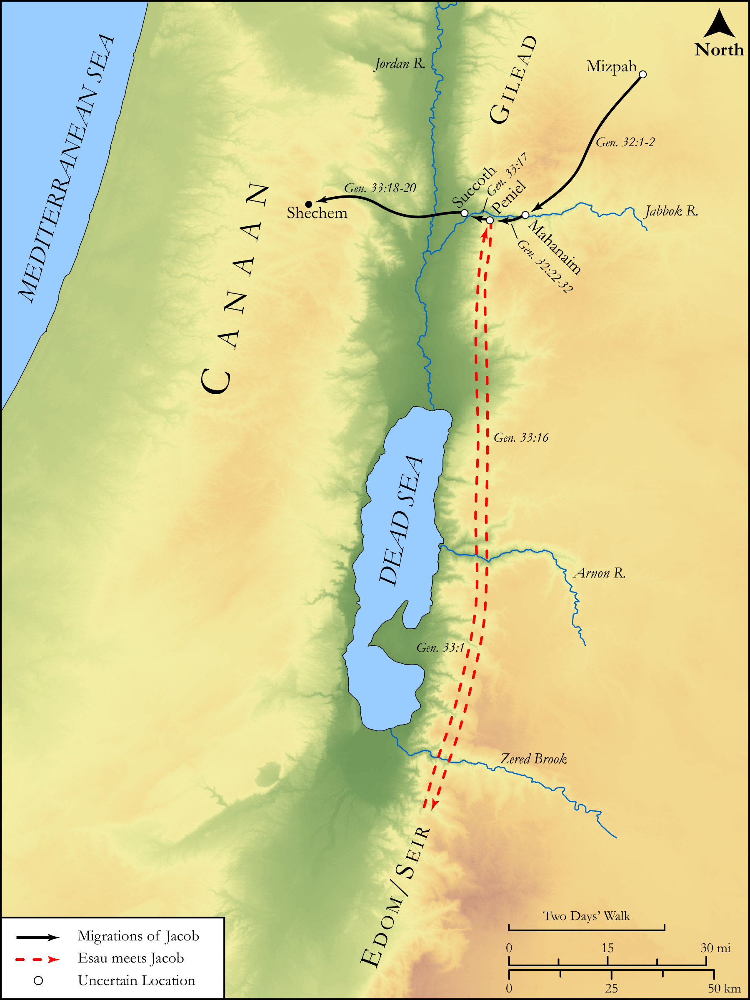

# Biblica Open Bible Maps

## License Information

Biblica Open Bible Maps, © 2023–2025 Biblica, Inc. This work is licensed under Creative Commons Attribution-ShareAlike 4.0 International (<a href="https://creativecommons.org/licenses/by-sa/4.0/">https://creativecommons.org/licenses/by-sa/4.0/</a>). More Information: <a href="https://docs.google.com/document/d/1Pp44yZ0Zdnd59vJHTrt2rPYq0SppfX5rZbPBt6mz37U/edit?tab=t.0#heading=h.oev9aj1ksvk2">https://docs.google.com/document/d/1Pp44yZ0Zdnd59vJHTrt2rPYq0SppfX5rZbPBt6mz37U/edit?tab=t.0#heading=h.oev9aj1ksvk2</a>

--------------------------------

## Pentateuch: The Migrations of Jacob (Part 2) (id: OT021)

### Image Content

[link](images/OT021.png)

Original: [Pentateuch: The Migrations of Jacob (Part 2\)](https://drive.google.com/open?id=1yhO4zq3EJTRxyCz13RVlpjRZvt8PbiTi&usp=drive_copy)

* **Associated Passages:** Genesis 32:1-33:20

* **Associated ACAI Concepts:** Israel (ID: `person:Israel`); Esau (ID: `person:Esau`); LORD (ID: `deity:Lord`); Offering (ID: `keyterm:Offering`); Flock (ID: `fauna:Flock`); Goat (ID: `fauna:Goat`); Favor (ID: `keyterm:Favor`); Cattle (ID: `fauna:Bull`); Bless (ID: `keyterm:Bless`); An Angel (ID: `deity:Angel`); Leah (ID: `person:Leah`); Seir (ID: `place:Seir`); Rachel (ID: `person:Rachel`); Penuel (ID: `place:Penuel`); To Be Kindly Disposed (ID: `keyterm:KindlyDisposed`); Joseph (ID: `person:Joseph.10`); Mahanaim (ID: `place:Mahanaim`); Edom (ID: `place:Edom`); Shechem (ID: `place:Shechem`); Succoth (ID: `place:Succoth`); Jabbok (ID: `place:Jabbok`); Kindness (ID: `keyterm:Kindness`); Canaan (ID: `place:Canaan`); Isaac (ID: `person:Isaac`); Jordan River (ID: `place:Jordan`); Fear (ID: `keyterm:Fear`); Appease (ID: `keyterm:Appease`); Truth (ID: `keyterm:Truth`); Shechem (ID: `person:Shechem`); Abraham (ID: `person:Abraham`)
