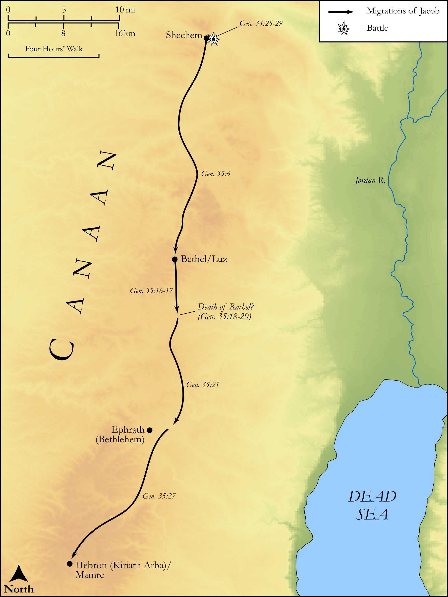

# Biblica Open Bible Maps

## License Information

Biblica Open Bible Maps, © 2023–2025 Biblica, Inc. This work is licensed under Creative Commons Attribution-ShareAlike 4.0 International (<a href="https://creativecommons.org/licenses/by-sa/4.0/">https://creativecommons.org/licenses/by-sa/4.0/</a>). More Information: <a href="https://docs.google.com/document/d/1Pp44yZ0Zdnd59vJHTrt2rPYq0SppfX5rZbPBt6mz37U/edit?tab=t.0#heading=h.oev9aj1ksvk2">https://docs.google.com/document/d/1Pp44yZ0Zdnd59vJHTrt2rPYq0SppfX5rZbPBt6mz37U/edit?tab=t.0#heading=h.oev9aj1ksvk2</a>

--------------------------------

## Pentateuch: The Migrations of Jacob (Part 3) (id: OT022)

### Image Content

[link](images/OT022.png)

Original: [Pentateuch: The Migrations of Jacob (Part 3\)](https://drive.google.com/open?id=1ClHqUc5o5lJ5ZXcjNBBPbEstWIyj7U0o&usp=drive_copy)

* **Associated Passages:** Genesis 34:1-35:29

* **Associated ACAI Concepts:** Israel (ID: `person:Israel`); Shechem (ID: `person:Shechem`); LORD (ID: `deity:Lord`); Hamor (ID: `person:Hamor`); Bethel (ID: `place:Bethel`); Dinah (ID: `person:Dinah`); Rachel (ID: `person:Rachel`); Circumcision (ID: `keyterm:Circumcision`); Isaac (ID: `person:Isaac`); Defilement (ID: `keyterm:Defilement`); Leah (ID: `person:Leah`); Simeon (ID: `person:Simeon.5`); Levi (ID: `person:Levi.3`); Benjamin (ID: `person:Benjamin`); Bethlehem (ID: `place:Bethlehem`); Reuben (ID: `person:Reuben`); Bilhah (ID: `person:Bilhah`); Canaan (ID: `place:Canaan`); Esau (ID: `person:Esau`); Abraham (ID: `person:Abraham`); Paddan-aram (ID: `place:Paddan-aram`); Altar (ID: `realia:Altar`); Stone Altar (ID: `realia:StoneAltar`); Temple Altar (ID: `realia:TempleAltar`); Tabernacle Altar (ID: `realia:TabernacleAltar`); Mamre (ID: `place:Mamre`); Allon-bachuth (ID: `place:Allon-bacuth`); Deborah (ID: `person:Deborah`); Tower of Eder (ID: `place:TowerOfEder`); Judah (ID: `person:Judah.4`)
