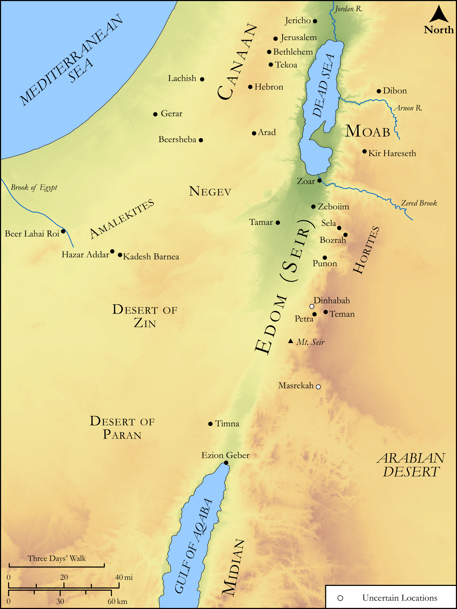

# Biblica Open Bible Maps

## License Information

Biblica Open Bible Maps, © 2023–2025 Biblica, Inc. This work is licensed under Creative Commons Attribution-ShareAlike 4.0 International (https://creativecommons.org/licenses/by-sa/4.0/). More Information: https://docs.google.com/document/d/1Pp44yZ0Zdnd59vJHTrt2rPYq0SppfX5rZbPBt6mz37U/edit?tab=t.0#heading=h.oev9aj1ksvk2

--------------------------------

## Pentateuch: Esau and Edom (id: OT023)

### Image Content

[link](images/OT023.png)

Original: [Pentateuch: Esau and Edom](https://drive.google.com/open?id=1WHfGRXrSlRj2fzSMIgaszlpdtYQiE86T&usp=drive_copy)

* **Associated Passages:** Genesis 36:1-43

* **Associated ACAI Concepts:** Esau (ID: `person:Esau`); Edom (ID: `place:Edom`); Eliphaz (ID: `person:Eliphaz`); Adah (ID: `person:Adah.2`); Hori (ID: `person:Hori`); Mahalath (ID: `person:Mahalath`); Reuel (ID: `person:Reuel.3`); Oholibamah (ID: `person:Oholibamah`); Zibeon (ID: `person:Zibeon.2`); Korah (ID: `person:Korah`); Anah (ID: `person:Anah`); Jeush (ID: `person:Jeush`); Jalam (ID: `person:Jalam`); Anah (ID: `person:Anah.2`); Shobal (ID: `person:Shobal`); Dishan (ID: `person:Dishan`); Lotan (ID: `person:Lotan`); Ezer (ID: `person:Ezer`); Teman (ID: `person:Teman`); Edomites (ID: `group:Edom`); Dishon (ID: `person:Dishon`); Canaan (ID: `place:Canaan`); Seir (ID: `place:Seir`); Horites (ID: `group:Hori`); Baal-hanan (ID: `person:Baal-hanan`); Kenaz (ID: `person:Kenaz`); Gatam (ID: `person:Gatam`); Husham (ID: `person:Husham`); Zerah (ID: `person:Zerah`); Nahath (ID: `person:Nahath`); Amalek (ID: `person:Amalek`); Jobab (ID: `person:Jobab.2`); Hadad (ID: `person:Hadad`); Seir (ID: `person:Seir`); Achbor (ID: `person:Achbor`); Zibeon (ID: `person:Zibeon`); Bela (ID: `person:Bela.2`); Shammah (ID: `person:Shammah.2`); Omar (ID: `person:Omar`); Samlah (ID: `person:Samlah`); Zepho (ID: `person:Zepho`); Mizzah (ID: `person:Mizzah`); Shaul (ID: `person:Shaul`); Israel (ID: `person:Israel`); Timna (ID: `person:Timna.3`); Manahath (ID: `person:Manahath`); Iram (ID: `person:Iram`); Zerah (ID: `person:Zerah.2`); Elon (ID: `person:Elon`); Magdiel (ID: `person:Magdiel`); Eshban (ID: `person:Eshban`); Bedad (ID: `person:Bedad`); Kenaz (ID: `person:Kenaz.2`); Cheran (ID: `person:Cheran`); Onam (ID: `person:Onam`); Akan (ID: `person:Akan`); Oholibamah (ID: `person:Oholibamah.3`); Masrekah (ID: `place:Masrekah`); Bilhan (ID: `person:Bilhan`); Dishon (ID: `person:Dishon.2`); Pau (ID: `place:Pau`); Uz (ID: `person:Uz.3`); Mehetabel (ID: `person:Mehetabel`); Alvah (ID: `person:Alvah`); Anah (ID: `person:Anah.3`); Pinon (ID: `person:Pinon`); Elah (ID: `person:Elah`); Matred (ID: `person:Matred`); Alvan (ID: `person:Alvan`); Mibzar (ID: `person:Mibzar`); Hemdan (ID: `person:Hemdan`); Avith (ID: `place:Avith`); Oholibamah (ID: `person:Oholibamah.2`); Timna (ID: `person:Timna.2`); Timna (ID: `person:Timna`); Rehoboth (ID: `place:Rehoboth.2`); Aiah (ID: `person:Aiah`); Mezahab (ID: `person:Mezahab`); Jetheth (ID: `person:Jetheth`); Ithran (ID: `person:Ithran`); Dinhabah (ID: `place:Dinhabah`); Korah (ID: `person:Korah.2`); Shepho (ID: `person:Shepho`); Ebal (ID: `person:Ebal`); Beor (ID: `person:Beor`); Zaavan (ID: `person:Zaavan`); Hadad (ID: `person:Hadad.2`); Hemam (ID: `person:Hemam`); Aran (ID: `person:Aran`); Hittites (ID: `group:Hittite`); Israelites (ID: `group:Israel`); Heth (ID: `person:Heth`); Temanites (ID: `group:Teman`); Bozrah (ID: `place:Bozrah.2`); Ishmael (ID: `person:Ishmael`); Midian (ID: `place:Midian`); Nebaioth (ID: `person:Nebaioth`); Moab (ID: `place:Moab`); Teman (ID: `place:Teman`); Hivites (ID: `group:Hivites`); Euphrates River (ID: `place:Euphrates`); Sheep (ID: `fauna:Lamb`); Cattle (ID: `fauna:Bull`); Donkey (ID: `fauna:Donkey`)
