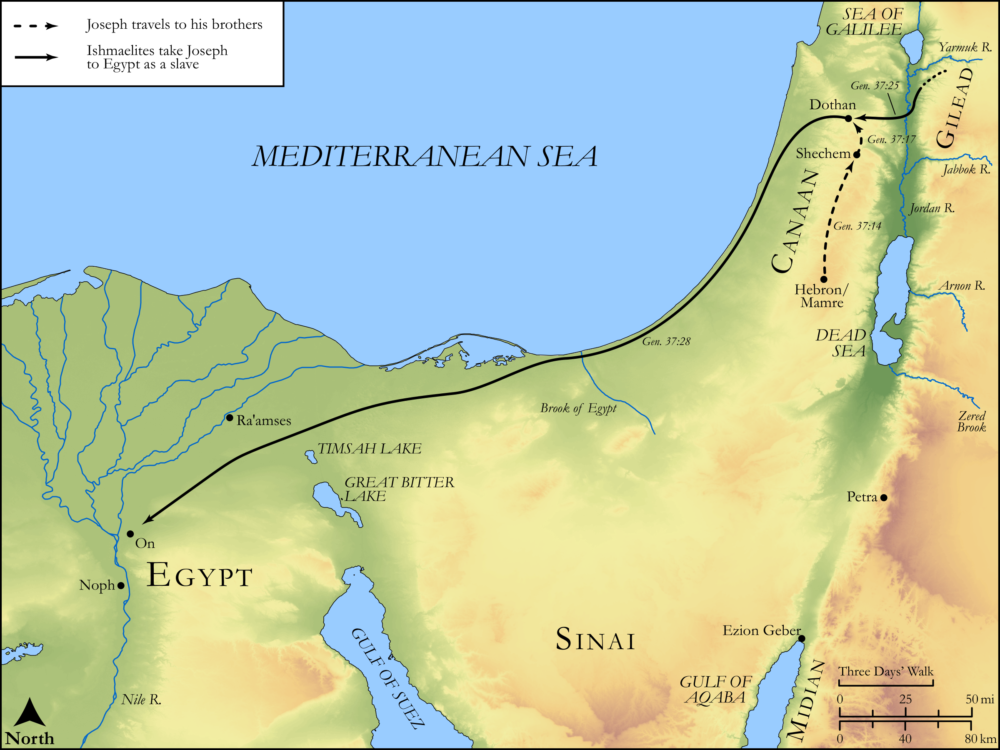

# Biblica Open Bible Maps

## License Information

Biblica Open Bible Maps, © 2023–2025 Biblica, Inc. This work is licensed under Creative Commons Attribution-ShareAlike 4.0 International (https://creativecommons.org/licenses/by-sa/4.0/). More Information: https://docs.google.com/document/d/1Pp44yZ0Zdnd59vJHTrt2rPYq0SppfX5rZbPBt6mz37U/edit?tab=t.0#heading=h.oev9aj1ksvk2

--------------------------------

## Pentateuch: Joseph Sold Into Egypt (id: OT024)

### Image Content

[link](images/OT024.png)

Original: [Pentateuch: Joseph Sold Into Egypt](https://drive.google.com/open?id=1gO-eKiTq3oLUMGkm-9KcjeTwsxL-Fbyi&usp=drive_copy)

* **Associated Passages:** Genesis 37:1-36

* **Associated ACAI Concepts:** Joseph (ID: `person:Joseph.10`); Israel (ID: `person:Israel`); Tunic (ID: `realia:Tunic.2`); Pit (ID: `realia:Pit`); Ishmaelites (ID: `group:Ishmael`); Reuben (ID: `person:Reuben`); Sheep (ID: `fauna:Lamb`); Flock (ID: `fauna:Flock`); Goat (ID: `fauna:Goat`); Shechem (ID: `place:Shechem`); Ishmael (ID: `person:Ishmael`); Egypt (ID: `place:Egypt`); Love (ID: `keyterm:Love`); Peace (ID: `keyterm:IntactState`); Midianites (ID: `group:Midian`); Midian (ID: `place:Midian`); Valley of Hebron (ID: `place:HebronValley`); Dothan (ID: `place:Dothan`); Gilead (ID: `place:Gilead`); Potiphar (ID: `person:Potiphar`); Hyena (ID: `fauna:Hyena`); Jackal (ID: `fauna:Jackal`); Bear (ID: `fauna:Bear`); Lion (ID: `fauna:Lion`); Canaan (ID: `place:Canaan`); Judah (ID: `person:Judah.4`); Zilpah (ID: `person:Zilpah`); Bilhah (ID: `person:Bilhah`); Hell (ID: `place:Hell`); A Man (ID: `person:GenericMale`); Be Zealous (ID: `keyterm:Zealous`); Pharaoh (ID: `person:Pharaoh.4`); Sheaf (ID: `realia:Sheaf`); Sackcloth (ID: `realia:Sackcloth`); Gum Tragacanth (ID: `flora:GumTragacanth`); Liquidambar (ID: `flora:Liquidambar`); Rock Rose (ID: `flora:Ladanum`); Money (ID: `realia:Money`); Camel (ID: `fauna:Camel`)
