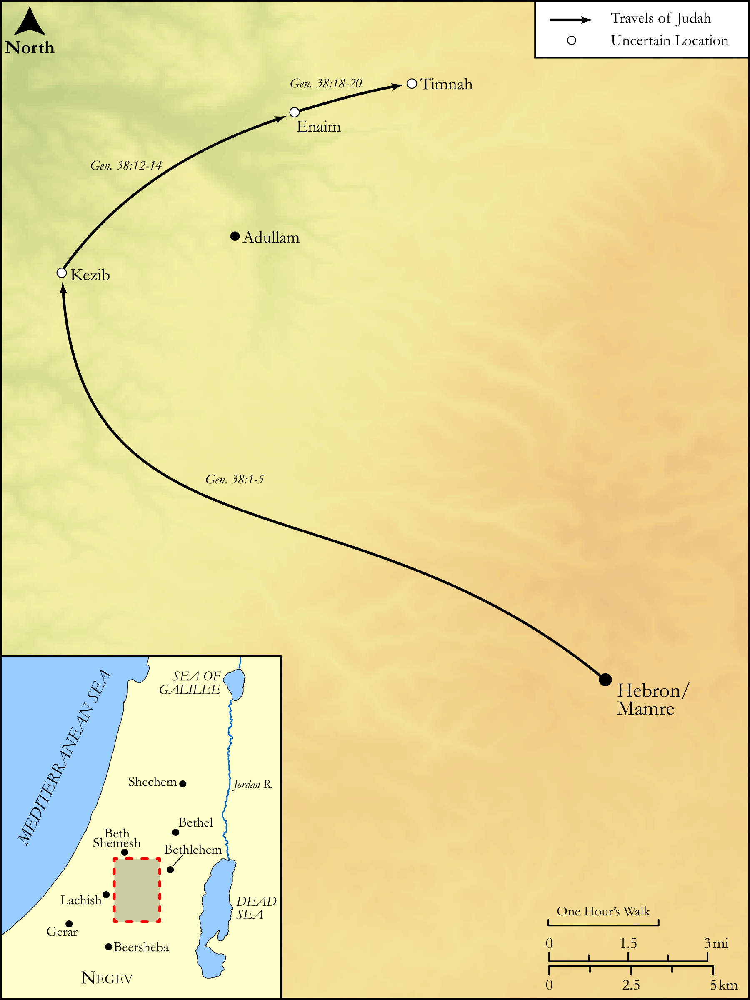

# Biblica Open Bible Maps

## License Information

Biblica Open Bible Maps, © 2023–2025 Biblica, Inc. This work is licensed under Creative Commons Attribution-ShareAlike 4.0 International (<a href="https://creativecommons.org/licenses/by-sa/4.0/">https://creativecommons.org/licenses/by-sa/4.0/</a>). More Information: <a href="https://docs.google.com/document/d/1Pp44yZ0Zdnd59vJHTrt2rPYq0SppfX5rZbPBt6mz37U/edit?tab=t.0#heading=h.oev9aj1ksvk2">https://docs.google.com/document/d/1Pp44yZ0Zdnd59vJHTrt2rPYq0SppfX5rZbPBt6mz37U/edit?tab=t.0#heading=h.oev9aj1ksvk2</a>

--------------------------------

## Pentateuch: Judah and Tamar (id: OT025)

### Image Content

[link](images/OT025.png)

Original: [Pentateuch: Judah and Tamar](https://drive.google.com/open?id=1MhvKnqqn2nseebVa9T-HTuz8YI4K-pI1&usp=drive_copy)

* **Associated Passages:** Genesis 38:1-30

* **Associated ACAI Concepts:** Judah (ID: `person:Judah.4`); Tamar (ID: `person:Tamar`); Shelah (ID: `person:Shelah`); Goat (ID: `fauna:Goat`); Timnah (ID: `place:Timnah`); Adullamites (ID: `group:Adullam`); Onan (ID: `person:Onan`); Er (ID: `person:Er.2`); Flock (ID: `fauna:Flock`); Adullam (ID: `place:Adullam`); Hirah (ID: `person:Hirah`); Enaim (ID: `place:Enaim`); Shua (ID: `person:Shua`); Kid (ID: `fauna:Kid`); LORD (ID: `deity:Lord`); Thread (ID: `realia:Thread`); Zerah (ID: `person:Zerah.3`); Perez (ID: `person:Perez`); Measuring Reed (ID: `realia:MeasuringReed`); Rod (ID: `realia:Rod`); Canaan (ID: `place:Canaan`); Be (Or Show Oneself) Just (ID: `keyterm:Just`); Play the Prostitute (ID: `keyterm:PlayTheProstitute`); Canaanites (ID: `group:Canaan`); Achzib (ID: `place:Achzib`)
