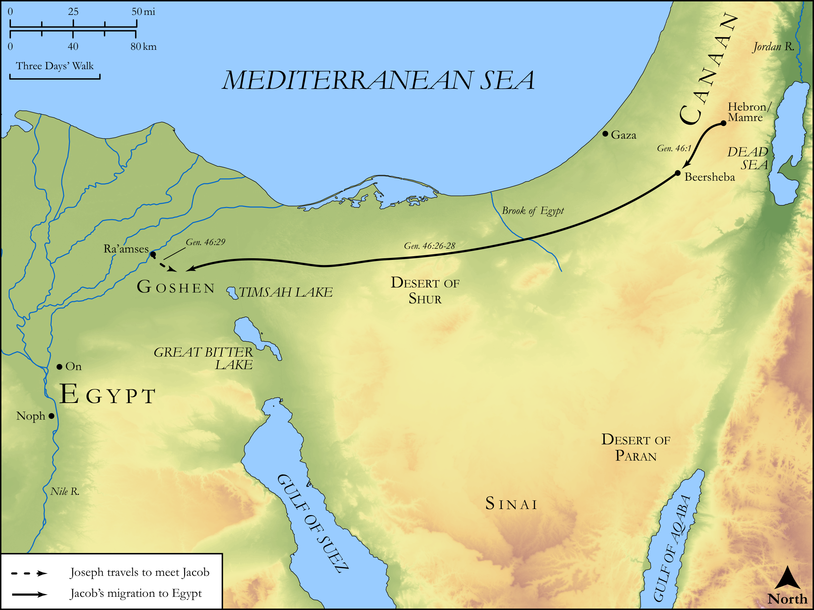

# Biblica Open Bible Maps

## License Information

Biblica Open Bible Maps, © 2023–2025 Biblica, Inc. This work is licensed under Creative Commons Attribution-ShareAlike 4.0 International (<a href="https://creativecommons.org/licenses/by-sa/4.0/">https://creativecommons.org/licenses/by-sa/4.0/</a>). More Information: <a href="https://docs.google.com/document/d/1Pp44yZ0Zdnd59vJHTrt2rPYq0SppfX5rZbPBt6mz37U/edit?tab=t.0#heading=h.oev9aj1ksvk2">https://docs.google.com/document/d/1Pp44yZ0Zdnd59vJHTrt2rPYq0SppfX5rZbPBt6mz37U/edit?tab=t.0#heading=h.oev9aj1ksvk2</a>

--------------------------------

## Pentateuch: Jacob Migrates to Egypt (id: OT026)

### Image Content

[link](images/OT026.png)

Original: [Pentateuch: Jacob Migrates to Egypt](https://drive.google.com/open?id=1aIDRYBJIIcuLrGuVDSil_U5w8Dqrpemg&usp=drive_copy)

* **Associated Passages:** Genesis 46:1-34

* **Associated ACAI Concepts:** Israel (ID: `person:Israel`); Egypt (ID: `place:Egypt`); Joseph (ID: `person:Joseph.10`); Canaan (ID: `place:Canaan`); Goshen (ID: `place:Goshen`); LORD (ID: `deity:Lord`); Pharaoh (ID: `person:Pharaoh.4`); Rachel (ID: `person:Rachel`); Judah (ID: `person:Judah.4`); Laban (ID: `person:Laban`); Benjamin (ID: `person:Benjamin`); Beersheba (ID: `place:Beersheba`); Leah (ID: `person:Leah`); Reuben (ID: `person:Reuben`); Jachin (ID: `person:Jachin`); Jahleel (ID: `person:Jahleel`); Tola (ID: `person:Tola`); Malchiel (ID: `person:Malchiel`); Hezron (ID: `person:Hezron.2`); Rosh (ID: `person:Rosh`); Jezer (ID: `person:Jezer`); Jemuel (ID: `person:Jemuel`); Ziphion (ID: `person:Ziphion`); Shuni (ID: `person:Shuni`); Asher (ID: `person:Asher`); Zerah (ID: `person:Zerah.6`); Arod (ID: `person:Arod`); Dan (ID: `person:Dan`); Ishvi (ID: `person:Ishvi.2`); Canaanite Woman (ID: `person:CanaaniteWoman`); Haggi (ID: `person:Haggi`); Imnah (ID: `person:Imnah`); Shaul (ID: `person:Shaul.2`); Heber (ID: `person:Heber`); Ezbon (ID: `person:Ezbon`); Naaman (ID: `person:Naaman`); Serah (ID: `person:Serah`); Gershon (ID: `person:Gershon`); Ishvah (ID: `person:Ishvah`); Sered (ID: `person:Sered`); Elon (ID: `person:Elon.2`); Hushim (ID: `person:Hushim.2`); Bela (ID: `person:Bela`); Guni (ID: `person:Guni`); Ard (ID: `person:Ard`); Jashub (ID: `person:Jashub`); Carmi (ID: `person:Carmi.2`); Gera (ID: `person:Gera`); Gad (ID: `person:Gad`); Ehi (ID: `person:Ehi`); Areli (ID: `person:Areli`); Huppim (ID: `person:Huppim`); Dinah (ID: `person:Dinah`); Potiphera (ID: `person:Potiphera`); Jamin (ID: `person:Jamin`); Beriah (ID: `person:Beriah`); Hezron (ID: `person:Hezron`); Pallu (ID: `person:Pallu`); Hamul (ID: `person:Hamul`); Shillem (ID: `person:Shillem`); Puah (ID: `person:Puah`); Asenath (ID: `person:Asenath`); Becher (ID: `person:Becher`); Hanoch (ID: `person:Hanoch.2`); Jahzeel (ID: `person:Jahzeel`); Zilpah (ID: `person:Zilpah`); Ashbel (ID: `person:Ashbel`); Ohad (ID: `person:Ohad`); Merari (ID: `person:Merari`); Muppim (ID: `person:Muppim`); Shimron (ID: `person:Shimron`); On (ID: `place:On`); Kohath (ID: `person:Kohath`); Eri (ID: `person:Eri`); Goat (ID: `fauna:Goat`); Sheep (ID: `fauna:Lamb`); Flock (ID: `fauna:Flock`); Onan (ID: `person:Onan`); Manasseh (ID: `person:Manasseh`); Isaac (ID: `person:Isaac`); Simeon (ID: `person:Simeon.5`); Naphtali (ID: `person:Naphtali`); Zebulun (ID: `person:Zebulun`); Shelah (ID: `person:Shelah`); Egyptians (ID: `group:Egypt`); Bilhah (ID: `person:Bilhah`); Fear (ID: `keyterm:Fear`); Er (ID: `person:Er.2`); Perez (ID: `person:Perez`); Ephraim (ID: `person:Ephraim`); Slaughtering (ID: `keyterm:Slaughtering`); Levi (ID: `person:Levi.3`); Zerah (ID: `person:Zerah.3`); Vision (ID: `keyterm:Vision`); Canaanites (ID: `group:Canaan`); Paddan-aram (ID: `place:Paddan-aram`); Issachar (ID: `person:Issachar`); Image (ID: `realia:Image`); Chariot (ID: `realia:Chariot`); Wagon (ID: `realia:Wagon`); Cattle (ID: `fauna:Bull`)
