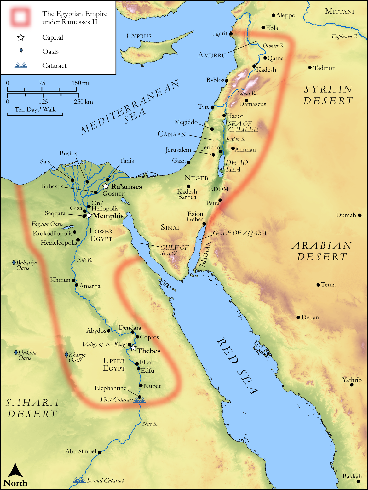

# Biblica Open Bible Maps

## License Information

Biblica Open Bible Maps, © 2023–2025 Biblica, Inc. This work is licensed under Creative Commons Attribution-ShareAlike 4.0 International (<a href="https://creativecommons.org/licenses/by-sa/4.0/">https://creativecommons.org/licenses/by-sa/4.0/</a>). More Information: <a href="https://docs.google.com/document/d/1Pp44yZ0Zdnd59vJHTrt2rPYq0SppfX5rZbPBt6mz37U/edit?tab=t.0#heading=h.oev9aj1ksvk2">https://docs.google.com/document/d/1Pp44yZ0Zdnd59vJHTrt2rPYq0SppfX5rZbPBt6mz37U/edit?tab=t.0#heading=h.oev9aj1ksvk2</a>

--------------------------------

## Pentateuch: The Kingdom of Egypt in the Time of Moses (id: OT028)

### Image Content

[link](images/OT028.png)

Original: [Pentateuch: The Kingdom of Egypt in the Time of Moses](https://drive.google.com/open?id=1SyqlLAZyF73rSEL_cbHg6ugm9Clky7d9&usp=drive_copy)

* **Associated Passages:** Exodus 1:1-40:38

* **Associated ACAI Concepts:** LORD (ID: `deity:Lord`); Moses (ID: `person:Moses`); Israel (ID: `person:Israel`); Egypt (ID: `place:Egypt`); Aaron (ID: `person:Aaron`); Pharaoh (ID: `person:Pharaoh.6`); Holy (ID: `keyterm:Holy`); Offering (ID: `keyterm:Offering`); Force to Serve (ID: `keyterm:EnticedToServe`); Egyptians (ID: `group:Egypt`); Pure (ID: `keyterm:Pure`); Testimony (ID: `keyterm:Witness.2`); Covenant Box (ID: `keyterm:CovenantBox`); Priesthood (ID: `keyterm:Priesthood`); Nile River (ID: `place:Nile`); To Sin (ID: `keyterm:Sin`); Mount Sinai (ID: `place:SinaiMount`); Hebrews (ID: `group:Hebrews`); Covenant (ID: `keyterm:Covenant`); Sabbath (ID: `keyterm:Sabbath`); Fear (ID: `keyterm:Fear`); Canaan (ID: `place:Canaan`); Bezalel (ID: `person:Bezalel`); Glory (ID: `keyterm:Glory`); Smear (ID: `keyterm:Smear`); Jethro (ID: `person:Jethro`); Work (ID: `keyterm:Work`); Pharaoh (ID: `person:Pharaoh.5`); Holy Place (ID: `place:HolyPlace`); Abraham (ID: `person:Abraham`)
