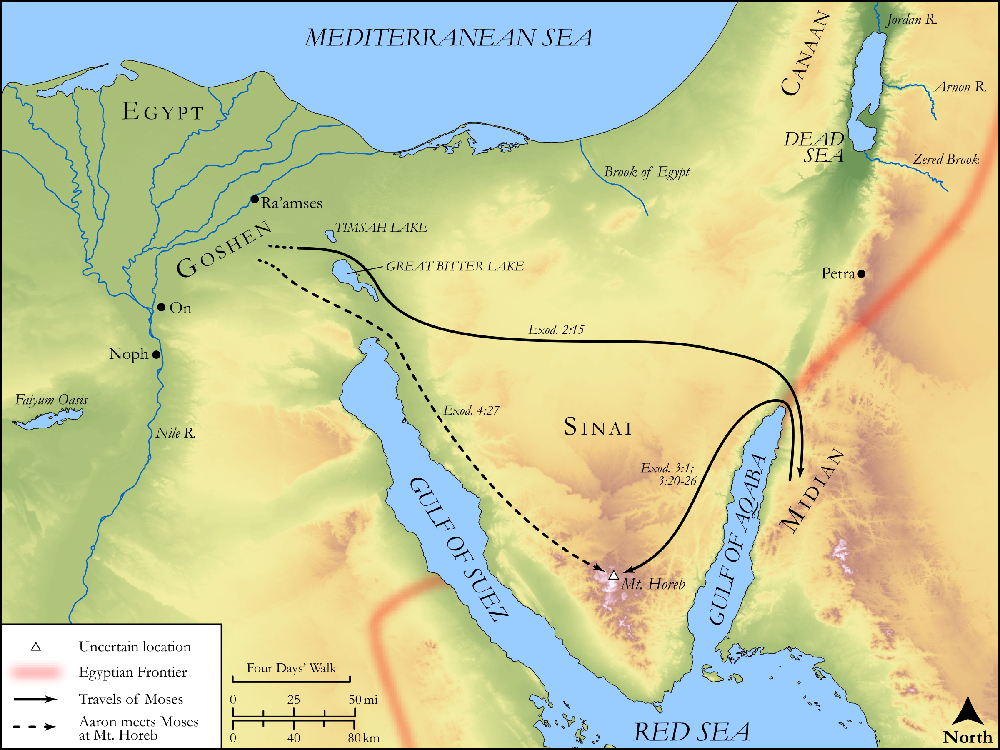

# Biblica Open Bible Maps

## License Information

Biblica Open Bible Maps, © 2023–2025 Biblica, Inc. This work is licensed under Creative Commons Attribution-ShareAlike 4.0 International (https://creativecommons.org/licenses/by-sa/4.0/). More Information: https://docs.google.com/document/d/1Pp44yZ0Zdnd59vJHTrt2rPYq0SppfX5rZbPBt6mz37U/edit?tab=t.0#heading=h.oev9aj1ksvk2

--------------------------------

## Pentateuch: Moses flees to Midian and returns to Egypt (id: OT029)

### Image Content

[link](images/OT029.png)

Original: [Pentateuch: Moses flees to Midian and returns to Egypt](https://drive.google.com/open?id=1Hb1BC4xc_MDBKXDAk3QcienpJtPwaePc&usp=drive_copy)

* **Associated Passages:** Exodus 2:1-4:31

* **Associated ACAI Concepts:** LORD (ID: `deity:Lord`); Moses (ID: `person:Moses`); Egypt (ID: `place:Egypt`); Israel (ID: `person:Israel`); Egyptians (ID: `group:Egypt`); Pharaoh (ID: `person:Pharaoh.5`); Believe In (ID: `keyterm:BelieveIn`); Aaron (ID: `person:Aaron`); Abraham (ID: `person:Abraham`); Hebrews (ID: `group:Hebrews`); Isaac (ID: `person:Isaac`); Midian (ID: `place:Midian`); Pharaoh (ID: `person:Pharaoh.6`); Jethro (ID: `person:Jethro`); Nile River (ID: `place:Nile`); Flock (ID: `fauna:Flock`); Goat (ID: `fauna:Goat`); Rod (ID: `realia:Rod`); Zipporah (ID: `person:Zipporah`); Perizzites (ID: `group:Perizzites`); Land Flowing of Milk and Honey (ID: `keyterm:LandFlowingOfMilkAndHoney`); Heth (ID: `person:Heth`); Canaan (ID: `place:Canaan`); Levi (ID: `person:Levi.3`); Hivites (ID: `group:Hivites`); Appoint (ID: `keyterm:Appoint`); Jebusites (ID: `group:Jebusites`); Hittites (ID: `group:Hittite`); Canaanites (ID: `group:Canaan`); Fear (ID: `keyterm:Fear`)
