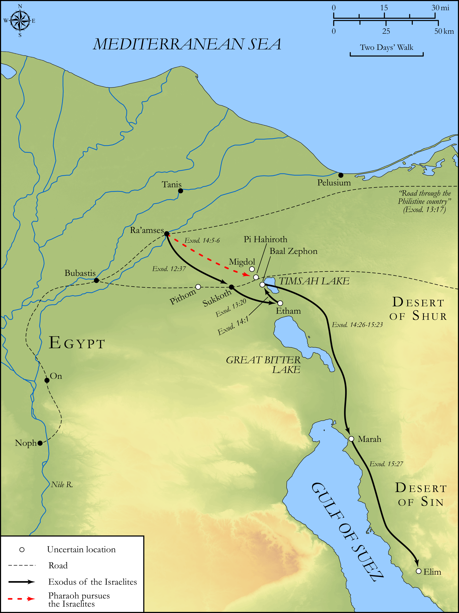

# Biblica Open Bible Maps

## License Information

Biblica Open Bible Maps, © 2023–2025 Biblica, Inc. This work is licensed under Creative Commons Attribution-ShareAlike 4.0 International (<a href="https://creativecommons.org/licenses/by-sa/4.0/">https://creativecommons.org/licenses/by-sa/4.0/</a>). More Information: <a href="https://docs.google.com/document/d/1Pp44yZ0Zdnd59vJHTrt2rPYq0SppfX5rZbPBt6mz37U/edit?tab=t.0#heading=h.oev9aj1ksvk2">https://docs.google.com/document/d/1Pp44yZ0Zdnd59vJHTrt2rPYq0SppfX5rZbPBt6mz37U/edit?tab=t.0#heading=h.oev9aj1ksvk2</a>

--------------------------------

## Pentateuch: The Exodus: From Egypt to Elim (id: OT031)

### Image Content

[link](images/OT031.png)

Original: [Pentateuch: The Exodus: From Egypt to Elim](https://drive.google.com/open?id=1Fn4QQa_owp2SoyKk90bUx-9jdiqRnNVI&usp=drive_copy)

* **Associated Passages:** Exodus 12:1-15:27

* **Associated ACAI Concepts:** LORD (ID: `deity:Lord`); Egypt (ID: `place:Egypt`); Israel (ID: `person:Israel`); Moses (ID: `person:Moses`); Pharaoh (ID: `person:Pharaoh.6`); Egyptians (ID: `group:Egypt`); Aaron (ID: `person:Aaron`); Passover (ID: `keyterm:Passover`); Chariot (ID: `realia:Chariot`); House (ID: `realia:House`); Unleavened Bread (ID: `realia:UnleavenedBread`); Cattle (ID: `fauna:Bull`); Force to Serve (ID: `keyterm:EnticedToServe`); Holy (ID: `keyterm:Holy`); Fear (ID: `keyterm:Fear`); Horse (ID: `fauna:Horse`); Red Sea (ID: `place:RedSea`); Decree (ID: `keyterm:Decree`); Canaan (ID: `place:Canaan`); Redeem (ID: `keyterm:Redeem`); Bring Honor and Glory on Oneself (ID: `keyterm:BringHonorAndGloryOnOneself`); Swear (ID: `keyterm:Swear`); Work (ID: `keyterm:Work`); Goat (ID: `fauna:Goat`); Sheep (ID: `fauna:Lamb`); Flock (ID: `fauna:Flock`); Succoth (ID: `place:Succoth.2`); Baal-zephon (ID: `place:Baal-zephon`); Miriam (ID: `person:Miriam`); Philistia (ID: `place:Philistine`)
