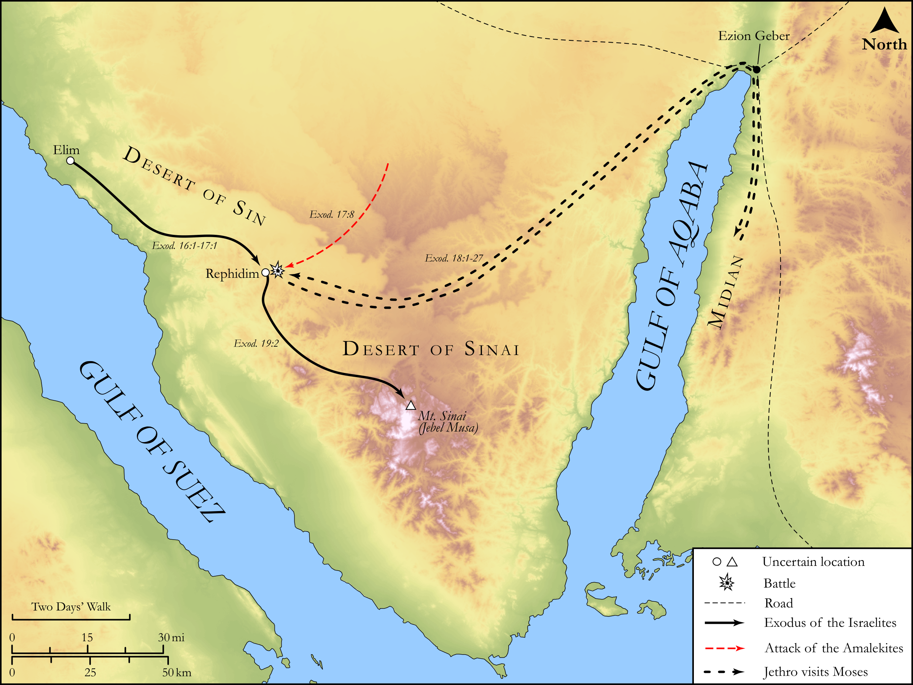

# Biblica Open Bible Maps

## License Information

Biblica Open Bible Maps, © 2023–2025 Biblica, Inc. This work is licensed under Creative Commons Attribution-ShareAlike 4.0 International (<a href="https://creativecommons.org/licenses/by-sa/4.0/">https://creativecommons.org/licenses/by-sa/4.0/</a>). More Information: <a href="https://docs.google.com/document/d/1Pp44yZ0Zdnd59vJHTrt2rPYq0SppfX5rZbPBt6mz37U/edit?tab=t.0#heading=h.oev9aj1ksvk2">https://docs.google.com/document/d/1Pp44yZ0Zdnd59vJHTrt2rPYq0SppfX5rZbPBt6mz37U/edit?tab=t.0#heading=h.oev9aj1ksvk2</a>

--------------------------------

## Pentateuch: The Exodus: From Elim to Mount Sinai (id: OT032)

### Image Content

[link](images/OT032.png)

Original: [Pentateuch: The Exodus: From Elim to Mount Sinai](https://drive.google.com/open?id=1DWP7qAhf0ZBNkBlPs0rPckODVC5caySo&usp=drive_copy)

* **Associated Passages:** Exodus 12:1-19:25

* **Associated ACAI Concepts:** LORD (ID: `deity:Lord`); Moses (ID: `person:Moses`); Israel (ID: `person:Israel`); Egypt (ID: `place:Egypt`); Pharaoh (ID: `person:Pharaoh.6`); Aaron (ID: `person:Aaron`); Holy (ID: `keyterm:Holy`); Egyptians (ID: `group:Egypt`); Jethro (ID: `person:Jethro`); Amalek (ID: `place:Amalek`); Mount Sinai (ID: `place:SinaiMount`); Instruction (ID: `keyterm:Instruction`); Decree (ID: `keyterm:Decree`); Passover (ID: `keyterm:Passover`); Fear (ID: `keyterm:Fear`); Chariot (ID: `realia:Chariot`); Canaan (ID: `place:Canaan`); Force to Serve (ID: `keyterm:EnticedToServe`); Sabbath (ID: `keyterm:Sabbath`); Joshua (ID: `person:Joshua.2`); House (ID: `realia:House`); Unleavened Bread (ID: `realia:UnleavenedBread`); Cattle (ID: `fauna:Bull`); Omer (ID: `realia:Omer`); Horse (ID: `fauna:Horse`); Rephidim (ID: `place:Rephidim`); Red Sea (ID: `place:RedSea`); Redeem (ID: `keyterm:Redeem`); Bring Honor and Glory on Oneself (ID: `keyterm:BringHonorAndGloryOnOneself`); Swear (ID: `keyterm:Swear`)
