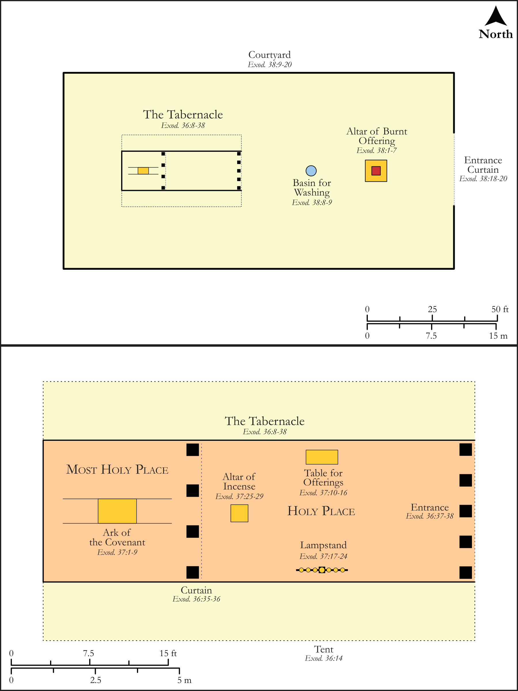

# Biblica Open Bible Maps

## License Information

Biblica Open Bible Maps, © 2023–2025 Biblica, Inc. This work is licensed under Creative Commons Attribution-ShareAlike 4.0 International (https://creativecommons.org/licenses/by-sa/4.0/). More Information: https://docs.google.com/document/d/1Pp44yZ0Zdnd59vJHTrt2rPYq0SppfX5rZbPBt6mz37U/edit?tab=t.0#heading=h.oev9aj1ksvk2

--------------------------------

## Pentateuch: Building Plan: The Tabernacle (id: OT033)

### Image Content

[link](images/OT033.png)

Original: [Pentateuch: Building Plan: The Tabernacle](https://drive.google.com/open?id=1WKgGkUhwtpB05jh-X90_77usEzqUVAOt&usp=drive_copy)

* **Associated Passages:** Exodus 36:1-40:38

* **Associated ACAI Concepts:** Moses (ID: `person:Moses`); LORD (ID: `deity:Lord`); Holy (ID: `keyterm:Holy`); Pure (ID: `keyterm:Pure`); Offering (ID: `keyterm:Offering`); Israel (ID: `person:Israel`); Covenant Box (ID: `keyterm:CovenantBox`); Aaron (ID: `person:Aaron`); Testimony (ID: `keyterm:Witness.2`); Smear (ID: `keyterm:Smear`); Temple Altar (ID: `realia:TempleAltar`); Tabernacle Altar (ID: `realia:TabernacleAltar`); Altar (ID: `realia:Altar`); Stone Altar (ID: `realia:StoneAltar`); Frame (ID: `realia:Frame`); Tent of Meeting (ID: `realia:TentOfMeeting`); Purple Cloth (ID: `realia:PurpleCloth`); Cubit (ID: `realia:Cubit`); Linen (ID: `realia:Linen`); Ark of the Covenant (ID: `realia:ArkOfTheCovenant`); Spindle (ID: `realia:Spindle`); Acacia (ID: `flora:Acacia`); Money (ID: `realia:Money`); Linen Strips (ID: `realia:LinenStrips`); Goat Hair Strips (ID: `realia:GoatHairStrips`); Screen (ID: `realia:Screen`); Bezalel (ID: `person:Bezalel`); Ephod (ID: `realia:Ephod`); Breast-Piece (ID: `realia:Breast-piece`); Perimiter Curtain (ID: `realia:PerimiterCurtain`)
