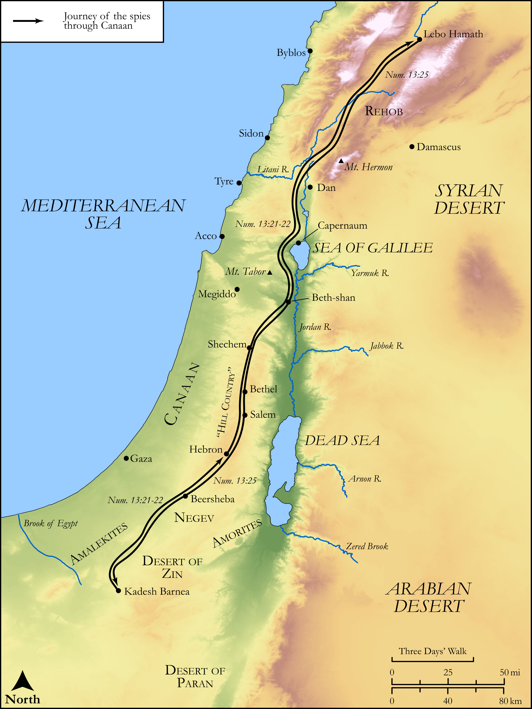

# Biblica Open Bible Maps

## License Information

Biblica Open Bible Maps, © 2023–2025 Biblica, Inc. This work is licensed under Creative Commons Attribution-ShareAlike 4.0 International (https://creativecommons.org/licenses/by-sa/4.0/). More Information: https://docs.google.com/document/d/1Pp44yZ0Zdnd59vJHTrt2rPYq0SppfX5rZbPBt6mz37U/edit?tab=t.0#heading=h.oev9aj1ksvk2

--------------------------------

## Pentateuch: Journey of the Spies to Canaan (id: OT034)

### Image Content

[link](images/OT034.png)

Original: [Pentateuch: Journey of the Spies to Canaan](https://drive.google.com/open?id=1-WkeLoPuiaiZuLgjrA18BfOgXD3K0JJB&usp=drive_copy)

* **Associated Passages:** Numbers 13:1-33

* **Associated ACAI Concepts:** Moses (ID: `person:Moses`); Israel (ID: `person:Israel`); Anak (ID: `person:Anak`); Negev (ID: `place:Negeb`); Canaan (ID: `place:Canaan`); Caleb (ID: `person:Caleb`); Valley of Eshcol (ID: `place:EshcolValley`); Paran (ID: `place:Paran`); Nun (ID: `person:Nun`); Vine (ID: `flora:Vine`); Sorghum (ID: `flora:Sorghum`); Wheat (ID: `flora:Wheat`); LORD (ID: `deity:Lord`); Joshua (ID: `person:Joshua.2`); Geuel (ID: `person:Geuel`); Sethur (ID: `person:Sethur`); Machi (ID: `person:Machi`); Jephunneh (ID: `person:Jephunneh`); Raphu (ID: `person:Raphu`); Talmai (ID: `person:Talmai`); Shammua (ID: `person:Shammua`); Ammiel (ID: `person:Ammiel`); Shaphat (ID: `person:Shaphat`); Sheshai (ID: `person:Sheshai`); Michael (ID: `person:Michael`); Gaddiel (ID: `person:Gaddiel`); Nephilim (ID: `group:Nephilim`); Palti (ID: `person:Palti`); Vophsi (ID: `person:Vophsi`); Hori (ID: `person:Hori.2`); Joseph (ID: `person:Joseph.11`); Susi (ID: `person:Susi`); Nahbi (ID: `person:Nahbi`); Beth-rehob (ID: `place:Beth-rehob`); Gaddi (ID: `person:Gaddi`); Amalek (ID: `place:Amalek`); Gemalli (ID: `person:Gemalli`); Kadesh-barnea (ID: `place:Kadesh-barnea`); Igal (ID: `person:Igal`); Zoan (ID: `place:Zoan`); Zaccur (ID: `person:Zaccur`); Land Flowing of Milk and Honey (ID: `keyterm:LandFlowingOfMilkAndHoney`); Sodi (ID: `person:Sodi`); Ahiman (ID: `person:Ahiman`); Heth (ID: `person:Heth`); Issachar (ID: `person:Issachar`); Jordan River (ID: `place:Jordan`); Tribe of Zebulun (ID: `group:Zebulun`); Tribe of Dan (ID: `group:Dan`); Hittites (ID: `group:Hittite`); Hebron (ID: `place:Hebron`); Tribe of Benjamin (ID: `group:Benjamin`); Egypt (ID: `place:Egypt`); Dispossess (ID: `keyterm:Dispossess`); Aaron (ID: `person:Aaron`); Tribe of Naphtali (ID: `group:Naphtali`); A Group of People (ID: `group:GenericGroup`); Tribe of Manasseh (ID: `group:Manasseh`); Judah (ID: `person:Judah.4`); Tribe of Judah (ID: `group:Judah`); Amalekites (ID: `group:Amalek`); Tribe of Ephraim (ID: `group:Ephraim`); Asher (ID: `person:Asher`); Naphtali (ID: `person:Naphtali`); Wilderness of Zin (ID: `place:Zin`); Jebusites (ID: `group:Jebusites`); Tribe of Reuben (ID: `group:Reuben`); Tribe of Asher (ID: `group:Asher`); Simeon (ID: `person:Simeon.5`); Hamath (ID: `place:Hamath`); Benjamin (ID: `person:Benjamin`); Canaanites (ID: `group:Canaan`); Dan (ID: `place:Dan`); Tribe of Issachar (ID: `group:Issachar`); Zebulun (ID: `person:Zebulun`); Ephraim (ID: `person:Ephraim`); Joseph (ID: `person:Joseph.10`); Tribe of Simeon (ID: `group:Simeon`); Manasseh (ID: `person:Manasseh`); Gad (ID: `person:Gad`); Reuben (ID: `person:Reuben`); Amorites (ID: `group:Amorites`); Pomegranate (ID: `flora:Pomegranate`); Locust (ID: `fauna:Locust`); Fig (ID: `flora:Fig`)
