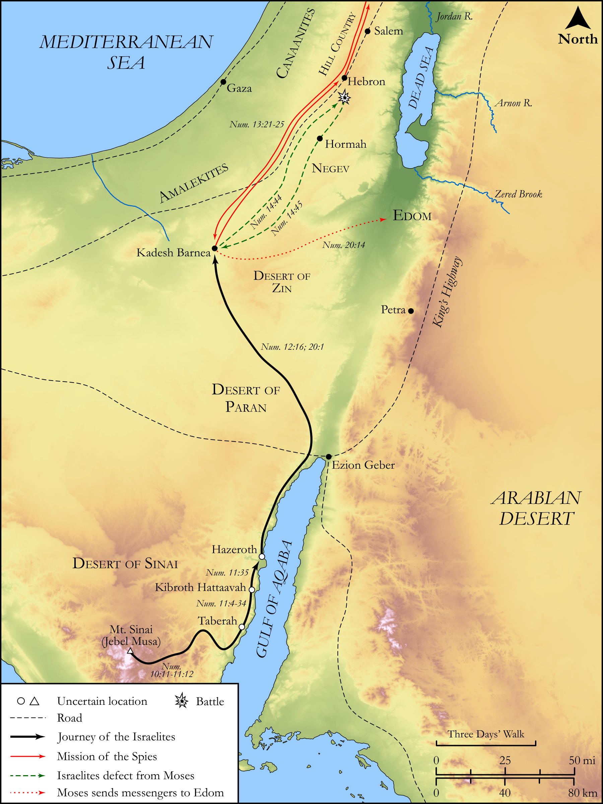

# Biblica Open Bible Maps

## License Information

Biblica Open Bible Maps, © 2023–2025 Biblica, Inc. This work is licensed under Creative Commons Attribution-ShareAlike 4.0 International (https://creativecommons.org/licenses/by-sa/4.0/). More Information: https://docs.google.com/document/d/1Pp44yZ0Zdnd59vJHTrt2rPYq0SppfX5rZbPBt6mz37U/edit?tab=t.0#heading=h.oev9aj1ksvk2

--------------------------------

## Pentateuch: From Mt. Sinai to Kadesh Barnea (id: OT035)

### Image Content

[link](images/OT035.png)

Original: [Pentateuch: From Mt. Sinai to Kadesh Barnea](https://drive.google.com/open?id=1RTMpiMUnkNF-TKcPnXvo4JENY-4xz5tA&usp=drive_copy)

* **Associated Passages:** Numbers 10:1-20:29

* **Associated ACAI Concepts:** LORD (ID: `deity:Lord`); Moses (ID: `person:Moses`); Israel (ID: `person:Israel`); Aaron (ID: `person:Aaron`); Offering (ID: `keyterm:Offering`); Defilement (ID: `keyterm:Defilement`); Egypt (ID: `place:Egypt`); Levi (ID: `person:Levi.3`); Tribe of Levi (ID: `group:Levi`); Korah (ID: `person:Korah.3`); To Sin (ID: `keyterm:Sin`); Holy (ID: `keyterm:Holy`); Eleazar (ID: `person:Eleazar.2`); Caleb (ID: `person:Caleb`); Pleasing Odor (ID: `keyterm:PleasingOdor`); Bear the Consequences Of (ID: `keyterm:BearTheConsequencesOf`); Miriam (ID: `person:Miriam`); Forgive (ID: `keyterm:Forgive`); Nun (ID: `person:Nun`); Abiram (ID: `person:Abiram`); Canaan (ID: `place:Canaan`); To Cause to Possess (ID: `keyterm:Possess`); Joshua (ID: `person:Joshua.2`); Pure (ID: `keyterm:Pure`); Glory (ID: `keyterm:Glory`); Testimony (ID: `keyterm:Witness.2`); Passion (ID: `keyterm:Ardour`); Dathan (ID: `person:Dathan`); Kadesh-barnea (ID: `place:Kadesh-barnea`); Edom (ID: `place:Edom`)
