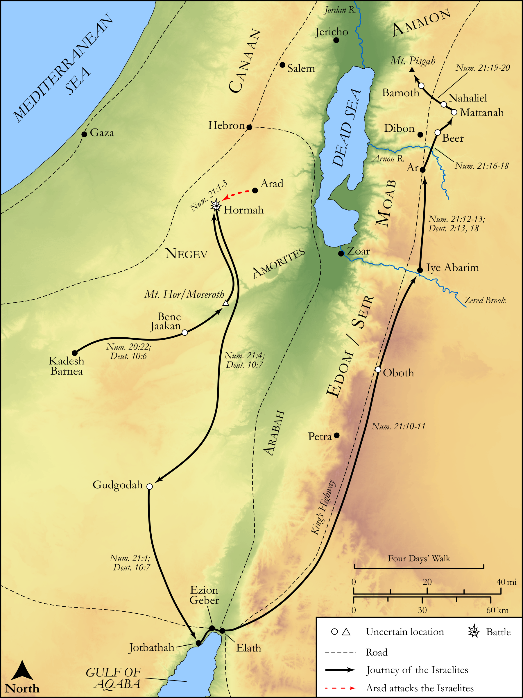

# Biblica Open Bible Maps

## License Information

Biblica Open Bible Maps, © 2023–2025 Biblica, Inc. This work is licensed under Creative Commons Attribution-ShareAlike 4.0 International (https://creativecommons.org/licenses/by-sa/4.0/). More Information: https://docs.google.com/document/d/1Pp44yZ0Zdnd59vJHTrt2rPYq0SppfX5rZbPBt6mz37U/edit?tab=t.0#heading=h.oev9aj1ksvk2

--------------------------------

## Pentateuch: Wandering in the Wilderness (id: OT036)

### Image Content

[link](images/OT036.png)

Original: [Pentateuch: Wandering in the Wilderness](https://drive.google.com/open?id=1mjdccnErbUUd2XNfT7z5BJ5hwNeeJwDe&usp=drive_copy)

* **Associated Passages:** Numbers 20:1-21:35; Deuteronomy 2:1-37

* **Associated ACAI Concepts:** LORD (ID: `deity:Lord`); Israel (ID: `person:Israel`); Moses (ID: `person:Moses`); Sihon (ID: `person:Sihon`); Edom (ID: `place:Edom`); Moab (ID: `place:Moab`); Aaron (ID: `person:Aaron`); Heshbon (ID: `place:Heshbon`); Amorites (ID: `group:Amorites`); Dispossess (ID: `keyterm:Dispossess`); Arnon (ID: `place:Arnon`); Edomites (ID: `group:Edom`); Kadesh-barnea (ID: `place:Kadesh-barnea`); Ar (ID: `place:Ar`); Seir (ID: `place:Seir`); Mount Hor (ID: `place:HorMount`); Ammon (ID: `place:Ammon`); Egypt (ID: `place:Egypt`); To Cause to Possess (ID: `keyterm:Possess`); An Angel (ID: `deity:Angel`); Valley of Zered (ID: `place:Zered`); Eleazar (ID: `person:Eleazar.2`); Set Apart for Destruction (ID: `keyterm:Proscribe.2`); Complete (ID: `keyterm:Complete`); Fear (ID: `keyterm:Fear`); Anakim (ID: `group:Anak`); Anak (ID: `person:Anak`); Rod (ID: `realia:Rod`); Oboth (ID: `place:Oboth`); Messengers (ID: `group:Messengers`)
