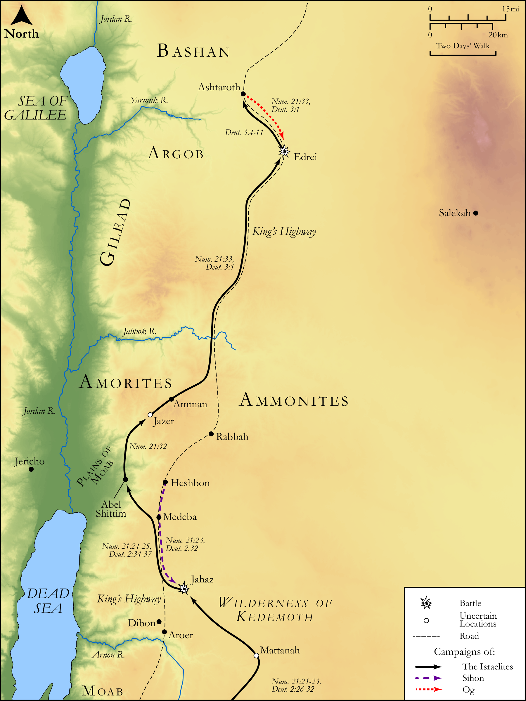

# Biblica Open Bible Maps

## License Information

Biblica Open Bible Maps, © 2023–2025 Biblica, Inc. This work is licensed under Creative Commons Attribution-ShareAlike 4.0 International (<a href="https://creativecommons.org/licenses/by-sa/4.0/">https://creativecommons.org/licenses/by-sa/4.0/</a>). More Information: <a href="https://docs.google.com/document/d/1Pp44yZ0Zdnd59vJHTrt2rPYq0SppfX5rZbPBt6mz37U/edit?tab=t.0#heading=h.oev9aj1ksvk2">https://docs.google.com/document/d/1Pp44yZ0Zdnd59vJHTrt2rPYq0SppfX5rZbPBt6mz37U/edit?tab=t.0#heading=h.oev9aj1ksvk2</a>

--------------------------------

## Pentateuch: The Defeat of Sihon and Og (id: OT037)

### Image Content

[link](images/OT037.png)

Original: [Pentateuch: The Defeat of Sihon and Og](https://drive.google.com/open?id=11xZxl67VA0M5ah1MxJECKUqsoaKGSQ4K&usp=drive_copy)

* **Associated Passages:** Numbers 21:1-35

* **Associated ACAI Concepts:** Israel (ID: `person:Israel`); LORD (ID: `deity:Lord`); Amorites (ID: `group:Amorites`); Sihon (ID: `person:Sihon`); Moses (ID: `person:Moses`); Moab (ID: `place:Moab`); Heshbon (ID: `place:Heshbon`); Arnon (ID: `place:Arnon`); Dispossess (ID: `keyterm:Dispossess`); Mattanah (ID: `place:Mattanah`); Oboth (ID: `place:Oboth`); Bamoth (ID: `place:Bamoth`); Snake (ID: `fauna:Snake`); Set Apart for Destruction (ID: `keyterm:Proscribe.2`); Canaan (ID: `place:Canaan`); Canaanites (ID: `group:Canaan`); Ar (ID: `place:Ar`); Viper (ID: `fauna:Viper`); Beer (ID: `place:Beer`); Woe (ID: `keyterm:Woe`); Waheb (ID: `place:Waheb`); Atharim (ID: `place:Atharim`); Suphah (ID: `place:Suphah`); Edrei (ID: `place:Edrei`); Jahaz (ID: `place:Jahaz`); Dibon (ID: `place:Dibon`); Chemosh (ID: `deity:Chemosh`); Og (ID: `person:Og`); Medeba (ID: `place:Medeba`); Jazer (ID: `place:Jazer`); Ammonites (ID: `group:Ammon`); King’s Highway (ID: `place:KingsHighway`); Valley of Zered (ID: `place:Zered`); Iye-abarim (ID: `place:Iye-abarim`); Negev (ID: `place:Negeb`); Bashan (ID: `place:Bashan`); Standard (ID: `realia:Standard`); Pisgah (ID: `place:Pisgah`); Vow (ID: `keyterm:Vow`); Zephath (ID: `place:Zephath`); Red Sea (ID: `place:RedSea`); Edom (ID: `place:Edom`); Jabbok (ID: `place:Jabbok`); Egypt (ID: `place:Egypt`); An Angel (ID: `deity:Angel`); Ammon (ID: `place:Ammon`); Fear (ID: `keyterm:Fear`); Mount Hor (ID: `place:HorMount`); Kenath (ID: `place:Kenath`); A Group of People (ID: `group:GenericGroup`); Arad (ID: `place:Arad`); To Sin (ID: `keyterm:Sin`); Bamoth-baal (ID: `place:Bamoth-baal`); Lasha (ID: `place:Lasha`); Sword (ID: `realia:Sword`); Staff (ID: `realia:Staff`); Vine (ID: `flora:Vine`); Rod (ID: `realia:Rod`); Cattails (ID: `flora:Cattails`)
