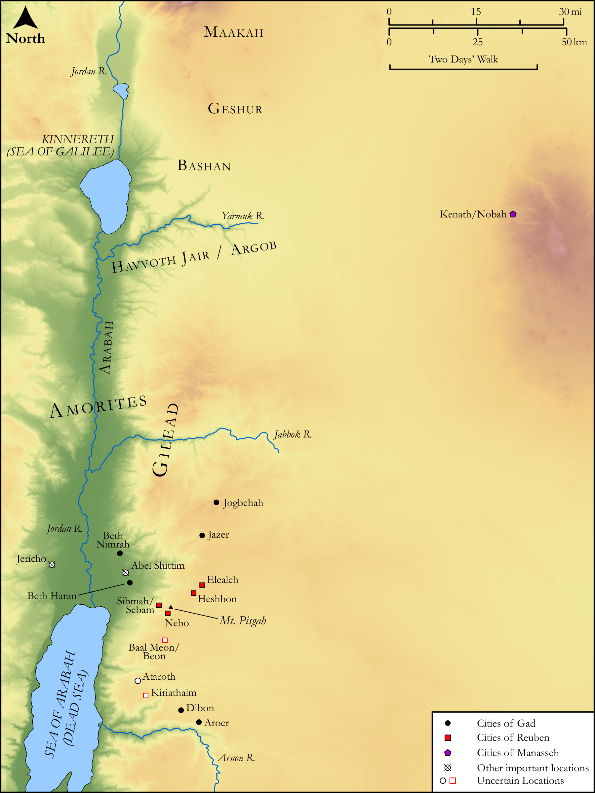

# Biblica Open Bible Maps

## License Information

Biblica Open Bible Maps, © 2023–2025 Biblica, Inc. This work is licensed under Creative Commons Attribution-ShareAlike 4.0 International (https://creativecommons.org/licenses/by-sa/4.0/). More Information: https://docs.google.com/document/d/1Pp44yZ0Zdnd59vJHTrt2rPYq0SppfX5rZbPBt6mz37U/edit?tab=t.0#heading=h.oev9aj1ksvk2

--------------------------------

## Pentateuch: Settlements of the Reubenites and Gadites (id: OT040)

### Image Content

[link](images/OT040.png)

Original: [Pentateuch: Settlements of the Reubenites and Gadites](https://drive.google.com/open?id=1SAwd5F9zAz0zq5BujTNvsIagX0j9QOO2&usp=drive_copy)

* **Associated Passages:** Numbers 32:1-42; Deuteronomy 3:1-29

* **Associated ACAI Concepts:** LORD (ID: `deity:Lord`); Israel (ID: `person:Israel`); Gad (ID: `person:Gad`); Jordan River (ID: `place:Jordan`); Gilead (ID: `place:Gilead`); Tribe of Reuben (ID: `group:Reuben`); Reuben (ID: `person:Reuben`); Moses (ID: `person:Moses`); Bashan (ID: `place:Bashan`); Og (ID: `person:Og`); Tribe of Manasseh (ID: `group:Manasseh`); Manasseh (ID: `person:Manasseh`); Dispossess (ID: `keyterm:Dispossess`); Amorites (ID: `group:Amorites`); Heshbon (ID: `place:Heshbon`); To Cause to Possess (ID: `keyterm:Possess`); Joshua (ID: `person:Joshua.2`); Machir (ID: `person:Machir`); Argob (ID: `place:Argob`); Arnon (ID: `place:Arnon`); Sihon (ID: `person:Sihon`); Jazer (ID: `place:Jazer`); Beth-nimrah (ID: `place:Beth-nimrah`); Jair (ID: `person:Jair.2`); Mount Hermon (ID: `place:HermonMount`); Baal-meon (ID: `place:Baal-meon`); Ataroth (ID: `place:Ataroth`); Elealeh (ID: `place:Elealeh`); Pisgah (ID: `place:Pisgah`); Havvoth-jair (ID: `place:Havvoth-jair`)
