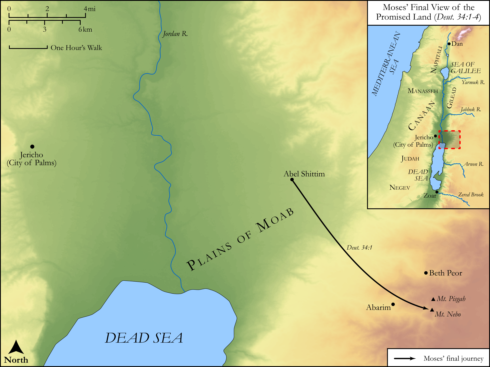

# Biblica Open Bible Maps

## License Information

Biblica Open Bible Maps, © 2023–2025 Biblica, Inc. This work is licensed under Creative Commons Attribution-ShareAlike 4.0 International (<a href="https://creativecommons.org/licenses/by-sa/4.0/">https://creativecommons.org/licenses/by-sa/4.0/</a>). More Information: <a href="https://docs.google.com/document/d/1Pp44yZ0Zdnd59vJHTrt2rPYq0SppfX5rZbPBt6mz37U/edit?tab=t.0#heading=h.oev9aj1ksvk2">https://docs.google.com/document/d/1Pp44yZ0Zdnd59vJHTrt2rPYq0SppfX5rZbPBt6mz37U/edit?tab=t.0#heading=h.oev9aj1ksvk2</a>

--------------------------------

## Pentateuch: Moses’ Death (id: OT042)

### Image Content

[link](images/OT042.png)

Original: [Pentateuch: Moses’ Death](https://drive.google.com/open?id=16M8QOiUqu80brQFNYxbNq355TGmBnAfZ&usp=drive_copy)

* **Associated Passages:** Deuteronomy 31:1-34:12

* **Associated ACAI Concepts:** LORD (ID: `deity:Lord`); Israel (ID: `person:Israel`); Moses (ID: `person:Moses`); Instruction (ID: `keyterm:Instruction`); Joshua (ID: `person:Joshua.2`); Bless (ID: `keyterm:Bless`); Covenant (ID: `keyterm:Covenant`); Fear (ID: `keyterm:Fear`); Swear (ID: `keyterm:Swear`); Complete (ID: `keyterm:Complete`); Dispossess (ID: `keyterm:Dispossess`); Vine (ID: `flora:Vine`); Jericho (ID: `place:Jericho`); Nun (ID: `person:Nun`); Covenant Box (ID: `keyterm:CovenantBox`); Tribe of Levi (ID: `group:Levi`); Jordan River (ID: `place:Jordan`); Perceive (ID: `keyterm:Perceive`); Levi (ID: `person:Levi.3`); Moab (ID: `place:Moab`); Mount Nebo (ID: `place:NeboMount`); Tribe of Dan (ID: `group:Dan`); Arrow (ID: `keyterm:Arrow`); Naphtali (ID: `person:Naphtali`); Be Zealous (ID: `keyterm:Zealous`); Tribe of Naphtali (ID: `group:Naphtali`); Judah (ID: `person:Judah.4`); Dan (ID: `place:Dan`); Manasseh (ID: `person:Manasseh`); Holy (ID: `keyterm:Holy`)
