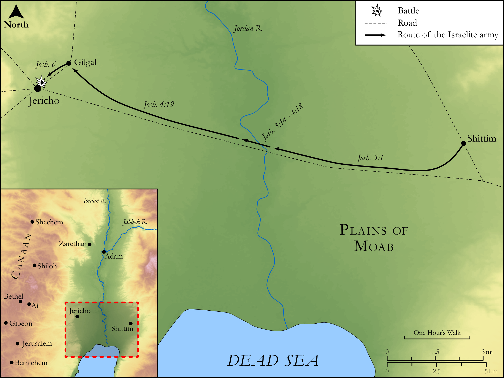

# Biblica Open Bible Maps

## License Information

Biblica Open Bible Maps, © 2023–2025 Biblica, Inc. This work is licensed under Creative Commons Attribution-ShareAlike 4.0 International (<a href="https://creativecommons.org/licenses/by-sa/4.0/">https://creativecommons.org/licenses/by-sa/4.0/</a>). More Information: <a href="https://docs.google.com/document/d/1Pp44yZ0Zdnd59vJHTrt2rPYq0SppfX5rZbPBt6mz37U/edit?tab=t.0#heading=h.oev9aj1ksvk2">https://docs.google.com/document/d/1Pp44yZ0Zdnd59vJHTrt2rPYq0SppfX5rZbPBt6mz37U/edit?tab=t.0#heading=h.oev9aj1ksvk2</a>

--------------------------------

## Historical: Crossing the Jordan and the Fall of Jericho (id: OT044)

### Image Content

[link](images/OT044.png)

Original: [Historical: Crossing the Jordan and the Fall of Jericho](https://drive.google.com/open?id=1m4NRQqVi2QWMurODMIf0X5IUWwfNDFOL&usp=drive_copy)

* **Associated Passages:** Joshua 3:1-6:27

* **Associated ACAI Concepts:** LORD (ID: `deity:Lord`); Joshua (ID: `person:Joshua.2`); Covenant Box (ID: `keyterm:CovenantBox`); Israel (ID: `person:Israel`); Jordan River (ID: `place:Jordan`); Ark of the Covenant (ID: `realia:ArkOfTheCovenant`); Covenant (ID: `keyterm:Covenant`); Jericho (ID: `place:Jericho`); Complete (ID: `keyterm:Complete`); Circumcision (ID: `keyterm:Circumcision`); Gilgal (ID: `place:Gilgal.2`); Rams Horn (ID: `realia:RamsHorn`); Moses (ID: `person:Moses`); Egypt (ID: `place:Egypt`); Rahab (ID: `person:Rahab`); Canaan (ID: `place:Canaan`); Swear (ID: `keyterm:Swear`); Canaanites (ID: `group:Canaan`); Something Devoted to God (ID: `keyterm:SomethingDevotedToGod`); Amorites (ID: `group:Amorites`); An Angel (ID: `deity:Angel`); Fear (ID: `keyterm:Fear`); Passover (ID: `keyterm:Passover`); House (ID: `realia:House`); Uncircumcised Person (ID: `keyterm:UncircumcisedPerson`); Set Apart for God (ID: `keyterm:Proscribe`); Set Apart for Destruction (ID: `keyterm:Proscribe.2`); Foreskin (ID: `keyterm:Foreskin`); Adam (ID: `place:Adam`); Zarethan (ID: `place:Zarethan`)
