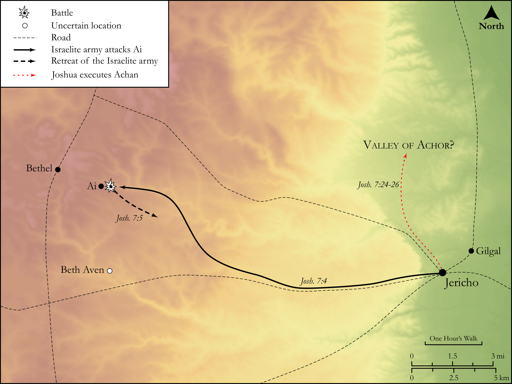

# Biblica Open Bible Maps

## License Information

Biblica Open Bible Maps, © 2023–2025 Biblica, Inc. This work is licensed under Creative Commons Attribution-ShareAlike 4.0 International (https://creativecommons.org/licenses/by-sa/4.0/). More Information: https://docs.google.com/document/d/1Pp44yZ0Zdnd59vJHTrt2rPYq0SppfX5rZbPBt6mz37U/edit?tab=t.0#heading=h.oev9aj1ksvk2

--------------------------------

## Historical: Achan’s Sin (id: OT045)

### Image Content

[link](images/OT045.png)

Original: [Historical: Achan’s Sin](https://drive.google.com/open?id=1jVOetMlQdDlQppTeWZoxreKc7IlQv0sJ&usp=drive_copy)

* **Associated Passages:** Joshua 7:1-26

* **Associated ACAI Concepts:** LORD (ID: `deity:Lord`); Israel (ID: `person:Israel`); Joshua (ID: `person:Joshua.2`); Achan (ID: `person:Achan`); Something Devoted to God (ID: `keyterm:SomethingDevotedToGod`); Ai (ID: `place:Ai`); Judah (ID: `person:Judah.4`); Tribe of Judah (ID: `group:Judah`); Zabdi (ID: `person:Zabdi`); Tent (ID: `realia:Tent`); Zerah (ID: `person:Zerah.3`); Carmi (ID: `person:Carmi.3`); Valley of Achor (ID: `place:AchorValley`); Money (ID: `realia:Money`); Covenant (ID: `keyterm:Covenant`); To Sin (ID: `keyterm:Sin`); Clothing (ID: `realia:Clothing`); Zerahites (ID: `group:Zerah`); Shebarim (ID: `place:Shebarim`); Beth-aven (ID: `place:Beth-aven`); Canaan (ID: `place:Canaan`); Jericho (ID: `place:Jericho`); Jordan River (ID: `place:Jordan`); Shinar (ID: `place:Shinar`); An Angel (ID: `deity:Angel`); Praise (ID: `keyterm:Praise`); Glory (ID: `keyterm:Glory`); Foolish (ID: `keyterm:Foolish`); Canaanites (ID: `group:Canaan`); Be Unfaithful (ID: `keyterm:Unfaithful`); Bethel (ID: `place:Bethel`); Holy (ID: `keyterm:Holy`); Amorites (ID: `group:Amorites`); Zerah (ID: `person:Zerah.6`); Covenant Box (ID: `keyterm:CovenantBox`); Shekel (ID: `realia:Shekel`); Flock (ID: `fauna:Flock`); Donkey (ID: `fauna:Donkey`); Goat (ID: `fauna:Goat`); Cattle (ID: `fauna:Bull`); Ark of the Covenant (ID: `realia:ArkOfTheCovenant`)
