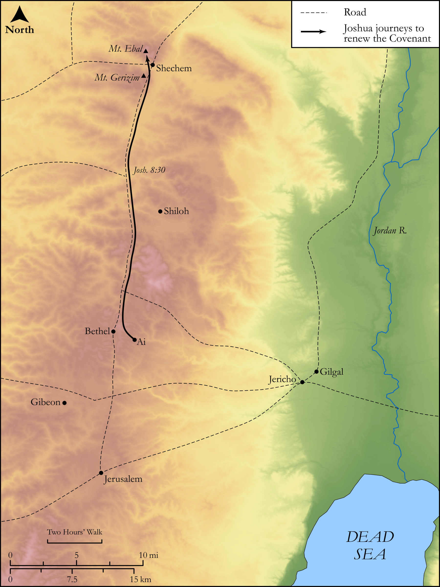

# Biblica Open Bible Maps

## License Information

Biblica Open Bible Maps, © 2023–2025 Biblica, Inc. This work is licensed under Creative Commons Attribution-ShareAlike 4.0 International (<a href="https://creativecommons.org/licenses/by-sa/4.0/">https://creativecommons.org/licenses/by-sa/4.0/</a>). More Information: <a href="https://docs.google.com/document/d/1Pp44yZ0Zdnd59vJHTrt2rPYq0SppfX5rZbPBt6mz37U/edit?tab=t.0#heading=h.oev9aj1ksvk2">https://docs.google.com/document/d/1Pp44yZ0Zdnd59vJHTrt2rPYq0SppfX5rZbPBt6mz37U/edit?tab=t.0#heading=h.oev9aj1ksvk2</a>

--------------------------------

## Historical: The Covenant Renewed (id: OT047)

### Image Content

[link](images/OT047.png)

Original: [Historical: The Covenant Renewed](https://drive.google.com/open?id=1Ghu1Schdj6xhq76H0MB78rBPuyyGGuAB&usp=drive_copy)

* **Associated Passages:** Joshua 8:1-35

* **Associated ACAI Concepts:** Ai (ID: `place:Ai`); Joshua (ID: `person:Joshua.2`); Israel (ID: `person:Israel`); LORD (ID: `deity:Lord`); Moses (ID: `person:Moses`); Bethel (ID: `place:Bethel`); Instruction (ID: `keyterm:Instruction`); Mount Ebal (ID: `place:EbalMount`); Bless (ID: `keyterm:Bless`); Word of the Lord (ID: `keyterm:WordOfTheLord`); Javelin (ID: `realia:Javelin`); Mount Gerizim (ID: `place:GerizimMount`); Altar (ID: `realia:Altar`); Stone Altar (ID: `realia:StoneAltar`); Temple Altar (ID: `realia:TempleAltar`); Tabernacle Altar (ID: `realia:TabernacleAltar`); Cattle (ID: `fauna:Bull`); Scroll (ID: `realia:Scroll`); Arabah (ID: `place:Arabah`); Set Apart for Destruction (ID: `keyterm:Proscribe.2`); Dispossess (ID: `keyterm:Dispossess`); Offering (ID: `keyterm:Offering`); Covenant (ID: `keyterm:Covenant`); Fear (ID: `keyterm:Fear`); Covenant Box (ID: `keyterm:CovenantBox`); Jericho (ID: `place:Jericho`); Complete (ID: `keyterm:Complete`); Tribe of Levi (ID: `group:Levi`); Levi (ID: `person:Levi.3`); Sword (ID: `realia:Sword`); Ark of the Covenant (ID: `realia:ArkOfTheCovenant`)
