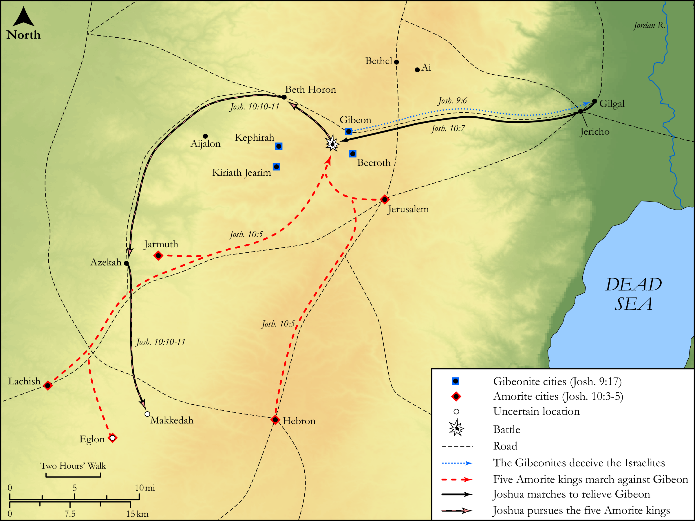

# Biblica Open Bible Maps

## License Information

Biblica Open Bible Maps, © 2023–2025 Biblica, Inc. This work is licensed under Creative Commons Attribution-ShareAlike 4.0 International (https://creativecommons.org/licenses/by-sa/4.0/). More Information: https://docs.google.com/document/d/1Pp44yZ0Zdnd59vJHTrt2rPYq0SppfX5rZbPBt6mz37U/edit?tab=t.0#heading=h.oev9aj1ksvk2

--------------------------------

## Historical: Victory at Gibeon and the Death of the Five Kings (id: OT048)

### Image Content

[link](images/OT048.png)

Original: [Historical: Victory at Gibeon and the Death of the Five Kings](https://drive.google.com/open?id=1m_OC7TlFJGLELIY30gzGWE2UCgnkp2vi&usp=drive_copy)

* **Associated Passages:** Joshua 9:1-10:43

* **Associated ACAI Concepts:** Joshua (ID: `person:Joshua.2`); Israel (ID: `person:Israel`); LORD (ID: `deity:Lord`); Gibeon (ID: `place:Gibeon`); Lachish (ID: `place:Lachish`); Makkedah (ID: `place:Makkedah`); Eglon (ID: `place:Eglon`); Set Apart for Destruction (ID: `keyterm:Proscribe.2`); Gilgal (ID: `place:Gilgal.2`); Covenant (ID: `keyterm:Covenant`); Hebron (ID: `place:Hebron`); Amorites (ID: `group:Amorites`); Sword (ID: `realia:Sword`); Libnah (ID: `place:Libnah.2`); Swear (ID: `keyterm:Swear`); Jericho (ID: `place:Jericho`); Jerusalem (ID: `place:Jerusalem`); Fear (ID: `keyterm:Fear`); Jarmuth (ID: `place:Jarmuth`); Ai (ID: `place:Ai`); Lower Beth-horon (ID: `place:Beth-horonLower`); Debir (ID: `place:Debir`); Adoni-zedek (ID: `person:Adoni-zedek`); Azekah (ID: `place:Azekah`); Jordan River (ID: `place:Jordan`); Hivites (ID: `group:Hivites`); Peace (ID: `keyterm:IntactState`); Complete (ID: `keyterm:Complete`); Shephelah (ID: `place:Shephelah`); Horam (ID: `person:Horam`)
