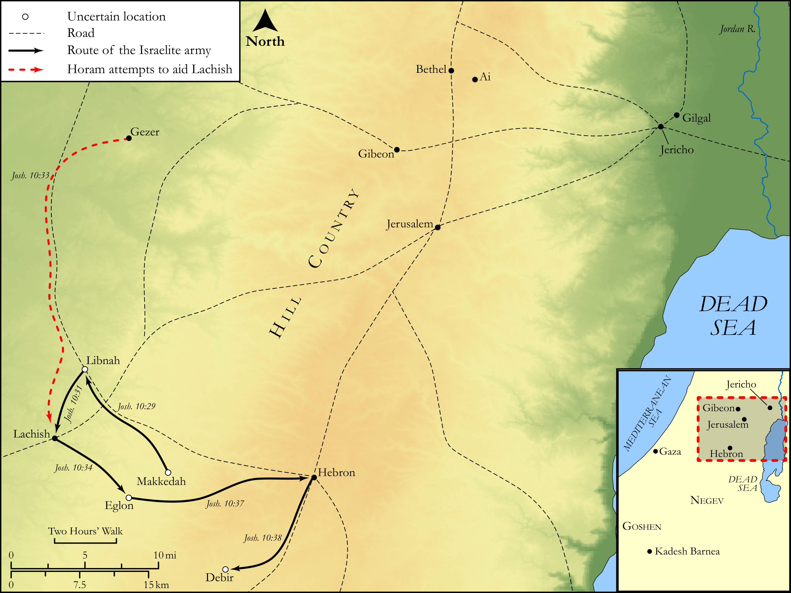

# Biblica Open Bible Maps

## License Information

Biblica Open Bible Maps, © 2023–2025 Biblica, Inc. This work is licensed under Creative Commons Attribution-ShareAlike 4.0 International (<a href="https://creativecommons.org/licenses/by-sa/4.0/">https://creativecommons.org/licenses/by-sa/4.0/</a>). More Information: <a href="https://docs.google.com/document/d/1Pp44yZ0Zdnd59vJHTrt2rPYq0SppfX5rZbPBt6mz37U/edit?tab=t.0#heading=h.oev9aj1ksvk2">https://docs.google.com/document/d/1Pp44yZ0Zdnd59vJHTrt2rPYq0SppfX5rZbPBt6mz37U/edit?tab=t.0#heading=h.oev9aj1ksvk2</a>

--------------------------------

## Historical: Joshua's Conquests in the South (id: OT049)

### Image Content

[link](images/OT049.png)

Original: [Historical: Joshua's Conquests in the South](https://drive.google.com/open?id=13WE066AOpp_b0yL0NzZhd1FfWBBeuV7o&usp=drive_copy)

* **Associated Passages:** Joshua 10:1-43

* **Associated ACAI Concepts:** Joshua (ID: `person:Joshua.2`); Israel (ID: `person:Israel`); LORD (ID: `deity:Lord`); Gibeon (ID: `place:Gibeon`); Lachish (ID: `place:Lachish`); Makkedah (ID: `place:Makkedah`); Eglon (ID: `place:Eglon`); Set Apart for Destruction (ID: `keyterm:Proscribe.2`); Hebron (ID: `place:Hebron`); Gilgal (ID: `place:Gilgal.2`); Sword (ID: `realia:Sword`); Libnah (ID: `place:Libnah.2`); Jerusalem (ID: `place:Jerusalem`); Jarmuth (ID: `place:Jarmuth`); Amorites (ID: `group:Amorites`); Fear (ID: `keyterm:Fear`); Jericho (ID: `place:Jericho`); Lower Beth-horon (ID: `place:Beth-horonLower`); Debir (ID: `place:Debir`); Adoni-zedek (ID: `person:Adoni-zedek`); Azekah (ID: `place:Azekah`); Ai (ID: `place:Ai`); Complete (ID: `keyterm:Complete`); Debir (ID: `person:Debir`); Piram (ID: `person:Piram`); Gezer (ID: `place:Gezer`); Gaza (ID: `place:Gaza`); Horam (ID: `person:Horam`); Hoham (ID: `person:Hoham`); Negev (ID: `place:Negeb`); Jashar (ID: `person:Jashar`); Japhia (ID: `person:Japhia`); Goshen (ID: `place:Goshen.2`); Appoint (ID: `keyterm:Appoint`); Kadesh-barnea (ID: `place:Kadesh-barnea`); Aijalon (ID: `place:Aijalon`); Shephelah (ID: `place:Shephelah`); Peace (ID: `keyterm:IntactState`)
