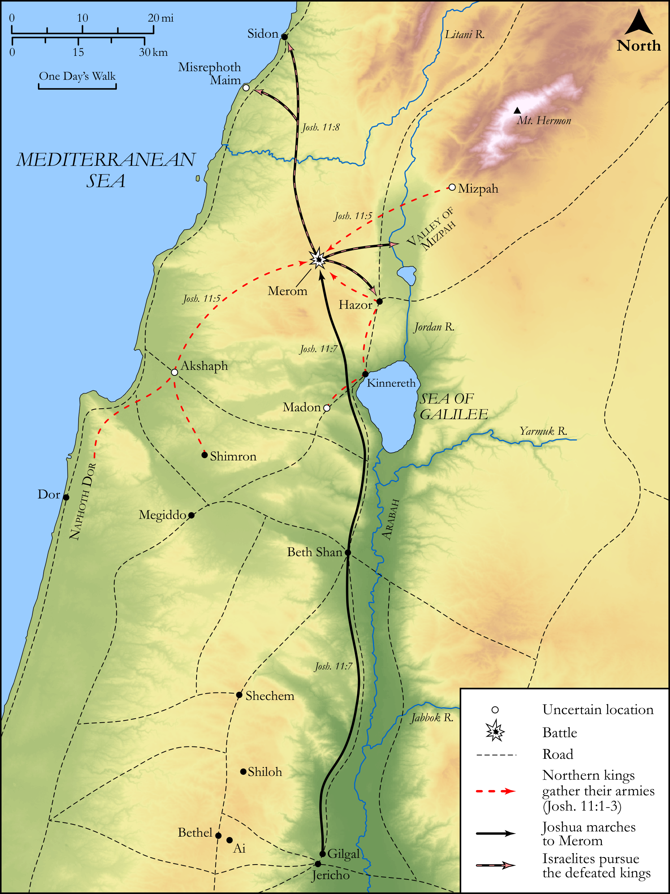

# Biblica Open Bible Maps

## License Information

Biblica Open Bible Maps, © 2023–2025 Biblica, Inc. This work is licensed under Creative Commons Attribution-ShareAlike 4.0 International (https://creativecommons.org/licenses/by-sa/4.0/). More Information: https://docs.google.com/document/d/1Pp44yZ0Zdnd59vJHTrt2rPYq0SppfX5rZbPBt6mz37U/edit?tab=t.0#heading=h.oev9aj1ksvk2

--------------------------------

## Historical: Joshua's Conquests in the North (id: OT050)

### Image Content

[link](images/OT050.png)

Original: [Historical: Joshua's Conquests in the North](https://drive.google.com/open?id=1dE7PuUz_YStTP9gYkFkCsYHfAcLAgoJV&usp=drive_copy)

* **Associated Passages:** Joshua 11:1-23

* **Associated ACAI Concepts:** Israel (ID: `person:Israel`); Joshua (ID: `person:Joshua.2`); LORD (ID: `deity:Lord`); Hazor (ID: `place:Hazor`); Set Apart for Destruction (ID: `keyterm:Proscribe.2`); Moses (ID: `person:Moses`); Sword (ID: `realia:Sword`); Waters of Merom (ID: `place:Merom`); Valley of Mizpeh (ID: `place:MizpehValley`); Chariot (ID: `realia:Chariot`); Horse (ID: `fauna:Horse`); Mount Hermon (ID: `place:HermonMount`); Arabah (ID: `place:Arabah`); Hivites (ID: `group:Hivites`); Anakim (ID: `group:Anak`); Shephelah (ID: `place:Shephelah`); Anak (ID: `person:Anak`); Madon (ID: `place:Madon`); Dor (ID: `place:Dor`); Jobab (ID: `person:Jobab.3`); Achshaph (ID: `place:Achshaph`); Shimron (ID: `place:Shimron`); Valley of Lebanon (ID: `place:LebanonValley`); Mount Halak (ID: `place:HalakMount`); To Cause to Possess (ID: `keyterm:Possess`); Misrephoth-maim (ID: `place:Misrephoth-maim`); Anab (ID: `place:Anab`); Jabin (ID: `person:Jabin`); Goshen (ID: `place:Goshen.2`); Canaan (ID: `place:Canaan`); Hebron (ID: `place:Hebron`); Seir (ID: `place:Seir`); Gath (ID: `place:Gath`); Ashdod (ID: `place:Ashdod`); Tribe of Judah (ID: `group:Judah`); Hittites (ID: `group:Hittite`); Judah (ID: `person:Judah.4`); Canaanites (ID: `group:Canaan`); Amorites (ID: `group:Amorites`); Sidon (ID: `place:Sidon`); Gibeon (ID: `place:Gibeon`); Negev (ID: `place:Negeb`); Heth (ID: `person:Heth`); Gaza (ID: `place:Gaza`); Debir (ID: `place:Debir`); Chinnereth (ID: `place:Chinnereth`); Fear (ID: `keyterm:Fear`); Plea for Mercy (ID: `keyterm:Supplication`); Jebusites (ID: `group:Jebusites`); Perizzites (ID: `group:Perizzites`); Cattle (ID: `fauna:Bull`)
