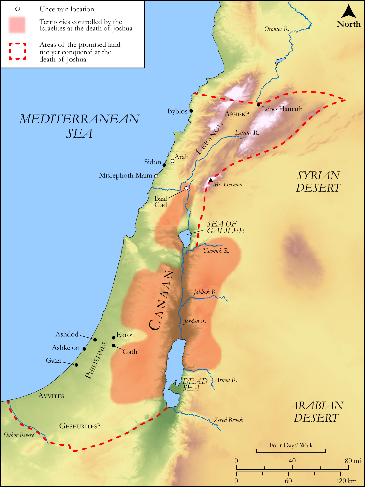

# Biblica Open Bible Maps

## License Information

Biblica Open Bible Maps, © 2023–2025 Biblica, Inc. This work is licensed under Creative Commons Attribution-ShareAlike 4.0 International (<a href="https://creativecommons.org/licenses/by-sa/4.0/">https://creativecommons.org/licenses/by-sa/4.0/</a>). More Information: <a href="https://docs.google.com/document/d/1Pp44yZ0Zdnd59vJHTrt2rPYq0SppfX5rZbPBt6mz37U/edit?tab=t.0#heading=h.oev9aj1ksvk2">https://docs.google.com/document/d/1Pp44yZ0Zdnd59vJHTrt2rPYq0SppfX5rZbPBt6mz37U/edit?tab=t.0#heading=h.oev9aj1ksvk2</a>

--------------------------------

## Historical: Lands Still to Be Conquered (id: OT052)

### Image Content

[link](images/OT052.png)

Original: [Historical: Lands Still to Be Conquered](https://drive.google.com/open?id=1rgTkh-2lzZFB_U9POyO6qfBtIc_v9La3&usp=drive_copy)

* **Associated Passages:** Joshua 13:1-33

* **Associated ACAI Concepts:** Moses (ID: `person:Moses`); To Cause to Possess (ID: `keyterm:Possess`); Heshbon (ID: `place:Heshbon`); Israel (ID: `person:Israel`); LORD (ID: `deity:Lord`); Jordan River (ID: `place:Jordan`); Dispossess (ID: `keyterm:Dispossess`); Bashan (ID: `place:Bashan`); Og (ID: `person:Og`); Geshurites (ID: `group:Geshur`); Tribe of Reuben (ID: `group:Reuben`); Sihon (ID: `person:Sihon`); Manasseh (ID: `person:Manasseh`); Amorites (ID: `group:Amorites`); Geshur (ID: `place:Geshur`); Gad (ID: `person:Gad`); Gilead (ID: `place:Gilead`); Reuben (ID: `person:Reuben`); Tribe of Manasseh (ID: `group:Manasseh`); Lebanon (ID: `place:Lebanon`); Edrei (ID: `place:Edrei`); Maacathites (ID: `group:Maacah`); Medeba (ID: `place:Medeba`); Maacah (ID: `place:Maacah`); Canaan (ID: `place:Canaan`); Dibon (ID: `place:Dibon`); Aroer (ID: `place:Aroer.2`); Ammon (ID: `place:Ammon`); Sidon (ID: `place:Sidon`); Tribe of Levi (ID: `group:Levi`); Ashtaroth (ID: `place:Ashtaroth`); Mahanaim (ID: `place:Mahanaim`); Philistines (ID: `group:Philistine`); Ammonites (ID: `group:Ammon`); Mount Hermon (ID: `place:HermonMount`); Philistia (ID: `place:Philistine`); Sidonians (ID: `group:Sidon`); Levi (ID: `person:Levi.3`); Canaanites (ID: `group:Canaan`); Arnon (ID: `place:Arnon`); Aroer (ID: `place:Aroer`); Evi (ID: `person:Evi`); Rekem (ID: `person:Rekem`); Misrephoth-maim (ID: `place:Misrephoth-maim`); Ashdod (ID: `place:Ashdod`); Avvim (ID: `group:Avvim`); Havvoth-jair (ID: `place:Havvoth-jair`); Mearah (ID: `place:Mearah`); Gebalites (ID: `group:Gebal`); Succoth (ID: `place:Succoth`); Reba (ID: `person:Reba`); Jazer (ID: `place:Jazer`); Beor (ID: `person:Beor.2`); Beth-haram (ID: `place:Beth-haram`); Zaphon (ID: `place:Zaphon`); Hur (ID: `person:Hur.3`); Beth-peor (ID: `place:Beth-peor`); Zereth-shahar (ID: `place:Zereth-shahar`); Gebal (ID: `place:Gebal`); Beth-nimrah (ID: `place:Beth-nimrah`); Betonim (ID: `place:Betonim`); Ramath-mizpeh (ID: `place:Ramath-mizpeh`); Zur (ID: `person:Zur.2`); Bamoth-baal (ID: `place:Bamoth-baal`); Pisgah (ID: `place:Pisgah`); Ashkelon (ID: `place:Ashkelon`); Brook of Egypt (ID: `place:BrookOfEgypt`); Rephaim (ID: `group:Rephaim`); Mephaath (ID: `place:Mephaath`); Lo-debar (ID: `place:Lo-debar`); Offering (ID: `keyterm:Offering`); Jahaz (ID: `place:Jahaz`); Jericho (ID: `place:Jericho`); Kedemoth (ID: `place:Kedemoth`); Sea of Galilee (ID: `place:GalileeSea`); Kiriathaim (ID: `place:Kiriathaim`); Aphek (ID: `place:Aphek.2`); Salecah (ID: `place:Salecah`); Ekron (ID: `place:Ekron`); Beth-jeshimoth (ID: `place:Beth-jeshimoth`); Egypt (ID: `place:Egypt`); Baal-meon (ID: `place:Baal-meon`); Joshua (ID: `person:Joshua.2`); Practice Divination (ID: `keyterm:PracticeDivination`); Midian (ID: `place:Midian`); Hamath (ID: `place:Hamath`); Sibmah (ID: `place:Sibmah`); Plains of Moab (ID: `place:MoabPlains`); Gaza (ID: `place:Gaza`); Gath (ID: `place:Gath`); Balaam (ID: `person:Balaam`); Machir (ID: `person:Machir`); Sword (ID: `realia:Sword`)
