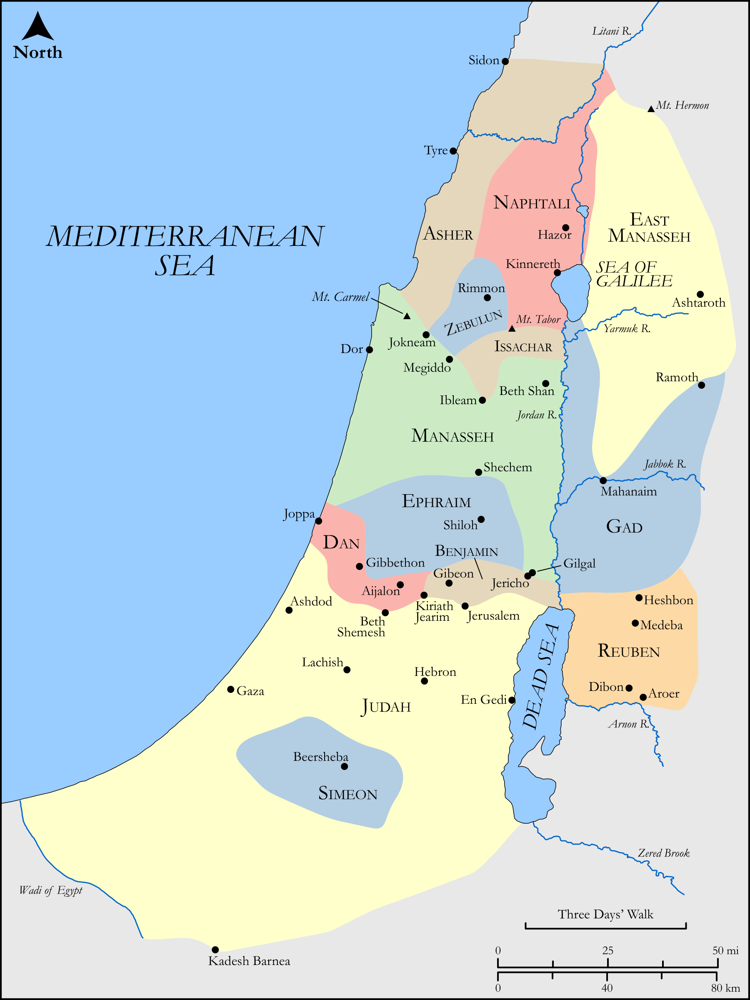

# Biblica Open Bible Maps

## License Information

Biblica Open Bible Maps, © 2023–2025 Biblica, Inc. This work is licensed under Creative Commons Attribution-ShareAlike 4.0 International (https://creativecommons.org/licenses/by-sa/4.0/). More Information: https://docs.google.com/document/d/1Pp44yZ0Zdnd59vJHTrt2rPYq0SppfX5rZbPBt6mz37U/edit?tab=t.0#heading=h.oev9aj1ksvk2

--------------------------------

## Historical: Canaan Overview (id: OT053)

### Image Content

[link](images/OT053.png)

Original: [Historical: Canaan Overview](https://drive.google.com/open?id=1ja4pdljw8je0BAXuYVG7XYxlPfKMrpzb&usp=drive_copy)

* **Associated Passages:** Joshua 13:1-21:45

* **Associated ACAI Concepts:** To Cause to Possess (ID: `keyterm:Possess`); LORD (ID: `deity:Lord`); Lot (ID: `keyterm:Lot`); Tribe of Manasseh (ID: `group:Manasseh`); Manasseh (ID: `person:Manasseh`); Israel (ID: `person:Israel`); Moses (ID: `person:Moses`); Judah (ID: `person:Judah.4`); Tribe of Judah (ID: `group:Judah`); Joshua (ID: `person:Joshua.2`); Jordan River (ID: `place:Jordan`); Tribe of Ephraim (ID: `group:Ephraim`); Ephraim (ID: `person:Ephraim`); Tribe of Levi (ID: `group:Levi`); Levi (ID: `person:Levi.3`); Dispossess (ID: `keyterm:Dispossess`); Joseph (ID: `person:Joseph.10`); Caleb (ID: `person:Caleb`); Tribe of Reuben (ID: `group:Reuben`); Bashan (ID: `place:Bashan`); Canaan (ID: `place:Canaan`); Reuben (ID: `person:Reuben`); Hebron (ID: `place:Hebron`); Gilead (ID: `place:Gilead`); Asher (ID: `person:Asher`); Tribe of Asher (ID: `group:Asher`); Kiriath-jearim (ID: `place:Kiriath-jearim`); Refuge (ID: `keyterm:Refuge`); Gad (ID: `person:Gad`); Canaanites (ID: `group:Canaan`)
