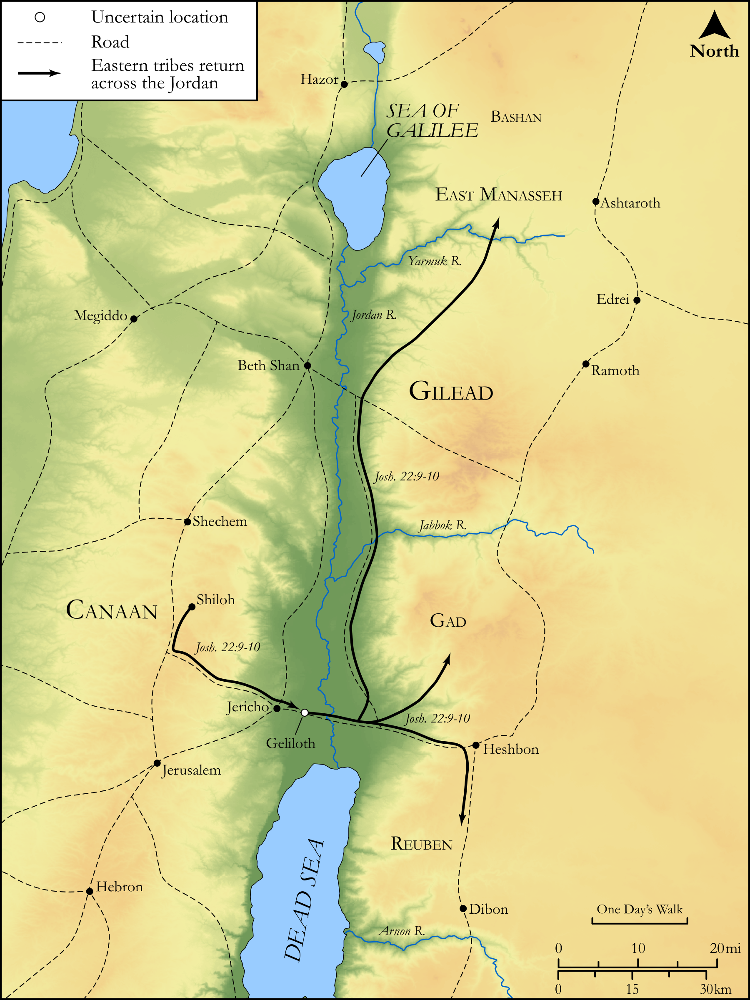

# Biblica Open Bible Maps

## License Information

Biblica Open Bible Maps, © 2023–2025 Biblica, Inc. This work is licensed under Creative Commons Attribution-ShareAlike 4.0 International (<a href="https://creativecommons.org/licenses/by-sa/4.0/">https://creativecommons.org/licenses/by-sa/4.0/</a>). More Information: <a href="https://docs.google.com/document/d/1Pp44yZ0Zdnd59vJHTrt2rPYq0SppfX5rZbPBt6mz37U/edit?tab=t.0#heading=h.oev9aj1ksvk2">https://docs.google.com/document/d/1Pp44yZ0Zdnd59vJHTrt2rPYq0SppfX5rZbPBt6mz37U/edit?tab=t.0#heading=h.oev9aj1ksvk2</a>

--------------------------------

## Historical: Tensions with the Eastern Tribes (id: OT059)

### Image Content

[link](images/OT059.png)

Original: [Historical: Tensions with the Eastern Tribes](https://drive.google.com/open?id=1tKExybTrFJkD0ilHfijN4SJBodNkGw46&usp=drive_copy)

* **Associated Passages:** Joshua 22:1-34

* **Associated ACAI Concepts:** LORD (ID: `deity:Lord`); Israel (ID: `person:Israel`); Tribe of Reuben (ID: `group:Reuben`); Gad (ID: `person:Gad`); Reuben (ID: `person:Reuben`); Tribe of Manasseh (ID: `group:Manasseh`); Manasseh (ID: `person:Manasseh`); Moses (ID: `person:Moses`); Offering (ID: `keyterm:Offering`); Jordan River (ID: `place:Jordan`); Rebel (ID: `keyterm:Rebel`); Slaughtering (ID: `keyterm:Slaughtering`); Altar (ID: `realia:Altar`); Stone Altar (ID: `realia:StoneAltar`); Temple Altar (ID: `realia:TempleAltar`); Tabernacle Altar (ID: `realia:TabernacleAltar`); Phinehas (ID: `person:Phinehas`); Canaan (ID: `place:Canaan`); Be Unfaithful (ID: `keyterm:Unfaithful`); Gilead (ID: `place:Gilead`); Bless (ID: `keyterm:Bless`); Eleazar (ID: `person:Eleazar.2`); Joshua (ID: `person:Joshua.2`); Force to Serve (ID: `keyterm:EnticedToServe`); Passion (ID: `keyterm:Ardour`); Shiloh (ID: `place:Shiloh`); The Way (ID: `keyterm:TheWay`); Zerah (ID: `person:Zerah.3`); Baal-peor (ID: `place:Peor`); Bashan (ID: `place:Bashan`); Pure (ID: `keyterm:Pure`); Defilement (ID: `keyterm:Defilement`); Fear (ID: `keyterm:Fear`); Instruction (ID: `keyterm:Instruction`); Work (ID: `keyterm:Work`); Love (ID: `keyterm:Love`); Something Devoted to God (ID: `keyterm:SomethingDevotedToGod`); Achan (ID: `person:Achan`); Money (ID: `realia:Money`); Cloak (ID: `realia:Cloak`)
