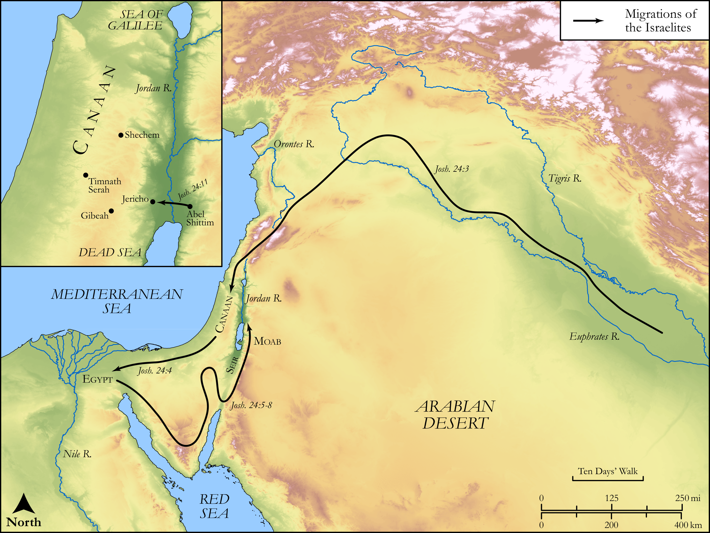

# Biblica Open Bible Maps

## License Information

Biblica Open Bible Maps, © 2023–2025 Biblica, Inc. This work is licensed under Creative Commons Attribution-ShareAlike 4.0 International (https://creativecommons.org/licenses/by-sa/4.0/). More Information: https://docs.google.com/document/d/1Pp44yZ0Zdnd59vJHTrt2rPYq0SppfX5rZbPBt6mz37U/edit?tab=t.0#heading=h.oev9aj1ksvk2

--------------------------------

## Historical: Joshua Recounts the History of Israel (id: OT060)

### Image Content

[link](images/OT060.png)

Original: [Historical: Joshua Recounts the History of Israel](https://drive.google.com/open?id=18ERn8-5JIOveYmgrAjJ88bxI9QaJ3_NY&usp=drive_copy)

* **Associated Passages:** Joshua 24:1-33

* **Associated ACAI Concepts:** LORD (ID: `deity:Lord`); Joshua (ID: `person:Joshua.2`); Force to Serve (ID: `keyterm:EnticedToServe`); Egypt (ID: `place:Egypt`); Israel (ID: `person:Israel`); Amorites (ID: `group:Amorites`); Euphrates River (ID: `place:Euphrates`); Shechem (ID: `place:Shechem`); To Cause to Possess (ID: `keyterm:Possess`); Dispossess (ID: `keyterm:Dispossess`); Canaan (ID: `place:Canaan`); Ephraim (ID: `person:Ephraim`); Egyptians (ID: `group:Egypt`); Abraham (ID: `person:Abraham`); Jordan River (ID: `place:Jordan`); Isaac (ID: `person:Isaac`); Tribe of Ephraim (ID: `group:Ephraim`); Balaam (ID: `person:Balaam`); Aaron (ID: `person:Aaron`); Hivites (ID: `group:Hivites`); Timnath-heres (ID: `place:Timnath-heres`); Terah (ID: `person:Terah`); Nun (ID: `person:Nun`); Nahor (ID: `person:Nahor`); Gaash (ID: `place:Gaash`); Gibeah (ID: `place:Gibeah.2`); Zippor (ID: `person:Zippor`); Balak (ID: `person:Balak`); Bless (ID: `keyterm:Bless`); Jericho (ID: `place:Jericho`); Eleazar (ID: `person:Eleazar.2`); Moses (ID: `person:Moses`); Perizzites (ID: `group:Perizzites`); Truth (ID: `keyterm:Truth`); To Sin (ID: `keyterm:Sin`); Edom (ID: `place:Edom`); Edomites (ID: `group:Edom`); Miraculous Sign (ID: `keyterm:MiraculousSign`); Joseph (ID: `person:Joseph.10`); Jebusites (ID: `group:Jebusites`); Red Sea (ID: `place:RedSea`); Complete (ID: `keyterm:Complete`); Hittites (ID: `group:Hittite`); Covenant (ID: `keyterm:Covenant`); Canaanites (ID: `group:Canaan`); Instruction (ID: `keyterm:Instruction`); Beor (ID: `person:Beor.2`); Fear (ID: `keyterm:Fear`); Forgive (ID: `keyterm:Forgive`); Decree (ID: `keyterm:Decree`); Zealous (ID: `keyterm:Zealous.3`); Rebel (ID: `keyterm:Rebel`); Esau (ID: `person:Esau`); Phinehas (ID: `person:Phinehas`); Moab (ID: `place:Moab`); Seir (ID: `place:Seir`); Holy (ID: `keyterm:Holy`); Hamor (ID: `person:Hamor`); Heth (ID: `person:Heth`); Girgashites (ID: `group:Girgashites`); Piece of Money (ID: `realia:PieceOfMoney`); Bow (ID: `realia:Bow`); Terebinth (ID: `flora:Terebinth`); Scroll (ID: `realia:Scroll`); Vine (ID: `flora:Vine`); Cattails (ID: `flora:Cattails`); Olive Tree (ID: `flora:OliveTree`); Hornet (ID: `fauna:Hornet`); Chariot (ID: `realia:Chariot`); Sword (ID: `realia:Sword`)
