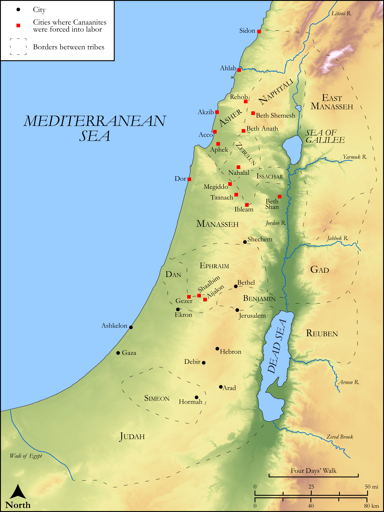

# Biblica Open Bible Maps

## License Information

Biblica Open Bible Maps, © 2023–2025 Biblica, Inc. This work is licensed under Creative Commons Attribution-ShareAlike 4.0 International (<a href="https://creativecommons.org/licenses/by-sa/4.0/">https://creativecommons.org/licenses/by-sa/4.0/</a>). More Information: <a href="https://docs.google.com/document/d/1Pp44yZ0Zdnd59vJHTrt2rPYq0SppfX5rZbPBt6mz37U/edit?tab=t.0#heading=h.oev9aj1ksvk2">https://docs.google.com/document/d/1Pp44yZ0Zdnd59vJHTrt2rPYq0SppfX5rZbPBt6mz37U/edit?tab=t.0#heading=h.oev9aj1ksvk2</a>

--------------------------------

## Historical: Israel Fights the Remaining Canaanites (id: OT061)

### Image Content

[link](images/OT061.png)

Original: [Historical: Israel Fights the Remaining Canaanites](https://drive.google.com/open?id=1u1OtUxqqgsL_Jq8H_XTweO5oct1Y4GNz&usp=drive_copy)

* **Associated Passages:** Judges 1:1-36

* **Associated ACAI Concepts:** Canaan (ID: `place:Canaan`); Canaanites (ID: `group:Canaan`); Judah (ID: `person:Judah.4`); Tribe of Judah (ID: `group:Judah`); Dispossess (ID: `keyterm:Dispossess`); LORD (ID: `deity:Lord`); Caleb (ID: `person:Caleb`); Adoni-bezek (ID: `person:Adoni-bezek`); Jerusalem (ID: `place:Jerusalem`); Joseph (ID: `person:Joseph.10`); Amorites (ID: `group:Amorites`); Negev (ID: `place:Negeb`); Achsah (ID: `person:Achsah`); Bezek (ID: `place:Bezek`); Tribe of Asher (ID: `group:Asher`); Moses (ID: `person:Moses`); Asher (ID: `person:Asher`); Simeon (ID: `person:Simeon.5`); Debir (ID: `place:Debir`); Bethel (ID: `place:Bethel`); Tribe of Simeon (ID: `group:Simeon`); Hebron (ID: `place:Hebron`); Perizzites (ID: `group:Perizzites`); Israel (ID: `person:Israel`); Dor (ID: `place:Dor`); Ashkelon (ID: `place:Ashkelon`); Ahiman (ID: `person:Ahiman`); Sela (ID: `place:Sela`); Beth-shemesh (ID: `place:Beth-shemesh.3`); Zephath (ID: `place:Zephath`); Nahalal (ID: `place:Nahalal`); Gezer (ID: `place:Gezer`); Megiddo (ID: `place:Megiddo`); Arad (ID: `place:Arad`); Kenaz (ID: `person:Kenaz.3`); Ahlab (ID: `place:Ahlab`); Shaalbim (ID: `place:Shaalbim`); Aphek (ID: `place:Aphek.2`); Ekron (ID: `place:Ekron`); Talmai (ID: `person:Talmai`); Ibleam (ID: `place:Ibleam`); Beth-anath (ID: `place:Beth-anath`); Helbah (ID: `place:Helbah`); Luz (ID: `place:Luz.2`); Acco (ID: `place:Acco`); Taanach (ID: `place:Taanach`); Sheshai (ID: `person:Sheshai`); Kenites (ID: `group:Kenite`); Beth-shan (ID: `place:Beth-shan`); Achzib (ID: `place:Achzib.2`); Gaza (ID: `place:Gaza`); Kitron (ID: `place:Kitron`); Sword (ID: `realia:Sword`); Hittites (ID: `group:Hittite`); Tribe of Benjamin (ID: `group:Benjamin`); Anak (ID: `person:Anak`); Heth (ID: `person:Heth`); Sidon (ID: `place:Sidon`); Tribe of Dan (ID: `group:Dan`); Benjamin (ID: `person:Benjamin`); Dan (ID: `place:Dan`); Manasseh (ID: `person:Manasseh`); Set Apart for Destruction (ID: `keyterm:Proscribe.2`); Tribe of Ephraim (ID: `group:Ephraim`); Tribe of Zebulun (ID: `group:Zebulun`); Naphtali (ID: `person:Naphtali`); Zebulun (ID: `person:Zebulun`); Shephelah (ID: `place:Shephelah`); Akrabbim (ID: `place:Akrabbim`); Othniel (ID: `person:Othniel`); Beth-shemesh (ID: `place:Beth-shemesh`); Aijalon (ID: `place:Aijalon`); Joshua (ID: `person:Joshua.2`); Ephraim (ID: `person:Ephraim`); Tribe of Naphtali (ID: `group:Naphtali`); Kindness (ID: `keyterm:Kindness`); Bless (ID: `keyterm:Bless`); Rehob (ID: `place:Rehob.3`); Lot (ID: `keyterm:Lot`); Tribe of Manasseh (ID: `group:Manasseh`); Jebusites (ID: `group:Jebusites`); Donkey (ID: `fauna:Donkey`); Chariot (ID: `realia:Chariot`); Scorpion (ID: `fauna:Scorpion`); Date Palm (ID: `flora:DatePalm`)
