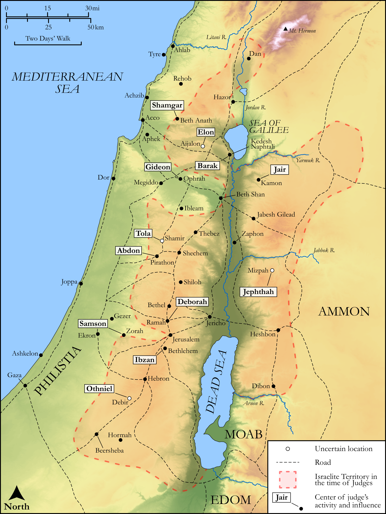

# Biblica Open Bible Maps

## License Information

Biblica Open Bible Maps, © 2023–2025 Biblica, Inc. This work is licensed under Creative Commons Attribution-ShareAlike 4.0 International (https://creativecommons.org/licenses/by-sa/4.0/). More Information: https://docs.google.com/document/d/1Pp44yZ0Zdnd59vJHTrt2rPYq0SppfX5rZbPBt6mz37U/edit?tab=t.0#heading=h.oev9aj1ksvk2

--------------------------------

## Historical: Judges and Enemies Overview (id: OT062)

### Image Content

[link](images/OT062.png)

Original: [Historical: Judges and Enemies Overview](https://drive.google.com/open?id=1860U73a7ha_rlCMjmU5VxQQ7LkvYLkSp&usp=drive_copy)

* **Associated Passages:** Judges 1:1-21:25

* **Associated ACAI Concepts:** LORD (ID: `deity:Lord`); Israel (ID: `person:Israel`); Gideon (ID: `person:Gideon`); Tribe of Benjamin (ID: `group:Benjamin`); Benjamin (ID: `person:Benjamin`); Abimelech (ID: `person:Abimelech.2`); Samson (ID: `person:Samson`); Philistia (ID: `place:Philistine`); Philistines (ID: `group:Philistine`); Midian (ID: `place:Midian`); Ammon (ID: `place:Ammon`); Ammonites (ID: `group:Ammon`); An Angel (ID: `deity:Angel`); Jephthah (ID: `person:Jephthah`); Gibeah (ID: `place:Gibeah.2`); Tribe of Ephraim (ID: `group:Ephraim`); Judah (ID: `person:Judah.4`); Shechem (ID: `place:Shechem`); Tribe of Judah (ID: `group:Judah`); Ephraim (ID: `person:Ephraim`); Canaan (ID: `place:Canaan`); Dispossess (ID: `keyterm:Dispossess`); Micah (ID: `person:Micah.3`); Gilead (ID: `place:Gilead`); Dan (ID: `place:Dan`); Sisera (ID: `person:Sisera`); Canaanites (ID: `group:Canaan`); Manoah (ID: `person:Manoah`); Tribe of Dan (ID: `group:Dan`); Force to Serve (ID: `keyterm:EnticedToServe`)
