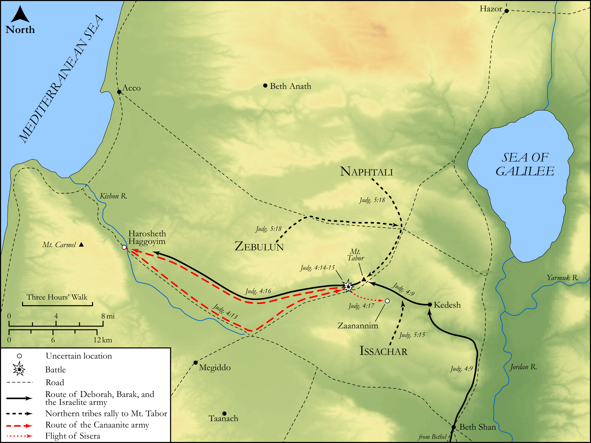

# Biblica Open Bible Maps

## License Information

Biblica Open Bible Maps, © 2023–2025 Biblica, Inc. This work is licensed under Creative Commons Attribution-ShareAlike 4.0 International (https://creativecommons.org/licenses/by-sa/4.0/). More Information: https://docs.google.com/document/d/1Pp44yZ0Zdnd59vJHTrt2rPYq0SppfX5rZbPBt6mz37U/edit?tab=t.0#heading=h.oev9aj1ksvk2

--------------------------------

## Historical: Deborah, Barak, and Sisera (id: OT064)

### Image Content

[link](images/OT064.png)

Original: [Historical: Deborah, Barak, and Sisera](https://drive.google.com/open?id=1XAhPtgNhc7pWCjyaaJ-zA9Fw6OOU1ozE&usp=drive_copy)

* **Associated Passages:** Judges 4:1-5:31

* **Associated ACAI Concepts:** LORD (ID: `deity:Lord`); Sisera (ID: `person:Sisera`); Israel (ID: `person:Israel`); Barak (ID: `person:Barak`); Deborah (ID: `person:Deborah.2`); Jael (ID: `person:Jael`); Jabin (ID: `person:Jabin.2`); Heber (ID: `person:Heber.2`); Abinoam (ID: `person:Abinoam`); Tent (ID: `realia:Tent`); Chariot (ID: `realia:Chariot`); Canaan (ID: `place:Canaan`); Tribe of Zebulun (ID: `group:Zebulun`); Kedesh (ID: `place:Kedesh`); Zebulun (ID: `person:Zebulun`); Harosheth-hagoyim (ID: `place:Harosheth-hagoyim`); Mount Tabor (ID: `place:TaborMount`); Kishon (ID: `place:Kishon`); Kenites (ID: `group:Kenite`); Tribe of Naphtali (ID: `group:Naphtali`); Naphtali (ID: `person:Naphtali`); Bless (ID: `keyterm:Bless`); Peg (ID: `realia:Peg.2`); Peg (ID: `realia:Peg`); Hazor (ID: `place:Hazor`); Tribe of Ephraim (ID: `group:Ephraim`); Tribe of Reuben (ID: `group:Reuben`); Ephraim (ID: `person:Ephraim`); Reuben (ID: `person:Reuben`); Meroz (ID: `place:Meroz`)
