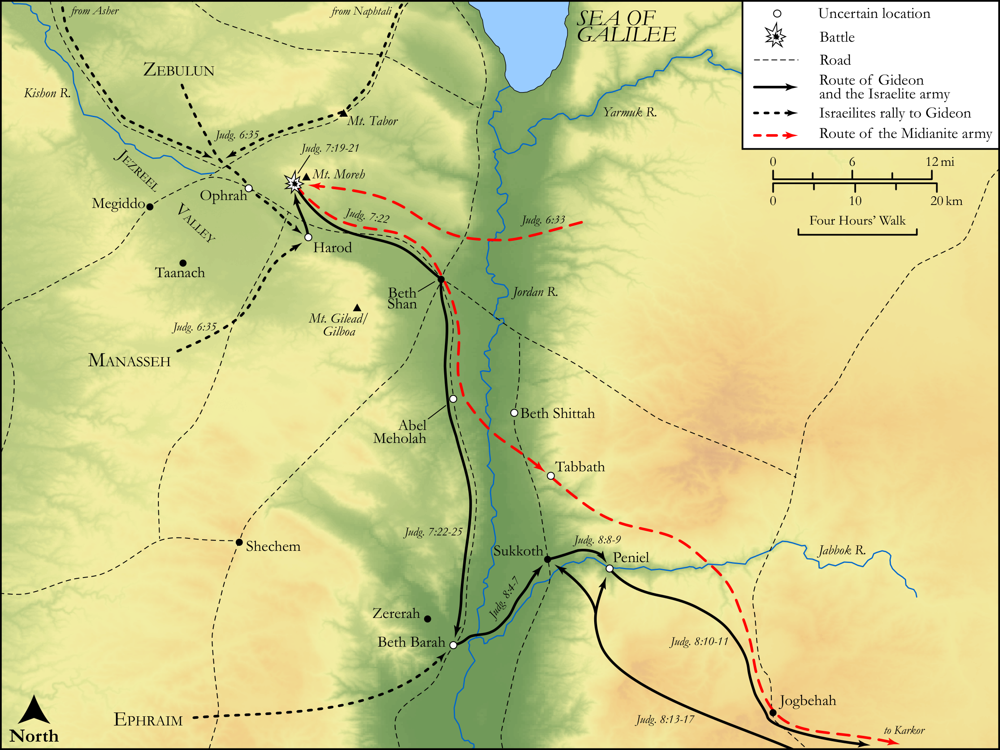

# Biblica Open Bible Maps

## License Information

Biblica Open Bible Maps, © 2023–2025 Biblica, Inc. This work is licensed under Creative Commons Attribution-ShareAlike 4.0 International (<a href="https://creativecommons.org/licenses/by-sa/4.0/">https://creativecommons.org/licenses/by-sa/4.0/</a>). More Information: <a href="https://docs.google.com/document/d/1Pp44yZ0Zdnd59vJHTrt2rPYq0SppfX5rZbPBt6mz37U/edit?tab=t.0#heading=h.oev9aj1ksvk2">https://docs.google.com/document/d/1Pp44yZ0Zdnd59vJHTrt2rPYq0SppfX5rZbPBt6mz37U/edit?tab=t.0#heading=h.oev9aj1ksvk2</a>

--------------------------------

## Historical: Gideon (id: OT065)

### Image Content

[link](images/OT065.png)

Original: [Historical: Gideon](https://drive.google.com/open?id=13h_D7uBIrok861T0wUFXLaciT2pqro07&usp=drive_copy)

* **Associated Passages:** Judges 6:1-8:35

* **Associated ACAI Concepts:** Gideon (ID: `person:Gideon`); LORD (ID: `deity:Lord`); Midian (ID: `place:Midian`); Israel (ID: `person:Israel`); Joash (ID: `person:Joash`); Zebah (ID: `person:Zebah`); Zalmunna (ID: `person:Zalmunna`); An Angel (ID: `deity:Angel`); Baal (ID: `deity:Baal`); Fear (ID: `keyterm:Fear`); Succoth (ID: `place:Succoth`); Abiezer (ID: `person:Abiezer`); Ophrah (ID: `place:Ophrah.2`); Altar (ID: `realia:Altar`); Tabernacle Altar (ID: `realia:TabernacleAltar`); Rams Horn (ID: `realia:RamsHorn`); Stone Altar (ID: `realia:StoneAltar`); Temple Altar (ID: `realia:TempleAltar`); Asherah (ID: `deity:Asherah`); East (ID: `place:East`); Abiezrites (ID: `group:Abiezer`); Amalekites (ID: `group:Amalek`); Peace (ID: `keyterm:IntactState`); Manasseh (ID: `person:Manasseh`); Penuel (ID: `place:Penuel`); Amalek (ID: `place:Amalek`); Jordan River (ID: `place:Jordan`); Tribe of Ephraim (ID: `group:Ephraim`); Egypt (ID: `place:Egypt`); Ephraim (ID: `person:Ephraim`)
