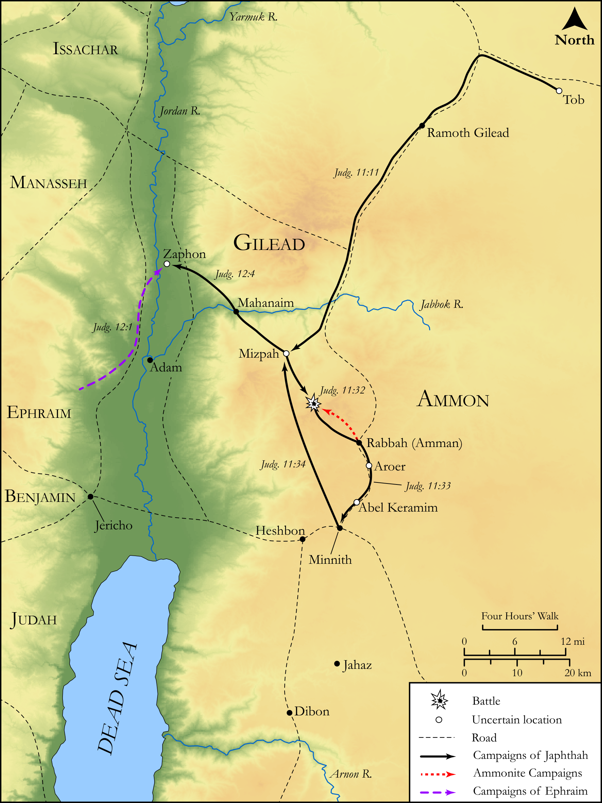

# Biblica Open Bible Maps

## License Information

Biblica Open Bible Maps, © 2023–2025 Biblica, Inc. This work is licensed under Creative Commons Attribution-ShareAlike 4.0 International (https://creativecommons.org/licenses/by-sa/4.0/). More Information: https://docs.google.com/document/d/1Pp44yZ0Zdnd59vJHTrt2rPYq0SppfX5rZbPBt6mz37U/edit?tab=t.0#heading=h.oev9aj1ksvk2

--------------------------------

## Historical: Jephthah (id: OT067)

### Image Content

[link](images/OT067.png)

Original: [Historical: Jephthah](https://drive.google.com/open?id=1dbRBMCIHMoaa_w8BceZSWyYpF3aHiSVQ&usp=drive_copy)

* **Associated Passages:** Judges 10:1-12:15

* **Associated ACAI Concepts:** Israel (ID: `person:Israel`); Ammon (ID: `place:Ammon`); Ammonites (ID: `group:Ammon`); Jephthah (ID: `person:Jephthah`); LORD (ID: `deity:Lord`); Gilead (ID: `place:Gilead`); Tribe of Ephraim (ID: `group:Ephraim`); Ephraim (ID: `person:Ephraim`); Jordan River (ID: `place:Jordan`); Amorites (ID: `group:Amorites`); An Angel (ID: `deity:Angel`); Moab (ID: `place:Moab`); Arnon (ID: `place:Arnon`); Mizpah (ID: `place:Mizpah.2`); Gileadites (ID: `group:Gilead`); Force to Serve (ID: `keyterm:EnticedToServe`); Dispossess (ID: `keyterm:Dispossess`); To Sin (ID: `keyterm:Sin`); Philistines (ID: `group:Philistine`); Egypt (ID: `place:Egypt`); Sihon (ID: `person:Sihon`); Philistia (ID: `place:Philistine`); Elon (ID: `person:Elon.3`); Ibzan (ID: `person:Ibzan`); Gilead (ID: `person:Gilead.2`); Jair (ID: `person:Jair.3`); Shamir (ID: `place:Shamir.2`); Abdon (ID: `person:Abdon`); Tribe of Zebulun (ID: `group:Zebulun`); Hillel (ID: `person:Hillel`)
