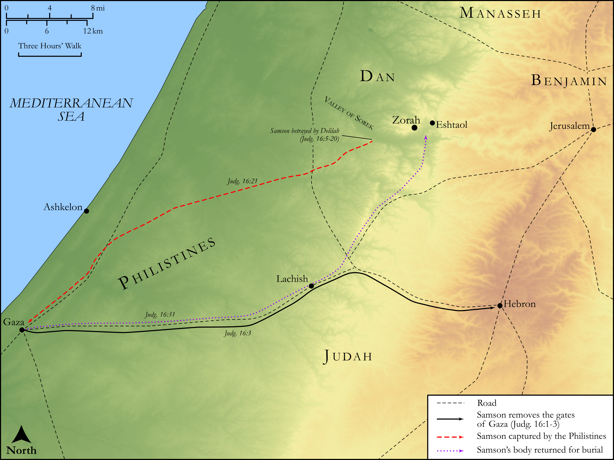

# Biblica Open Bible Maps

## License Information

Biblica Open Bible Maps, © 2023–2025 Biblica, Inc. This work is licensed under Creative Commons Attribution-ShareAlike 4.0 International (https://creativecommons.org/licenses/by-sa/4.0/). More Information: https://docs.google.com/document/d/1Pp44yZ0Zdnd59vJHTrt2rPYq0SppfX5rZbPBt6mz37U/edit?tab=t.0#heading=h.oev9aj1ksvk2

--------------------------------

## Historical: Samson and Delilah (id: OT069)

### Image Content

[link](images/OT069.png)

Original: [Historical: Samson and Delilah](https://drive.google.com/open?id=1hiBQ7cJhKSOotMIs3AEKw9QVBYcrLTuJ&usp=drive_copy)

* **Associated Passages:** Judges 16:1-31

* **Associated ACAI Concepts:** Samson (ID: `person:Samson`); Philistines (ID: `group:Philistine`); Philistia (ID: `place:Philistine`); Delilah (ID: `person:Delilah`); Strength (ID: `keyterm:Strength`); LORD (ID: `deity:Lord`); House (ID: `realia:House`); Gaza (ID: `place:Gaza`); Love (ID: `keyterm:Love`); Nazirites (ID: `group:Nazirite`); Dagon (ID: `deity:Dagon`); Valley of Sorek (ID: `place:SorekValley`); Eshtaol (ID: `place:Eshtaol`); Manoah (ID: `person:Manoah`); Thread (ID: `realia:Thread`); Money (ID: `realia:Money`); Rope (ID: `realia:Rope`); Hebron (ID: `place:Hebron`); Zorah (ID: `place:Zorah`); Israel (ID: `person:Israel`); Slaughtering (ID: `keyterm:Slaughtering`); Shuttle (ID: `realia:Shuttle`); Pin (ID: `realia:Pin`); Doorpost (ID: `realia:Doorpost`); Measuring Reed (ID: `realia:MeasuringReed`); Razor (ID: `realia:Razor`)
