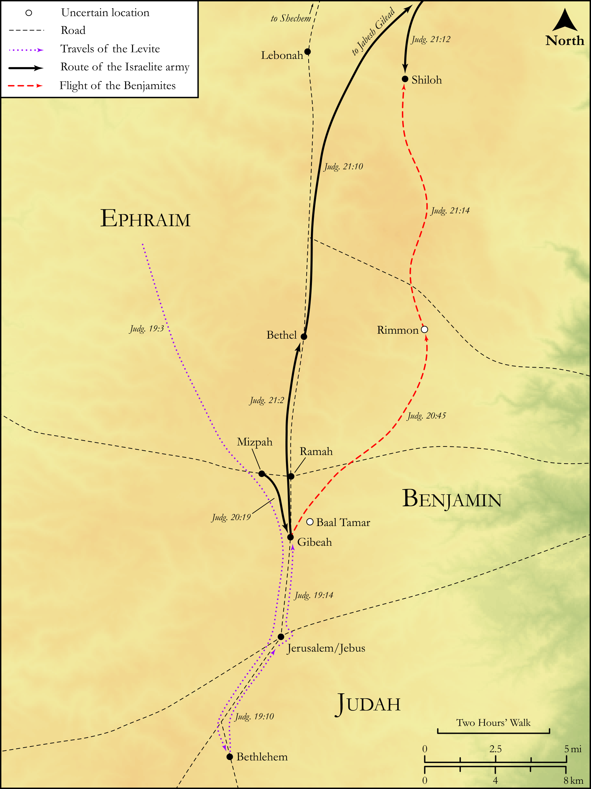

# Biblica Open Bible Maps

## License Information

Biblica Open Bible Maps, © 2023–2025 Biblica, Inc. This work is licensed under Creative Commons Attribution-ShareAlike 4.0 International (<a href="https://creativecommons.org/licenses/by-sa/4.0/">https://creativecommons.org/licenses/by-sa/4.0/</a>). More Information: <a href="https://docs.google.com/document/d/1Pp44yZ0Zdnd59vJHTrt2rPYq0SppfX5rZbPBt6mz37U/edit?tab=t.0#heading=h.oev9aj1ksvk2">https://docs.google.com/document/d/1Pp44yZ0Zdnd59vJHTrt2rPYq0SppfX5rZbPBt6mz37U/edit?tab=t.0#heading=h.oev9aj1ksvk2</a>

--------------------------------

## Historical: Sins of the Benjaminites (id: OT071)

### Image Content

[link](images/OT071.png)

Original: [Historical: Sins of the Benjaminites](https://drive.google.com/open?id=1lyZUrKxu3hzF7pjJ_uBiNYrnM0bPJ8bn&usp=drive_copy)

* **Associated Passages:** Judges 19:1-21:25

* **Associated ACAI Concepts:** Israel (ID: `person:Israel`); Tribe of Benjamin (ID: `group:Benjamin`); Benjamin (ID: `person:Benjamin`); Gibeah (ID: `place:Gibeah.2`); LORD (ID: `deity:Lord`); Jabesh-gilead (ID: `place:Jabesh-gilead`); Mizpah (ID: `place:Mizpah`); Bethel (ID: `place:Bethel`); House (ID: `realia:House`); Sword (ID: `realia:Sword`); Tribe of Judah (ID: `group:Judah`); A Father (ID: `person:GenericFather`); Judah (ID: `person:Judah.4`); To Cause to Possess (ID: `keyterm:Possess`); Foolish (ID: `keyterm:Foolish`); Donkey (ID: `fauna:Donkey`); Rock of Rimmon (ID: `place:Rimmon.3`); Bethlehem (ID: `place:Bethlehem`); Tribe of Ephraim (ID: `group:Ephraim`); Shiloh (ID: `place:Shiloh`); Ephraim (ID: `person:Ephraim`); Swear (ID: `keyterm:Swear`); Offering (ID: `keyterm:Offering`); Jerusalem (ID: `place:Jerusalem`); A Man (ID: `person:GenericMale`); Tribe of Levi (ID: `group:Levi`); Peace (ID: `keyterm:IntactState`); Wickedness (ID: `keyterm:Wickedness`); Levi (ID: `person:Levi.3`); Vine (ID: `flora:Vine`)
