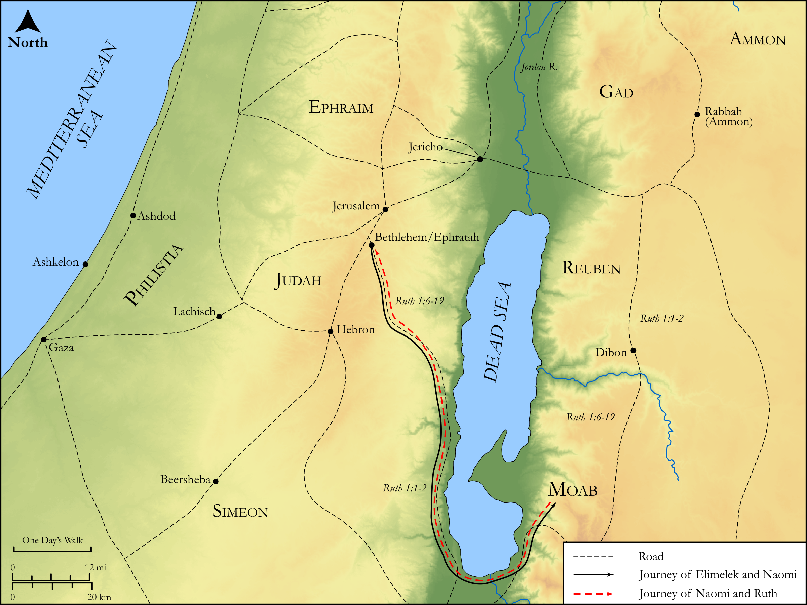

# Biblica Open Bible Maps

## License Information

Biblica Open Bible Maps, © 2023–2025 Biblica, Inc. This work is licensed under Creative Commons Attribution-ShareAlike 4.0 International (<a href="https://creativecommons.org/licenses/by-sa/4.0/">https://creativecommons.org/licenses/by-sa/4.0/</a>). More Information: <a href="https://docs.google.com/document/d/1Pp44yZ0Zdnd59vJHTrt2rPYq0SppfX5rZbPBt6mz37U/edit?tab=t.0#heading=h.oev9aj1ksvk2">https://docs.google.com/document/d/1Pp44yZ0Zdnd59vJHTrt2rPYq0SppfX5rZbPBt6mz37U/edit?tab=t.0#heading=h.oev9aj1ksvk2</a>

--------------------------------

## Historical: Ruth (id: OT072)

### Image Content

[link](images/OT072.png)

Original: [Historical: Ruth](https://drive.google.com/open?id=1OX3TSjuNX5bA0fwXVUjch8knJyXDeEUy&usp=drive_copy)

* **Associated Passages:** Ruth 1:1-4:22

* **Associated ACAI Concepts:** Naomi (ID: `person:Naomi`); Boaz (ID: `person:Boaz`); LORD (ID: `deity:Lord`); Ruth (ID: `person:Ruth`); Moab (ID: `place:Moab`); Elimelech (ID: `person:Elimelech`); Bethlehem (ID: `place:Bethlehem`); Bless (ID: `keyterm:Bless`); Barley (ID: `flora:Barley`); Mahlon (ID: `person:Mahlon`); Tribe of Judah (ID: `group:Judah`); Judah (ID: `person:Judah.4`); Israel (ID: `person:Israel`); Redeem (ID: `keyterm:Redeem`); Chilion (ID: `person:Chilion`); Obed (ID: `person:Obed`); Favor (ID: `keyterm:Favor`); Kindness (ID: `keyterm:Kindness`); To Cause to Possess (ID: `keyterm:Possess`); Threshing Floor (ID: `realia:ThreshingFloor`); Orpah (ID: `person:Orpah`); Women (ID: `group:GenericFemales`); Kinsman Redeemer (ID: `person:KinsmanRedeemer`); Salmon (ID: `person:Salmon`); Hezron (ID: `person:Hezron.2`); Jesse (ID: `person:Jesse`); David (ID: `person:David`); Amminadab (ID: `person:Amminadab`); Perez (ID: `person:Perez`); Ephrathah (ID: `person:Ephrathah`)
