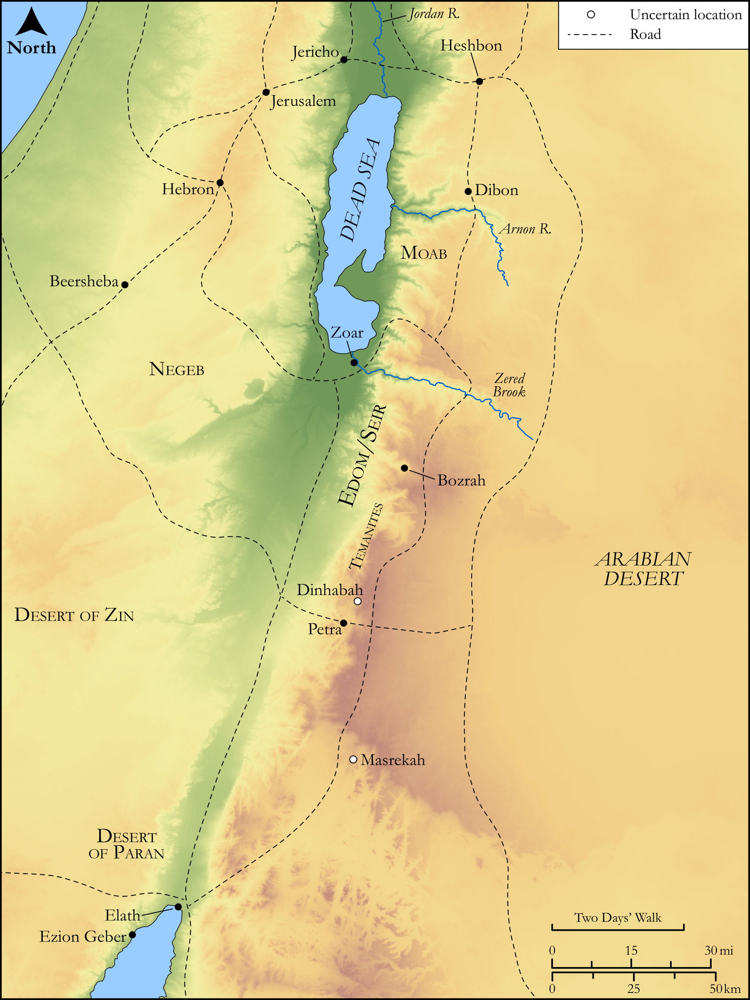

# Biblica Open Bible Maps

## License Information

Biblica Open Bible Maps, © 2023–2025 Biblica, Inc. This work is licensed under Creative Commons Attribution-ShareAlike 4.0 International (https://creativecommons.org/licenses/by-sa/4.0/). More Information: https://docs.google.com/document/d/1Pp44yZ0Zdnd59vJHTrt2rPYq0SppfX5rZbPBt6mz37U/edit?tab=t.0#heading=h.oev9aj1ksvk2

--------------------------------

## Historical: The Kings of Edom (id: OT073)

### Image Content

[link](images/OT073.png)

Original: [Historical: The Kings of Edom](https://drive.google.com/open?id=10I_naI_JLRReEMtZ9ORU1re6VwGaSCdJ&usp=drive_copy)

* **Associated Passages:** 1 Chronicles 1:1-54

* **Associated ACAI Concepts:** Esau (ID: `person:Esau`); Abraham (ID: `person:Abraham`); Arpachshad (ID: `person:Arpachshad`); Ishmael (ID: `person:Ishmael`); Cush (ID: `person:Cush.2`); Joktan (ID: `person:Joktan`); Shem (ID: `person:Shem`); Eber (ID: `person:Eber`); Hadad (ID: `person:Hadad.2`); Husham (ID: `person:Husham`); Baal-hanan (ID: `person:Baal-hanan`); Eliphaz (ID: `person:Eliphaz`); Anah (ID: `person:Anah.2`); Jobab (ID: `person:Jobab.2`); Javan (ID: `person:Javan`); Hadad (ID: `person:Hadad`); Shobal (ID: `person:Shobal`); Keturah (ID: `person:Keturah`); Reuel (ID: `person:Reuel.3`); Bela (ID: `person:Bela.2`); Dishan (ID: `person:Dishan`); Zibeon (ID: `person:Zibeon.2`); Lotan (ID: `person:Lotan`); Ezer (ID: `person:Ezer`); Teman (ID: `person:Teman`); Egypt (ID: `person:Egypt`); Gomer (ID: `person:Gomer`); Midian (ID: `person:Midian`); Shaul (ID: `person:Shaul`); Samlah (ID: `person:Samlah`)
