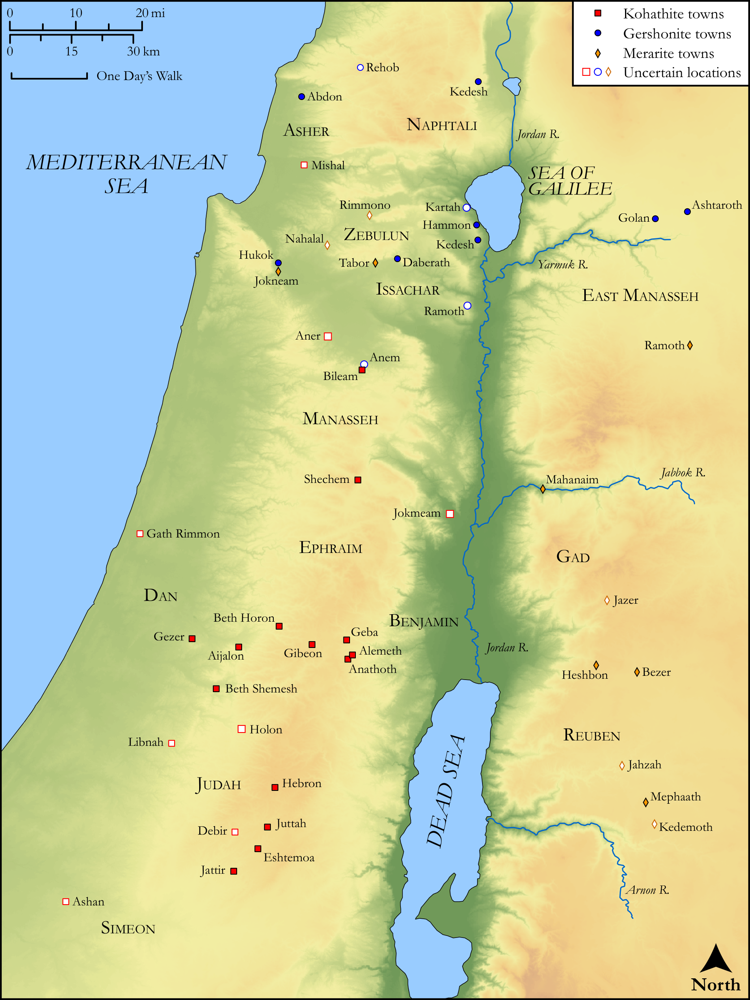

# Biblica Open Bible Maps

## License Information

Biblica Open Bible Maps, © 2023–2025 Biblica, Inc. This work is licensed under Creative Commons Attribution-ShareAlike 4.0 International (<a href="https://creativecommons.org/licenses/by-sa/4.0/">https://creativecommons.org/licenses/by-sa/4.0/</a>). More Information: <a href="https://docs.google.com/document/d/1Pp44yZ0Zdnd59vJHTrt2rPYq0SppfX5rZbPBt6mz37U/edit?tab=t.0#heading=h.oev9aj1ksvk2">https://docs.google.com/document/d/1Pp44yZ0Zdnd59vJHTrt2rPYq0SppfX5rZbPBt6mz37U/edit?tab=t.0#heading=h.oev9aj1ksvk2</a>

--------------------------------

## Historical: Levitical Towns (id: OT074)

### Image Content

[link](images/OT074.png)

Original: [Historical: Levitical Towns](https://drive.google.com/open?id=1z3Qo45KI5r_Wte8dOOPgoy9JzXfHJ2qR&usp=drive_copy)

* **Associated Passages:** 1 Chronicles 6:1-66

* **Associated ACAI Concepts:** Kohath (ID: `person:Kohath`); Merari (ID: `person:Merari`); Tribe of Levi (ID: `group:Levi`); Levi (ID: `person:Levi.3`); Gershon (ID: `person:Gershon`); LORD (ID: `deity:Lord`); Aaron (ID: `person:Aaron`); Izhar (ID: `person:Izhar`); Lot (ID: `keyterm:Lot`); Ahitub (ID: `person:Ahitub.2`); Uzzi (ID: `person:Uzzi`); Meraioth (ID: `person:Meraioth`); Libni (ID: `person:Libni`); Abishua (ID: `person:Abishua`); Amram (ID: `person:Amram`); Jerusalem (ID: `place:Jerusalem`); Judah (ID: `person:Judah.4`); Eleazar (ID: `person:Eleazar.2`); Tribe of Judah (ID: `group:Judah`); Ahimaaz (ID: `person:Ahimaaz.2`); Israel (ID: `person:Israel`); House (ID: `realia:House`); Bukki (ID: `person:Bukki.2`); Zerah (ID: `person:Zerah.4`); Joah (ID: `person:Joah.2`); Elkanah (ID: `person:Elkanah.4`); Iddo (ID: `person:Iddo.4`); Azariah (ID: `person:Azariah.7`); Azariah (ID: `person:Azariah.6`); Amasai (ID: `person:Amasai`)
