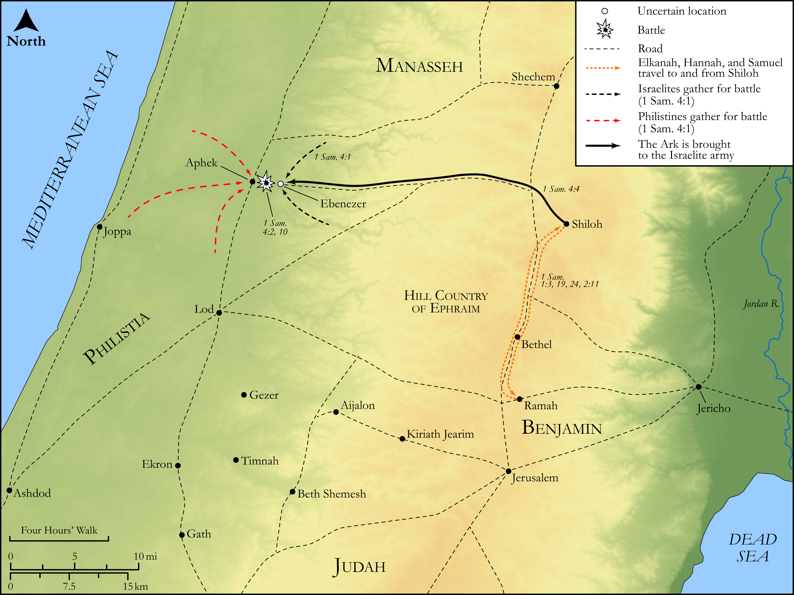

# Biblica Open Bible Maps

## License Information

Biblica Open Bible Maps, © 2023–2025 Biblica, Inc. This work is licensed under Creative Commons Attribution-ShareAlike 4.0 International (https://creativecommons.org/licenses/by-sa/4.0/). More Information: https://docs.google.com/document/d/1Pp44yZ0Zdnd59vJHTrt2rPYq0SppfX5rZbPBt6mz37U/edit?tab=t.0#heading=h.oev9aj1ksvk2

--------------------------------

## Historical: Eli, Samuel, and the Battle of Ebenezer (id: OT075)

### Image Content

[link](images/OT075.png)

Original: [Historical: Eli, Samuel, and the Battle of Ebenezer](https://drive.google.com/open?id=13Bnt1N7Zsh3Sr6lhe3OjK2aaUl3A3nHc&usp=drive_copy)

* **Associated Passages:** 1 Samuel 1:1-4:22

* **Associated ACAI Concepts:** LORD (ID: `deity:Lord`); Eli (ID: `person:Eli`); Samuel (ID: `person:Samuel`); Israel (ID: `person:Israel`); Hannah (ID: `person:Hannah`); Covenant Box (ID: `keyterm:CovenantBox`); Elkanah (ID: `person:Elkanah.2`); Shiloh (ID: `place:Shiloh`); Philistines (ID: `group:Philistine`); Philistia (ID: `place:Philistine`); Phinehas (ID: `person:Phinehas.2`); Hophni (ID: `person:Hophni`); Slaughtering (ID: `keyterm:Slaughtering`); Ark of the Covenant (ID: `realia:ArkOfTheCovenant`); Offering (ID: `keyterm:Offering`); House (ID: `realia:House`); Ramah (ID: `place:Ramah`); Word of the Lord (ID: `keyterm:WordOfTheLord`); Covenant (ID: `keyterm:Covenant`); Glory (ID: `keyterm:Glory`); Fear (ID: `keyterm:Fear`); Peninnah (ID: `person:Peninnah`); Well-Established (ID: `keyterm:BeFirm`); Vow (ID: `keyterm:Vow`); Horn (ID: `keyterm:Horn`); Woe (ID: `keyterm:Woe`); To Sin (ID: `keyterm:Sin`); Passion (ID: `keyterm:Ardour`); Hebrews (ID: `group:Hebrews`); Egypt (ID: `place:Egypt`)
