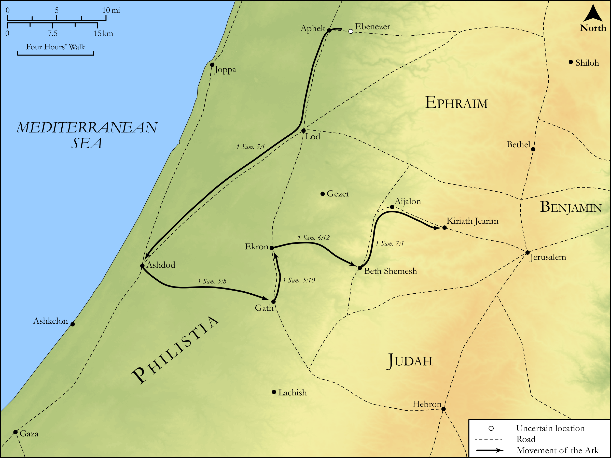

# Biblica Open Bible Maps

## License Information

Biblica Open Bible Maps, © 2023–2025 Biblica, Inc. This work is licensed under Creative Commons Attribution-ShareAlike 4.0 International (https://creativecommons.org/licenses/by-sa/4.0/). More Information: https://docs.google.com/document/d/1Pp44yZ0Zdnd59vJHTrt2rPYq0SppfX5rZbPBt6mz37U/edit?tab=t.0#heading=h.oev9aj1ksvk2

--------------------------------

## Historical: The Loss and Return of the Ark (id: OT076)

### Image Content

[link](images/OT076.png)

Original: [Historical: The Loss and Return of the Ark](https://drive.google.com/open?id=1WjtYRPw0HTIdQ0Yb01tWdWMqKmjFcpZD&usp=drive_copy)

* **Associated Passages:** 1 Samuel 5:1-7:17

* **Associated ACAI Concepts:** LORD (ID: `deity:Lord`); Israel (ID: `person:Israel`); Covenant Box (ID: `keyterm:CovenantBox`); Philistines (ID: `group:Philistine`); Philistia (ID: `place:Philistine`); Ark of the Covenant (ID: `realia:ArkOfTheCovenant`); Samuel (ID: `person:Samuel`); Tumors (ID: `keyterm:Tumors`); Offering (ID: `keyterm:Offering`); Beth-shemesh (ID: `place:Beth-shemesh`); Ashdod (ID: `place:Ashdod`); Mizpah (ID: `place:Mizpah`); Dagon (ID: `deity:Dagon`); House (ID: `realia:House`); Wagon (ID: `realia:Wagon`); Ekron (ID: `place:Ekron`); Mouse (ID: `fauna:Mouse`); Gath (ID: `place:Gath`); Kiriath-jearim (ID: `place:Kiriath-jearim`); Cattle (ID: `fauna:Bull`); Joshua (ID: `person:Joshua.3`); Ebenezer (ID: `place:Ebenezer`); Force to Serve (ID: `keyterm:EnticedToServe`); Holy (ID: `keyterm:Holy`); Ashtoreth (ID: `deity:Ashtoreth`); Abinadab (ID: `person:Abinadab`); People From Beth-Shemesh (ID: `group:Beth-shemesh`); Shen (ID: `place:Shen`); Beth-car (ID: `place:Beth-car`); Abel (ID: `place:Abel`); Gaza (ID: `place:Gaza`); Eleazar (ID: `person:Eleazar.3`); Plague (ID: `keyterm:Blow`); Peace (ID: `keyterm:IntactState`); An Angel (ID: `deity:Angel`); Ramah (ID: `place:Ramah`); Glory (ID: `keyterm:Glory`); Slaughtering (ID: `keyterm:Slaughtering`); Bethel (ID: `place:Bethel`); Amorites (ID: `group:Amorites`); Egypt (ID: `place:Egypt`); Pharaoh (ID: `person:Pharaoh.6`); Ashkelon (ID: `place:Ashkelon`); Gilgal (ID: `place:Gilgal.2`); Tribe of Levi (ID: `group:Levi`); Practice Divination (ID: `keyterm:PracticeDivination`); To Sin (ID: `keyterm:Sin`); Fear (ID: `keyterm:Fear`); Egyptians (ID: `group:Egypt`); Baal (ID: `deity:Baal`); Levi (ID: `person:Levi.3`); Image (ID: `realia:Image`); Stone Altar (ID: `realia:StoneAltar`); Barley (ID: `flora:Barley`); Temple Altar (ID: `realia:TempleAltar`); Sheep (ID: `fauna:Lamb`); Tabernacle Altar (ID: `realia:TabernacleAltar`); Yoke (ID: `realia:Yoke`); Wheat (ID: `flora:Wheat`); Altar (ID: `realia:Altar`)
