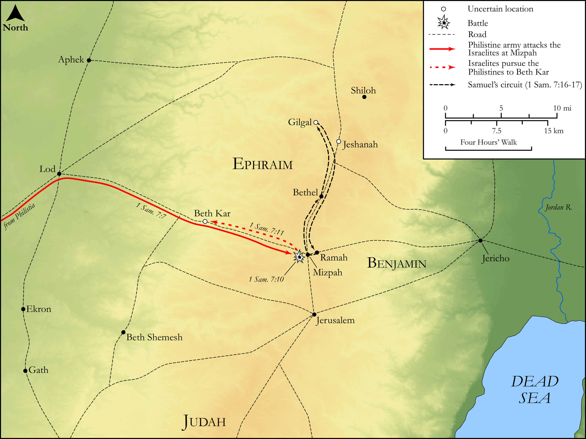

# Biblica Open Bible Maps

## License Information

Biblica Open Bible Maps, © 2023–2025 Biblica, Inc. This work is licensed under Creative Commons Attribution-ShareAlike 4.0 International (https://creativecommons.org/licenses/by-sa/4.0/). More Information: https://docs.google.com/document/d/1Pp44yZ0Zdnd59vJHTrt2rPYq0SppfX5rZbPBt6mz37U/edit?tab=t.0#heading=h.oev9aj1ksvk2

--------------------------------

## Historical: The Victory at Mizpah and Samuel as Judge (id: OT077)

### Image Content

[link](images/OT077.png)

Original: [Historical: The Victory at Mizpah and Samuel as Judge](https://drive.google.com/open?id=1QE2abloh38E8J2ehdgNlWdowHjQpWWSg&usp=drive_copy)

* **Associated Passages:** 1 Samuel 7:1-17

* **Associated ACAI Concepts:** Israel (ID: `person:Israel`); LORD (ID: `deity:Lord`); Samuel (ID: `person:Samuel`); Philistines (ID: `group:Philistine`); Philistia (ID: `place:Philistine`); Mizpah (ID: `place:Mizpah`); Kiriath-jearim (ID: `place:Kiriath-jearim`); Ashtoreth (ID: `deity:Ashtoreth`); Offering (ID: `keyterm:Offering`); Force to Serve (ID: `keyterm:EnticedToServe`); Covenant Box (ID: `keyterm:CovenantBox`); House (ID: `realia:House`); Ark of the Covenant (ID: `realia:ArkOfTheCovenant`); Abinadab (ID: `person:Abinadab`); Beth-car (ID: `place:Beth-car`); Shen (ID: `place:Shen`); Eleazar (ID: `person:Eleazar.3`); To Sin (ID: `keyterm:Sin`); Peace (ID: `keyterm:IntactState`); Ebenezer (ID: `place:Ebenezer`); Gath (ID: `place:Gath`); Ekron (ID: `place:Ekron`); Ramah (ID: `place:Ramah`); Fear (ID: `keyterm:Fear`); Gilgal (ID: `place:Gilgal.2`); Baal (ID: `deity:Baal`); Bethel (ID: `place:Bethel`); Amorites (ID: `group:Amorites`); Holy (ID: `keyterm:Holy`); Sheep (ID: `fauna:Lamb`); Temple Altar (ID: `realia:TempleAltar`); Tabernacle Altar (ID: `realia:TabernacleAltar`); Altar (ID: `realia:Altar`); Stone Altar (ID: `realia:StoneAltar`)
