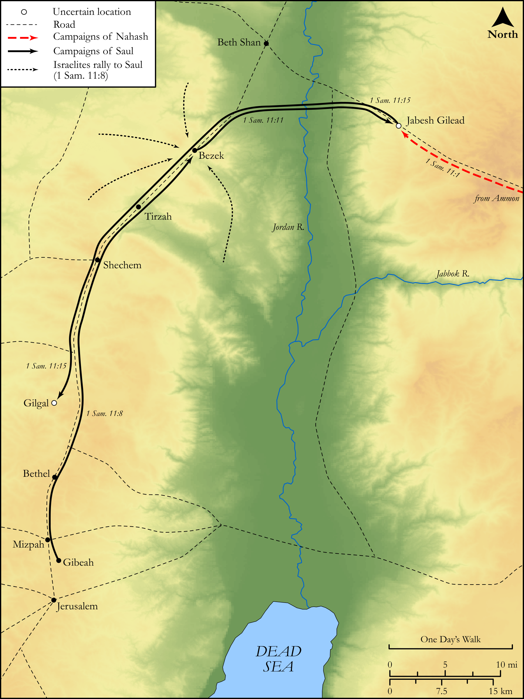

# Biblica Open Bible Maps

## License Information

Biblica Open Bible Maps, © 2023–2025 Biblica, Inc. This work is licensed under Creative Commons Attribution-ShareAlike 4.0 International (https://creativecommons.org/licenses/by-sa/4.0/). More Information: https://docs.google.com/document/d/1Pp44yZ0Zdnd59vJHTrt2rPYq0SppfX5rZbPBt6mz37U/edit?tab=t.0#heading=h.oev9aj1ksvk2

--------------------------------

## Historical: Saul Defeats Nahash (id: OT080)

### Image Content

[link](images/OT080.png)

Original: [Historical: Saul Defeats Nahash](https://drive.google.com/open?id=1IrEF165h1upXPdluzcaiPutUA8trDRyr&usp=drive_copy)

* **Associated Passages:** 1 Samuel 11:1-15

* **Associated ACAI Concepts:** Saul (ID: `person:Saul.2`); Israel (ID: `person:Israel`); Jabesh-gilead (ID: `place:Jabesh-gilead`); An Angel (ID: `deity:Angel`); LORD (ID: `deity:Lord`); Ammonites (ID: `group:Ammon`); Ammon (ID: `place:Ammon`); Samuel (ID: `person:Samuel`); Nahash (ID: `person:Nahash`); Salvation (ID: `keyterm:Salvation`); Gilgal (ID: `place:Gilgal.2`); Men (ID: `group:GenericMales`); Cattle (ID: `fauna:Bull`); Bezek (ID: `place:Bezek.2`); Force to Serve (ID: `keyterm:EnticedToServe`); Gibeah (ID: `place:Gibeah.2`); Slaughtering (ID: `keyterm:Slaughtering`); Tribe of Judah (ID: `group:Judah`); Judah (ID: `person:Judah.4`); Elders (ID: `group:GenericElders`); Offering (ID: `keyterm:Offering`); Covenant (ID: `keyterm:Covenant`)
