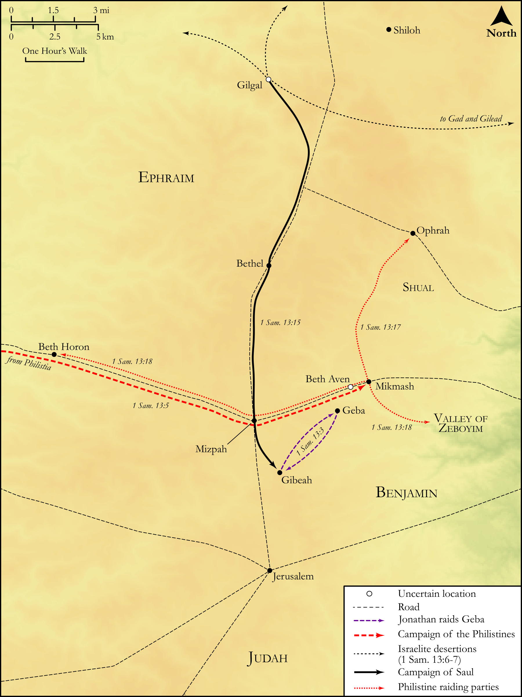

# Biblica Open Bible Maps

## License Information

Biblica Open Bible Maps, © 2023–2025 Biblica, Inc. This work is licensed under Creative Commons Attribution-ShareAlike 4.0 International (https://creativecommons.org/licenses/by-sa/4.0/). More Information: https://docs.google.com/document/d/1Pp44yZ0Zdnd59vJHTrt2rPYq0SppfX5rZbPBt6mz37U/edit?tab=t.0#heading=h.oev9aj1ksvk2

--------------------------------

## Historical: Invasion of the Philistines (id: OT081)

### Image Content

[link](images/OT081.png)

Original: [Historical: Invasion of the Philistines](https://drive.google.com/open?id=1pI5_GahbkdB4pxhU6y051Ai0zRVKdPgc&usp=drive_copy)

* **Associated Passages:** 1 Samuel 13:1-23

* **Associated ACAI Concepts:** Saul (ID: `person:Saul.2`); Philistines (ID: `group:Philistine`); Philistia (ID: `place:Philistine`); Israel (ID: `person:Israel`); Michmash (ID: `place:Michmash`); Samuel (ID: `person:Samuel`); Gilgal (ID: `place:Gilgal.2`); Jonathan (ID: `person:Jonathan.3`); LORD (ID: `deity:Lord`); Tribe of Benjamin (ID: `group:Benjamin`); Hebrews (ID: `group:Hebrews`); Benjamin (ID: `person:Benjamin`); Offering (ID: `keyterm:Offering`); Geba (ID: `place:Geba`); Gibeah (ID: `place:Gibeah.2`); Plough (ID: `realia:Plough`); Axe (ID: `realia:Axe`); Spear (ID: `realia:Spear`); Mattock (ID: `realia:Mattock`); Sword (ID: `realia:Sword`); Valley of Zeboim (ID: `place:ZeboimValley`); Shual (ID: `place:Shual`); Ophrah (ID: `place:Ophrah`); Ask for (ID: `keyterm:AskFor`); Lower Beth-horon (ID: `place:Beth-horonLower`); Israelites (ID: `group:Israel`); Bethel (ID: `place:Bethel`); Bless (ID: `keyterm:Bless`); Beth-aven (ID: `place:Beth-aven`); Gad (ID: `person:Gad`); Gilead (ID: `place:Gilead`); Jordan River (ID: `place:Jordan`); Fork (ID: `realia:Fork.2`); Goad (ID: `realia:Goad`); Rams Horn (ID: `realia:RamsHorn`); Sickle (ID: `realia:Sickle`); Chariot (ID: `realia:Chariot`); Craftsman (ID: `realia:Craftsman`); Thistle (ID: `flora:Thistle`); Pit (ID: `realia:Pit`)
