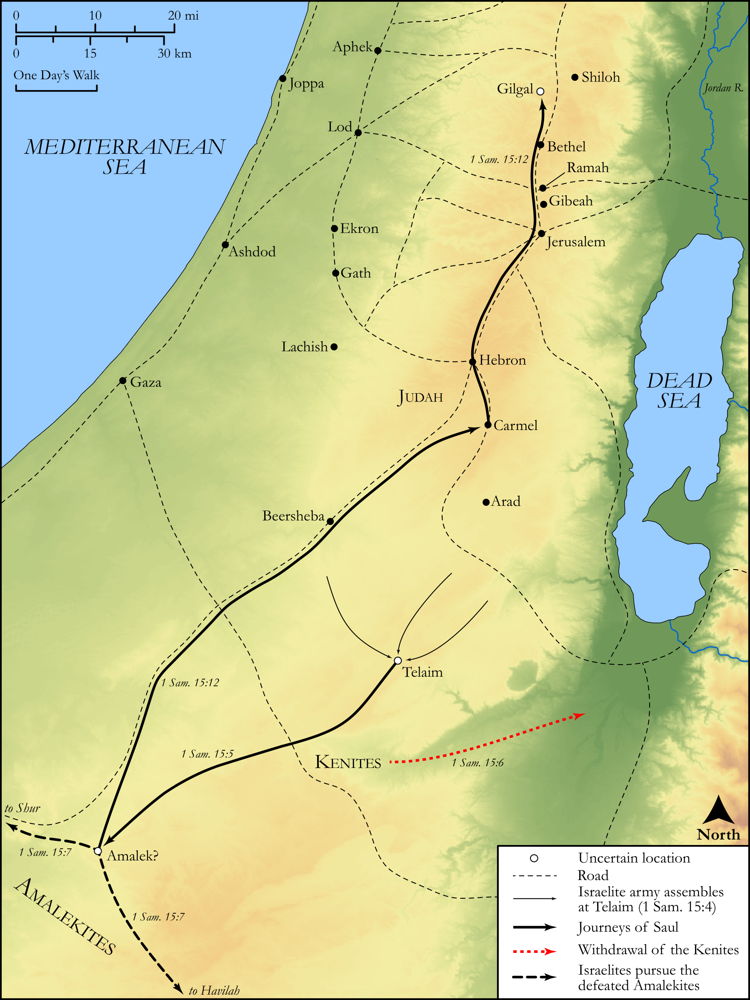

# Biblica Open Bible Maps

## License Information

Biblica Open Bible Maps, © 2023–2025 Biblica, Inc. This work is licensed under Creative Commons Attribution-ShareAlike 4.0 International (https://creativecommons.org/licenses/by-sa/4.0/). More Information: https://docs.google.com/document/d/1Pp44yZ0Zdnd59vJHTrt2rPYq0SppfX5rZbPBt6mz37U/edit?tab=t.0#heading=h.oev9aj1ksvk2

--------------------------------

## Historical: Saul Destroys the Amalekites (id: OT083)

### Image Content

[link](images/OT083.png)

Original: [Historical: Saul Destroys the Amalekites](https://drive.google.com/open?id=1KI_ZUDiM7tXOxpqUHYtd1TS5XqHY7SAs&usp=drive_copy)

* **Associated Passages:** 1 Samuel 15:1-35

* **Associated ACAI Concepts:** LORD (ID: `deity:Lord`); Samuel (ID: `person:Samuel`); Saul (ID: `person:Saul.2`); Amalek (ID: `place:Amalek`); Israel (ID: `person:Israel`); Amalekites (ID: `group:Amalek`); Set Apart for Destruction (ID: `keyterm:Proscribe.2`); Agag (ID: `person:Agag.2`); Word of the Lord (ID: `keyterm:WordOfTheLord`); Cattle (ID: `fauna:Bull`); To Sin (ID: `keyterm:Sin`); Flock (ID: `fauna:Flock`); Goat (ID: `fauna:Goat`); Egypt (ID: `place:Egypt`); Gilgal (ID: `place:Gilgal.2`); Sheep (ID: `fauna:Lamb`); Smear (ID: `keyterm:Smear`); Appoint (ID: `keyterm:Appoint`); Telaim (ID: `place:Telaim`); Havilah (ID: `place:Havilah.2`); Carmel (ID: `place:Carmel`); Something Devoted to God (ID: `keyterm:SomethingDevotedToGod`); Kenites (ID: `group:Kenite`); Sword (ID: `realia:Sword`); Bless (ID: `keyterm:Bless`); Fee for Divination (ID: `keyterm:FeeForDivination`); Judah (ID: `person:Judah.4`); Bring Honor and Glory on Oneself (ID: `keyterm:BringHonorAndGloryOnOneself`); Ramah (ID: `place:Ramah`); Offering (ID: `keyterm:Offering`); Tribe of Judah (ID: `group:Judah`); Mischief (ID: `keyterm:Mischief`); Fear (ID: `keyterm:Fear`); Forgive (ID: `keyterm:Forgive`); Gibeah (ID: `place:Gibeah.2`); Slaughtering (ID: `keyterm:Slaughtering`); Shur (ID: `place:Shur`); Kindness (ID: `keyterm:Kindness`); Teraphim (ID: `deity:Teraphim`); Robe (ID: `realia:Robe`); Donkey (ID: `fauna:Donkey`); Household Idols (ID: `realia:HouseholdIdols`); House (ID: `realia:House`); Camel (ID: `fauna:Camel`)
