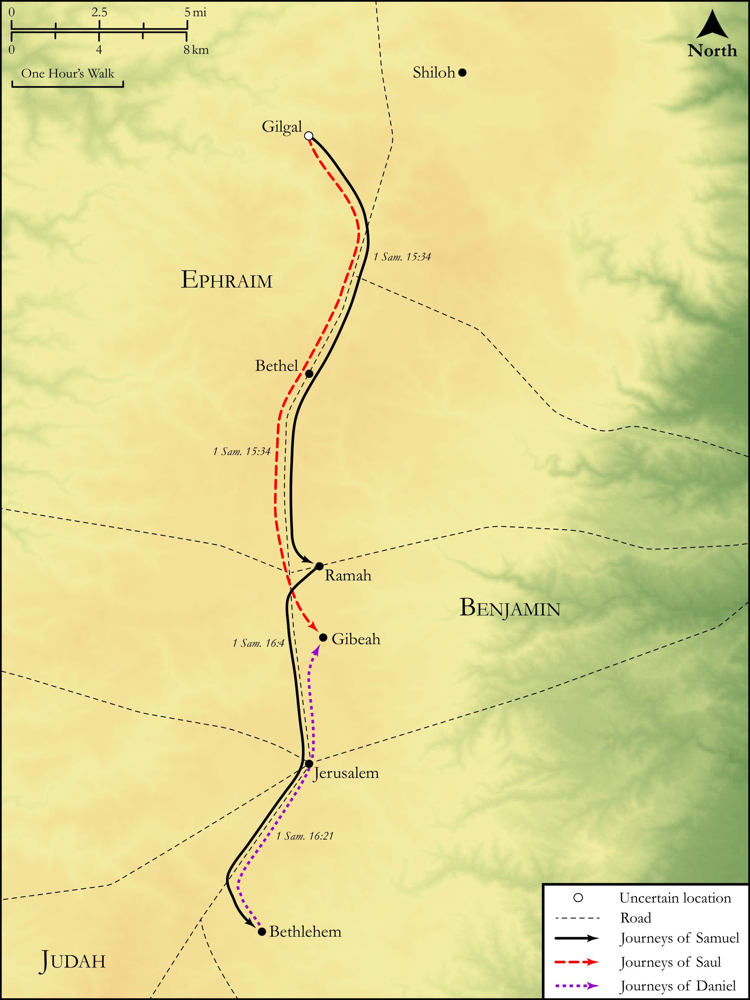

# Biblica Open Bible Maps

## License Information

Biblica Open Bible Maps, © 2023–2025 Biblica, Inc. This work is licensed under Creative Commons Attribution-ShareAlike 4.0 International (https://creativecommons.org/licenses/by-sa/4.0/). More Information: https://docs.google.com/document/d/1Pp44yZ0Zdnd59vJHTrt2rPYq0SppfX5rZbPBt6mz37U/edit?tab=t.0#heading=h.oev9aj1ksvk2

--------------------------------

## Historical: Saul and David (id: OT084)

### Image Content

[link](images/OT084.png)

Original: [Historical: Saul and David](https://drive.google.com/open?id=1V2uhhCMuswsqLtiLJVJAcWcuojpT1mxV&usp=drive_copy)

* **Associated Passages:** 1 Samuel 15:1-16:23

* **Associated ACAI Concepts:** LORD (ID: `deity:Lord`); Saul (ID: `person:Saul.2`); Samuel (ID: `person:Samuel`); Jesse (ID: `person:Jesse`); Amalek (ID: `place:Amalek`); Israel (ID: `person:Israel`); Amalekites (ID: `group:Amalek`); David (ID: `person:David`); Set Apart for Destruction (ID: `keyterm:Proscribe.2`); Agag (ID: `person:Agag.2`); Smear (ID: `keyterm:Smear`); Word of the Lord (ID: `keyterm:WordOfTheLord`); Flock (ID: `fauna:Flock`); Goat (ID: `fauna:Goat`); Cattle (ID: `fauna:Bull`); To Sin (ID: `keyterm:Sin`); Bethlehem (ID: `place:Bethlehem`); Egypt (ID: `place:Egypt`); Gilgal (ID: `place:Gilgal.2`); Slaughtering (ID: `keyterm:Slaughtering`); Sheep (ID: `fauna:Lamb`); Bethlehemites (ID: `group:Bethlehem`); Peace (ID: `keyterm:IntactState`); Ramah (ID: `place:Ramah`); Shimeah (ID: `person:Shimeah.2`); Appoint (ID: `keyterm:Appoint`); Telaim (ID: `place:Telaim`); Havilah (ID: `place:Havilah.2`); Carmel (ID: `place:Carmel`); Abinadab (ID: `person:Abinadab.3`)
