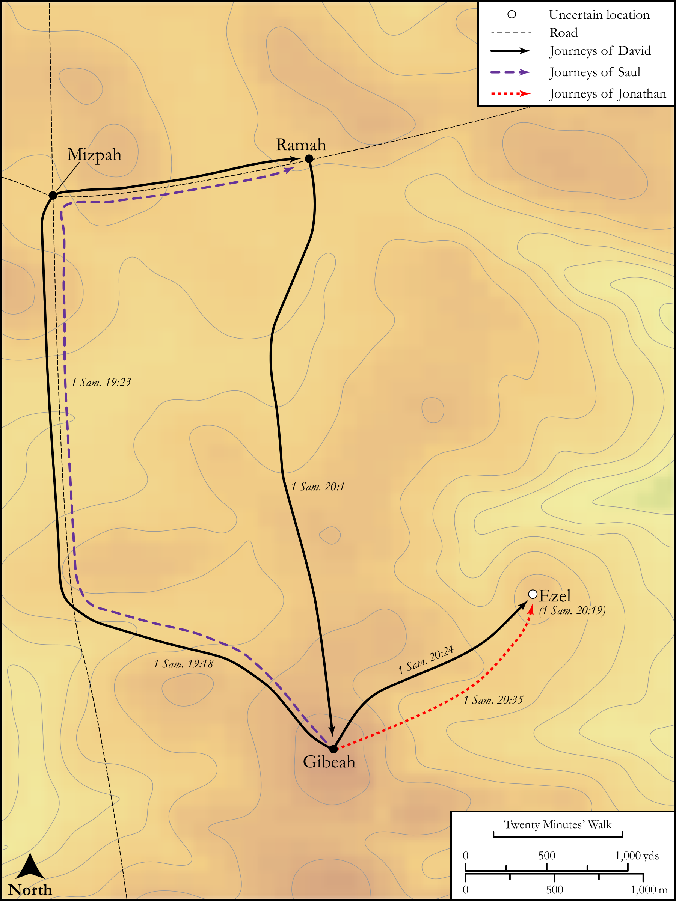

# Biblica Open Bible Maps

## License Information

Biblica Open Bible Maps, © 2023–2025 Biblica, Inc. This work is licensed under Creative Commons Attribution-ShareAlike 4.0 International (<a href="https://creativecommons.org/licenses/by-sa/4.0/">https://creativecommons.org/licenses/by-sa/4.0/</a>). More Information: <a href="https://docs.google.com/document/d/1Pp44yZ0Zdnd59vJHTrt2rPYq0SppfX5rZbPBt6mz37U/edit?tab=t.0#heading=h.oev9aj1ksvk2">https://docs.google.com/document/d/1Pp44yZ0Zdnd59vJHTrt2rPYq0SppfX5rZbPBt6mz37U/edit?tab=t.0#heading=h.oev9aj1ksvk2</a>

--------------------------------

## Historical: David on the Run (Part 1) (id: OT086)

### Image Content

[link](images/OT086.png)

Original: [Historical: David on the Run (Part 1\)](https://drive.google.com/open?id=1dzJ6MbrS9K9RlrMQolTqxRdKD2EnMFm0&usp=drive_copy)

* **Associated Passages:** 1 Samuel 19:1-20:42

* **Associated ACAI Concepts:** David (ID: `person:David`); Jonathan (ID: `person:Jonathan.3`); Saul (ID: `person:Saul.2`); LORD (ID: `deity:Lord`); An Angel (ID: `deity:Angel`); New Moon Festival (ID: `keyterm:NewMoonFestival`); Naioth (ID: `place:Naioth`); Ramah (ID: `place:Ramah`); Arrow (ID: `realia:Arrow`); Michal (ID: `person:Michal`); Arrow (ID: `keyterm:Arrow`); Peace (ID: `keyterm:IntactState`); Samuel (ID: `person:Samuel`); Swear (ID: `keyterm:Swear`); Speak as a Prophet (ID: `keyterm:Speak`); Jesse (ID: `person:Jesse`); Kindness (ID: `keyterm:Kindness`); To Sin (ID: `keyterm:Sin`); Favor (ID: `keyterm:Favor`); Bethlehem (ID: `place:Bethlehem`); Passion (ID: `keyterm:Ardour`); Philistia (ID: `place:Philistine`); Philistines (ID: `group:Philistine`); Israel (ID: `person:Israel`); Slaughtering (ID: `keyterm:Slaughtering`); Teraphim (ID: `deity:Teraphim`); Spear (ID: `realia:Spear`); Bed (ID: `realia:Bed`); Ezel (ID: `place:EzelStone`); Secu (ID: `place:Secu`)
