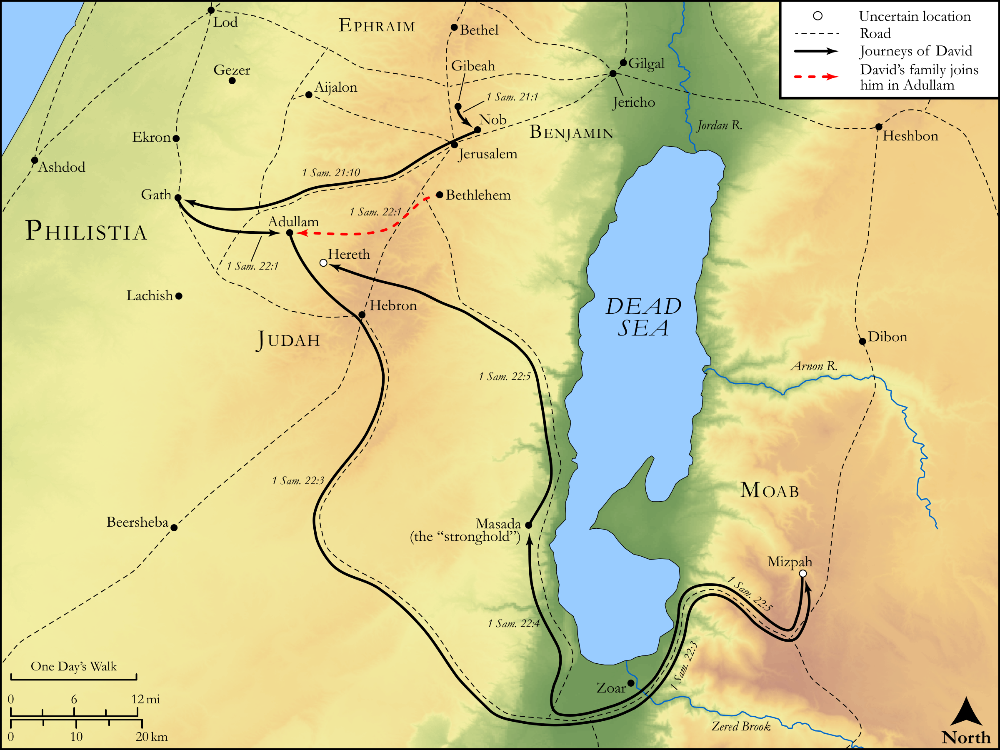

# Biblica Open Bible Maps

## License Information

Biblica Open Bible Maps, © 2023–2025 Biblica, Inc. This work is licensed under Creative Commons Attribution-ShareAlike 4.0 International (https://creativecommons.org/licenses/by-sa/4.0/). More Information: https://docs.google.com/document/d/1Pp44yZ0Zdnd59vJHTrt2rPYq0SppfX5rZbPBt6mz37U/edit?tab=t.0#heading=h.oev9aj1ksvk2

--------------------------------

## Historical: David on the Run (Part 2) (id: OT087)

### Image Content

[link](images/OT087.png)

Original: [Historical: David on the Run (Part 2\)](https://drive.google.com/open?id=1VXz4DjYSMonwuSbPC5-Qwgcyed1oqLoi&usp=drive_copy)

* **Associated Passages:** 1 Samuel 21:1-22:23

* **Associated ACAI Concepts:** David (ID: `person:David`); Saul (ID: `person:Saul.2`); Ahimelech (ID: `person:Ahimelech`); LORD (ID: `deity:Lord`); Doeg (ID: `person:Doeg`); Ahitub (ID: `person:Ahitub`); Achish (ID: `person:Achish`); Nob (ID: `place:Nob`); Sword (ID: `realia:Sword`); Edomites (ID: `group:Edom`); Edom (ID: `place:Edom`); Jesse (ID: `person:Jesse`); Abiathar (ID: `person:Abiathar`); Philistines (ID: `group:Philistine`); Gath (ID: `place:Gath`); Goliath (ID: `person:Goliath`); Fear (ID: `keyterm:Fear`); Philistia (ID: `place:Philistine`); Moab (ID: `place:Moab`); Profane (ID: `keyterm:Profane`); Bread of Display (ID: `keyterm:BreadOfDisplay`); Adullam (ID: `place:Adullam`); Hereth (ID: `place:Hereth`); Valley of Elah (ID: `place:ElahValley`); Gad (ID: `person:Gad.2`); Spear (ID: `realia:Spear`); Fortress (ID: `realia:Fortress`); Sheep (ID: `fauna:Lamb`); Mighty One (ID: `keyterm:MightyOne`); Kir (ID: `place:Kir`); Judah (ID: `person:Judah.4`); Servants (ID: `group:GenericServants`); Well-Established (ID: `keyterm:BeFirm`); Benjamin (ID: `person:Benjamin`); Tribe of Benjamin (ID: `group:Benjamin`); Tribe of Judah (ID: `group:Judah`); Gibeah (ID: `place:Gibeah.2`); Holy (ID: `keyterm:Holy`); Bring Honor and Glory on Oneself (ID: `keyterm:BringHonorAndGloryOnOneself`); Bread of Display (ID: `realia:BreadOfDisplay`); Tamarisk (ID: `flora:Tamarisk`); Sandalwood (ID: `flora:Sandalwood`); Cloak (ID: `realia:Cloak`); Flock (ID: `fauna:Flock`); Donkey (ID: `fauna:Donkey`); Vine (ID: `flora:Vine`); Goat (ID: `fauna:Goat`); House (ID: `realia:House`); Cattle (ID: `fauna:Bull`); Linen (ID: `realia:Linen`); Ephod (ID: `realia:Ephod`)
