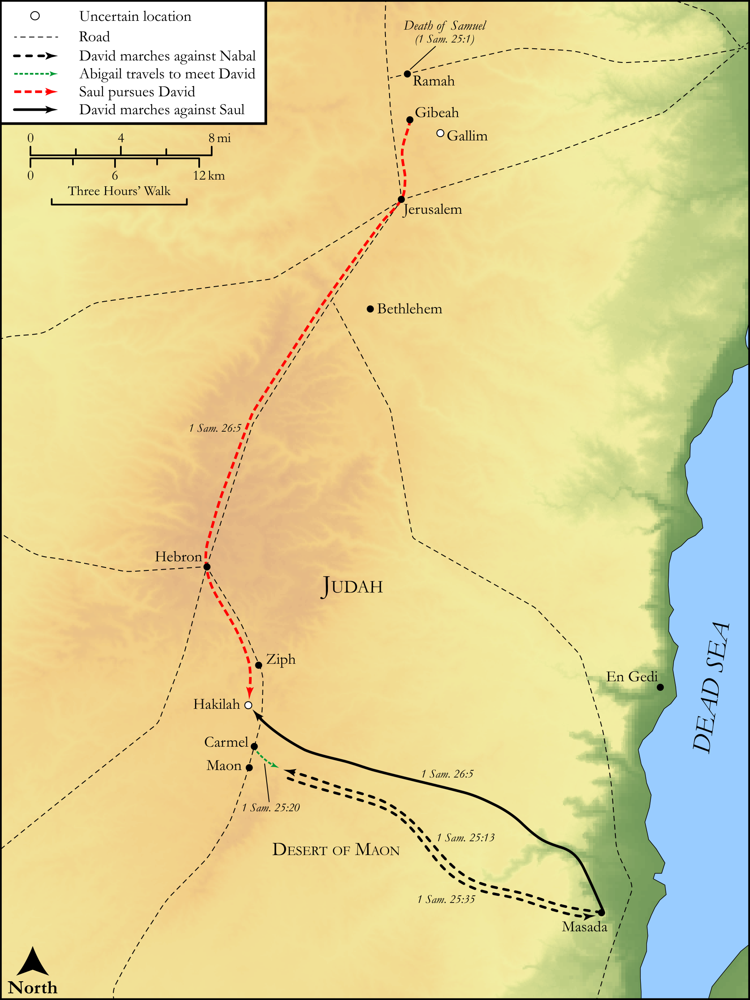

# Biblica Open Bible Maps

## License Information

Biblica Open Bible Maps, © 2023–2025 Biblica, Inc. This work is licensed under Creative Commons Attribution-ShareAlike 4.0 International (https://creativecommons.org/licenses/by-sa/4.0/). More Information: https://docs.google.com/document/d/1Pp44yZ0Zdnd59vJHTrt2rPYq0SppfX5rZbPBt6mz37U/edit?tab=t.0#heading=h.oev9aj1ksvk2

--------------------------------

## Historical: David on the Run (Part 4) (id: OT089)

### Image Content

[link](images/OT089.png)

Original: [Historical: David on the Run (Part 4\)](https://drive.google.com/open?id=1Pc2UQLYuXlI64BCddxdv6EPrc1DxXmWe&usp=drive_copy)

* **Associated Passages:** 1 Samuel 25:1-26:25

* **Associated ACAI Concepts:** David (ID: `person:David`); LORD (ID: `deity:Lord`); Nabal (ID: `person:Nabal`); Saul (ID: `person:Saul.2`); Abigail (ID: `person:Abigail`); Israel (ID: `person:Israel`); Bless (ID: `keyterm:Bless`); Spear (ID: `realia:Spear`); Abishai (ID: `person:Abishai`); Carmel (ID: `place:Carmel`); Abner (ID: `person:Abner`); Anointed (ID: `keyterm:Anointed`); Flock (ID: `fauna:Flock`); Goat (ID: `fauna:Goat`); Peace (ID: `keyterm:IntactState`); Donkey (ID: `fauna:Donkey`); Hachilah (ID: `place:Hachilah`); An Angel (ID: `deity:Angel`); Ner (ID: `person:Ner.2`); Jeshimon (ID: `place:Jeshimon`); Wickedness (ID: `keyterm:Wickedness`); Wilderness of Ziph (ID: `place:Ziph.2`); Clay Jar (ID: `realia:ClayJar`); House (ID: `realia:House`); Michal (ID: `person:Michal`); Gallim (ID: `place:Gallim`); Maon (ID: `place:Maon`); Palti (ID: `person:Palti.2`); Calebites (ID: `group:Caleb`); Laish (ID: `person:Laish`)
