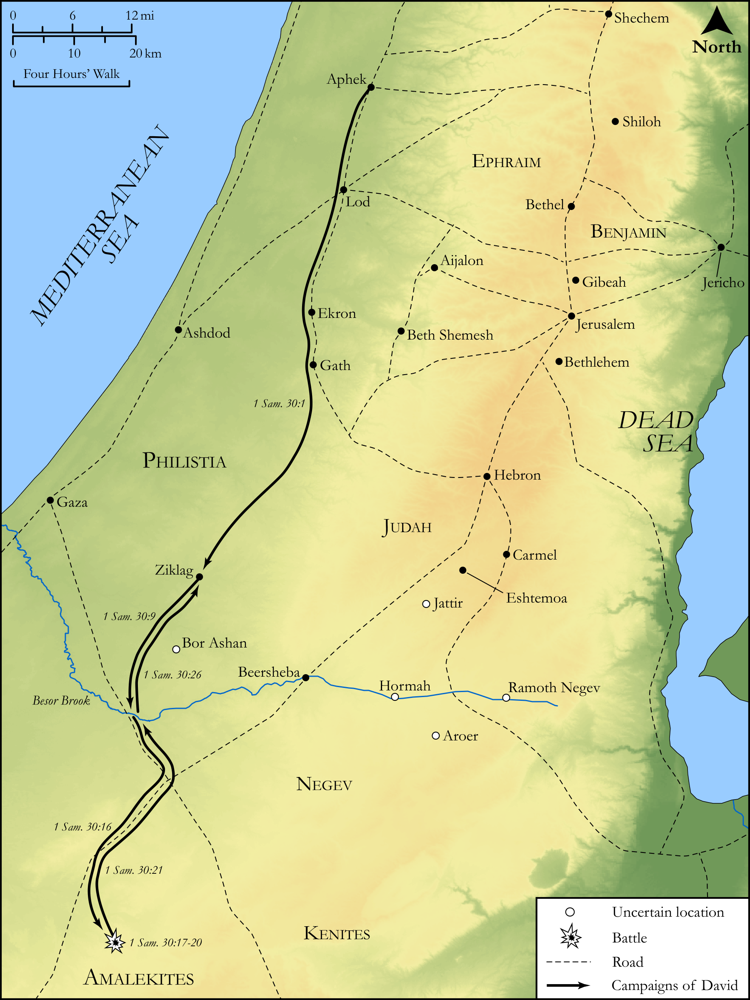

# Biblica Open Bible Maps

## License Information

Biblica Open Bible Maps, © 2023–2025 Biblica, Inc. This work is licensed under Creative Commons Attribution-ShareAlike 4.0 International (https://creativecommons.org/licenses/by-sa/4.0/). More Information: https://docs.google.com/document/d/1Pp44yZ0Zdnd59vJHTrt2rPYq0SppfX5rZbPBt6mz37U/edit?tab=t.0#heading=h.oev9aj1ksvk2

--------------------------------

## Historical: David Destroys the Amalekites (id: OT092)

### Image Content

[link](images/OT092.png)

Original: [Historical: David Destroys the Amalekites](https://drive.google.com/open?id=1kD9QUbahAjZSfu-bvBO55aQyQpsshYPn&usp=drive_copy)

* **Associated Passages:** 1 Samuel 30:1-31

* **Associated ACAI Concepts:** David (ID: `person:David`); LORD (ID: `deity:Lord`); Besor (ID: `place:Besor`); Ziklag (ID: `place:Ziklag`); Judah (ID: `person:Judah.4`); Tribe of Judah (ID: `group:Judah`); Amalekites (ID: `group:Amalek`); Amalek (ID: `place:Amalek`); Negev (ID: `place:Negeb`); Egyptians (ID: `group:Egypt`); Carmel (ID: `place:Carmel`); Egypt (ID: `place:Egypt`); Bor-ashan (ID: `place:Bor-ashan`); Athach (ID: `place:Athach`); Aroer (ID: `place:Aroer.3`); Siphmoth (ID: `place:Siphmoth`); Jerahmeelites (ID: `group:Jerahmeel`); Jerahmeel (ID: `person:Jerahmeel`); Cherethites (ID: `group:Cherethite`); Ahinoam (ID: `person:Ahinoam.2`); Bethel (ID: `place:Bethel.2`); Swear (ID: `keyterm:Swear`); A Servant (ID: `person:GenericServant`); Eshtemoa (ID: `place:Eshtemoa`); Jezreel (ID: `place:Jezreel.2`); Bless (ID: `keyterm:Bless`); Nabal (ID: `person:Nabal`); Zephath (ID: `place:Zephath`); Philistines (ID: `group:Philistine`); Peace (ID: `keyterm:IntactState`); Ahimelech (ID: `person:Ahimelech`); Wickedness (ID: `keyterm:Wickedness`); Hebron (ID: `place:Hebron`); Carmelites (ID: `group:Carmel`); Abigail (ID: `person:Abigail`); Kenites (ID: `group:Kenite`); Decree (ID: `keyterm:Decree`); Strength (ID: `keyterm:Strength`); Jezreel (ID: `group:Jezreel`); Caleb (ID: `person:Caleb`); Philistia (ID: `place:Philistine`); Israel (ID: `person:Israel`); Jattir (ID: `place:Jattir`); Abiathar (ID: `person:Abiathar`); Jezreel (ID: `place:Jezreel`); Baalath-beer (ID: `place:Baalath-beer`); Fig Cake (ID: `realia:FigCake`); Flock (ID: `fauna:Flock`); Vine (ID: `flora:Vine`); Goat (ID: `fauna:Goat`); Ephod (ID: `realia:Ephod`); Cattle (ID: `fauna:Bull`); Camel (ID: `fauna:Camel`)
