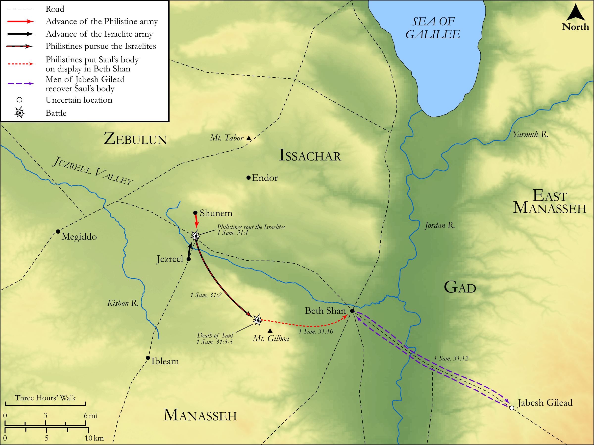

# Biblica Open Bible Maps

## License Information

Biblica Open Bible Maps, © 2023–2025 Biblica, Inc. This work is licensed under Creative Commons Attribution-ShareAlike 4.0 International (https://creativecommons.org/licenses/by-sa/4.0/). More Information: https://docs.google.com/document/d/1Pp44yZ0Zdnd59vJHTrt2rPYq0SppfX5rZbPBt6mz37U/edit?tab=t.0#heading=h.oev9aj1ksvk2

--------------------------------

## Historical: The Death of Saul (id: OT093)

### Image Content

[link](images/OT093.png)

Original: [Historical: The Death of Saul](https://drive.google.com/open?id=1fF6bu4n0YaJueNnSYzQ74BNToUM4Mggt&usp=drive_copy)

* **Associated Passages:** 1 Samuel 31:1-13

* **Associated ACAI Concepts:** Saul (ID: `person:Saul.2`); Philistines (ID: `group:Philistine`); Philistia (ID: `place:Philistine`); Jabesh-gilead (ID: `place:Jabesh-gilead`); Mount Gilboa (ID: `place:GilboaMount`); Israel (ID: `person:Israel`); Beth-shan (ID: `place:Beth-shan`); House (ID: `realia:House`); Sword (ID: `realia:Sword`); Beth-ashtoreth (ID: `place:Beth-ashtoreth`); Malchi-shua (ID: `person:Malchi-shua`); Abinadab (ID: `person:Abinadab.2`); Jonathan (ID: `person:Jonathan.3`); Jordan River (ID: `place:Jordan`); Ashtoreth (ID: `deity:Ashtoreth`); Uncircumcised Person (ID: `keyterm:UncircumcisedPerson`); Fear (ID: `keyterm:Fear`); Tamarisk (ID: `flora:Tamarisk`); Bow (ID: `realia:Bow`); Image (ID: `realia:Image`)
