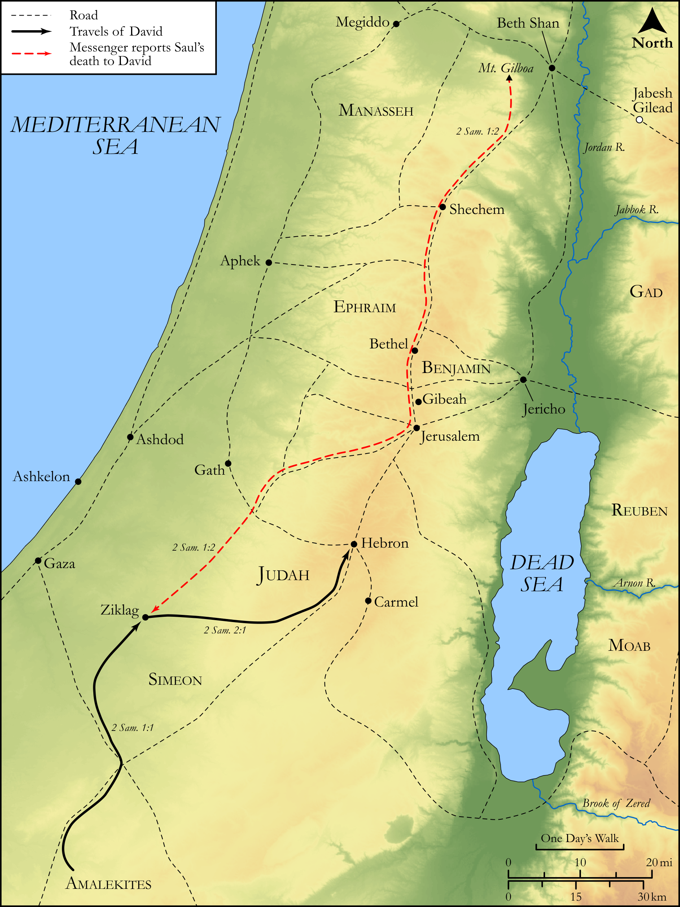

# Biblica Open Bible Maps

## License Information

Biblica Open Bible Maps, © 2023–2025 Biblica, Inc. This work is licensed under Creative Commons Attribution-ShareAlike 4.0 International (<a href="https://creativecommons.org/licenses/by-sa/4.0/">https://creativecommons.org/licenses/by-sa/4.0/</a>). More Information: <a href="https://docs.google.com/document/d/1Pp44yZ0Zdnd59vJHTrt2rPYq0SppfX5rZbPBt6mz37U/edit?tab=t.0#heading=h.oev9aj1ksvk2">https://docs.google.com/document/d/1Pp44yZ0Zdnd59vJHTrt2rPYq0SppfX5rZbPBt6mz37U/edit?tab=t.0#heading=h.oev9aj1ksvk2</a>

--------------------------------

## Historical: David Assumes the Throne of Judah (id: OT094)

### Image Content

[link](images/OT094.png)

Original: [Historical: David Assumes the Throne of Judah](https://drive.google.com/open?id=1evAwPok2aBwNmSPdKkBxaWzN2jW3pMSF&usp=drive_copy)

* **Associated Passages:** 2 Samuel 1:1-2:32

* **Associated ACAI Concepts:** David (ID: `person:David`); Saul (ID: `person:Saul.2`); Abner (ID: `person:Abner`); Joab (ID: `person:Joab`); Asahel (ID: `person:Asahel`); Jonathan (ID: `person:Jonathan.3`); Israel (ID: `person:Israel`); LORD (ID: `deity:Lord`); Tribe of Judah (ID: `group:Judah`); Judah (ID: `person:Judah.4`); Ish-bosheth (ID: `person:Ish-bosheth`); Hebron (ID: `place:Hebron`); Tribe of Benjamin (ID: `group:Benjamin`); Gibeon (ID: `place:Gibeon`); Benjamin (ID: `person:Benjamin`); Amalekites (ID: `group:Amalek`); Amalek (ID: `place:Amalek`); Mahanaim (ID: `place:Mahanaim`); Abishai (ID: `person:Abishai`); Jezreel (ID: `place:Jezreel.2`); Ner (ID: `person:Ner.2`); Zeruiah (ID: `person:Zeruiah`); Kindness (ID: `keyterm:Kindness`); Jabesh-gilead (ID: `place:Jabesh-gilead`); Smear (ID: `keyterm:Smear`); Mount Gilboa (ID: `place:GilboaMount`); Anointed (ID: `keyterm:Anointed`); Love (ID: `keyterm:Love`); Ammah (ID: `place:Ammah`); Jashar (ID: `person:Jashar`)
